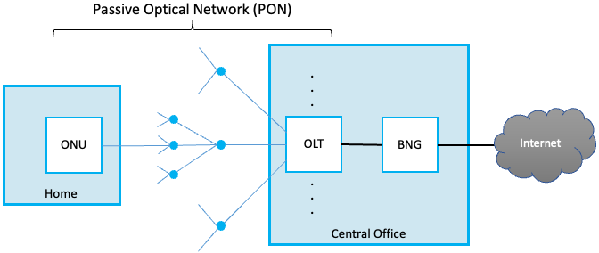
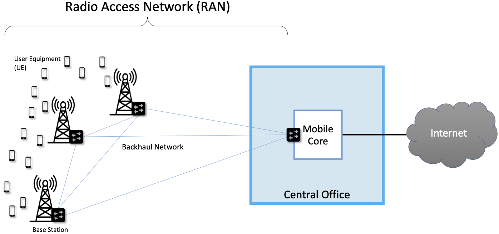
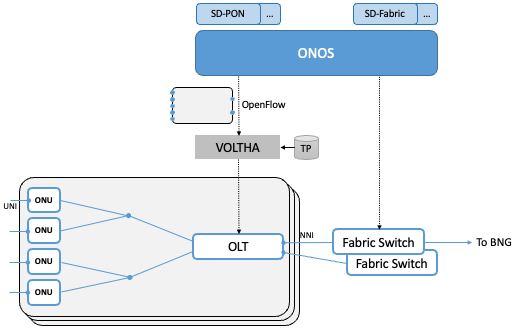
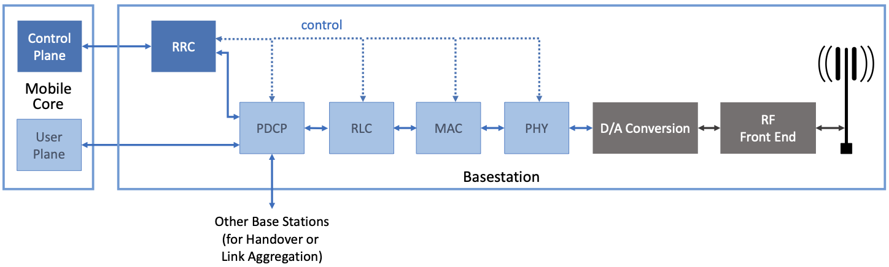
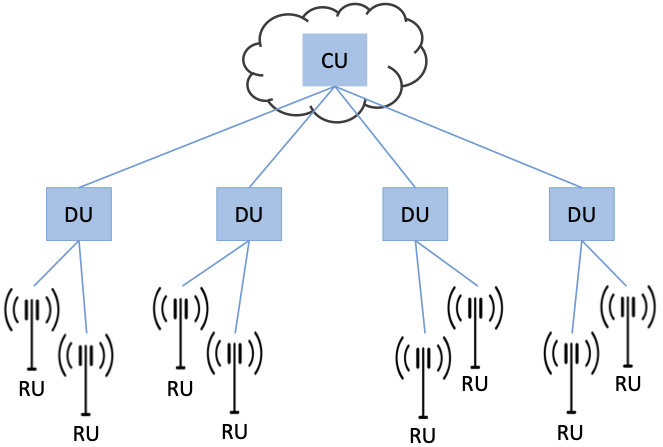
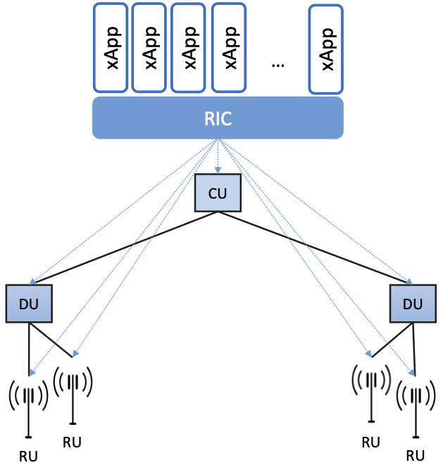
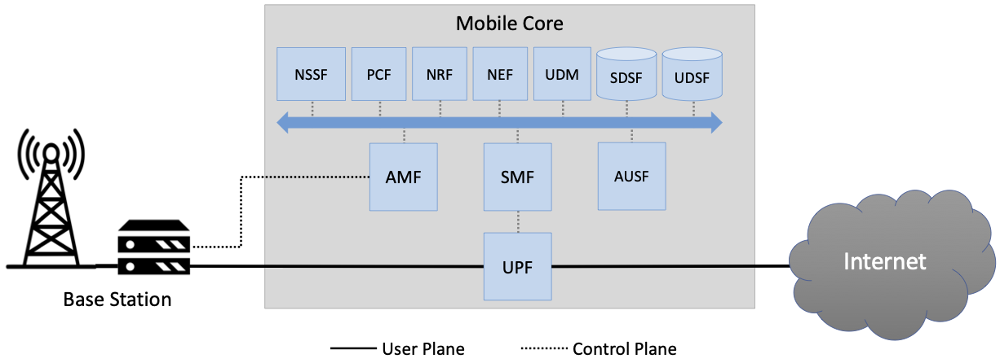

Chapter 9:  Access Networks
===========================

We now turn our attention to the latest emerging use case for SDN: the
Access Network. This includes both Fiber-to-the-Home and the Mobile
Cellular Network. It is still early (production deployments are just
now being rolled out), but the opportunity is substantial. This
chapter describes two examples—*Passive Optical Networks (PON)* and
*Radio Access Networks (RAN)*—the technologies at the core of
Fiber-to-the-Home and the Mobile Cellular Network, respectively.

9.1 Background
-------------------

The technologies used to implement the *last mile* networks connecting
homes, businesses, and mobile devices to the Internet have evolved
independently from the rest of the Internet. This evolution, which has
spanned decades, started with support for circuit-based voice
communication and then incrementally added support for IP-based data
communication.  The end result is a baroque collection of
purpose-built devices that look quite unfamiliar to anyone that
understands how to build a network out of a collection of L2/L3
Ethernet switches.

But this makes the access network fertile ground for SDN. To
understand what this means, we need to start with a brief overview of
the legacy systems being replaced. We do this in the context of the
two specific access technologies mentioned in the introduction: PON
and RAN. Fortunately, from our 10,000-foot view, their respective
architectures are strikingly similar. Of course the details differ
significantly, but hiding (or even eliminating) gratuitous detail is
one of the main values that SDN brings to the table.

Before getting to the specifics, we need one more bit of context. ISPs
(e.g., Telco or Cable companies) that offer broadband service often
operate a national backbone, and connected to the periphery of that
backbone are hundreds or thousands of edge sites.  These edge sites
are commonly called *Central Offices* in the Telco world and *Head
Ends* in the cable world. Despite their names implying
“centralized” and “root of the hierarchy”, these sites are at the very
edge of the ISP’s network—the ISP-side of the last-mile that directly
connects to customers. The PON and RAN-based access networks are
anchored in these facilities.

9.1.1 Passive Optical Network
~~~~~~~~~~~~~~~~~~~~~~~~~~~~~~

A PON is a tree-structured, fiber-based network, starting with a
single device in one of the ISP's edge sites, and fanning out to reach
up to 1024 homes. PON gets its name from the fact that the splitters
are passive: they forward optical signals downstream and upstream
without actively storing-and-forwarding frames. Framing then happens
at the end-points, at the ISP’s premises in a device called an
*Optical Line Terminal* (OLT), and in individual homes in a device
called an *Optical Network Unit* (ONU).

:numref:`Figure %s <fig-pon>` shows an example PON, simplified to
depict just one ONU and one OLT. In practice, a Central Office would
include multiple OLTs, fanning out to thousands of customer homes.
:numref:`Figure %s <fig-pon>` also highlights one other detail, which
is a *BNG (Broadband Network Gateway)* connecting the access network
to the Internet. The BNG is a piece of Telco equipment that, in
addition to forwarding packets, also authenticates users,
differentiates the level of service delivered to each customer, and
meters traffic for the sake of billing.

.. _fig-pon:

   An example PON that connects OLTs in the Central Office
   to ONUs in homes and businesses.

Because the splitters are passive, PON implements a multi-access
protocol. Briefly, upstream and downstream traffic are transmitted on
two different optical wavelengths, so they are completely independent
of each other. Downstream traffic starts at the OLT and the signal is
propagated down every link in the PON. As a consequence, every frame
reaches every ONU. This device then looks at a unique identifier in
the individual frames sent over the wavelength, and either keeps the
frame (if the identifier is for it) or drops it (if not). Encryption
is used to keep ONUs from eavesdropping on their neighbors’ traffic.
Upstream traffic is then time-division multiplexed on the upstream
wavelength, with each ONU periodically getting a turn to transmit.

PON is similar to Ethernet in the sense that it defines a sharing
algorithm that has evolved over the years to accommodate higher and
higher bandwidths. G-PON (Gigabit-PON) is the most widely deployed
today, supporting a bandwidth of 2.25-Gbps. XGS-PON (10 Gigabit-PON)
is now being deployed.

9.1.2 Radio Access Network
~~~~~~~~~~~~~~~~~~~~~~~~~~

A RAN implements the last hop by encoding and transmitting data at
various bandwidths in the radio spectrum.  For example, traditional
cellular technologies range from 700 MHz to 2400 MHz, with new
mid-spectrum allocations now happening at 6 GHz and millimeter-wave
(mmWave) allocations opening above 24 GHz.

As shown in :numref:`Figure %s <fig-ran>`, the set of base stations in
a given geographic region (e.g., a metro-area) are connected to each
other, and back to the Mobile Core running in the Central Office. The
Mobile Core is like the BNG (at the highest level) in that it
serves as an IP gateway connecting the
access network to the Internet, as well as being responsible for
authentication, QoS, and billing. Unlike the BNG, the Mobile Core also
has responsibility for managing mobility (i.e., recording which base
station is currently serving each active device, managing handoffs
across base stations, and so on).

.. _fig-ran:

   A Radio Access Network (RAN) connecting a set of cellular devices
   (User Equipment—UEs) to a Mobile Core hosted in a Central Office.

The figure shows the Mobile Core and set of base stations
interconnected by a backhaul network. The technology used to implement
this backhaul is an implementation choice—e.g., it could be
ethernet-based or PON-based—but for our purposes, the important point
is that the RAN is effectively a regional packet-switched network,
overlaid on the backhaul, where the base stations are the "nodes" of
that overlay network. Packets are "routed" through this network to
reach the best base station(s) to serve each mobile device (User
Equipment or UE) at a given moment in
time.\ [#]_ These forwarding decisions are implemented by the base
stations, which make decisions about *handovers* (one base station
handing a given UE's traffic off to another), *load balancing* (a set
of base stations deciding which should serve a UE based on their
current load), and *link aggregation* (multiple base stations deciding
to jointly transmit to a given UE).

.. [#] We say "routed" in quotes because the decision is based on a
       combination of mobility tracking and monitoring how to most
       efficiently use the radio spectrum, as opposed to the
       shortest-path criteria typically used in wired networks. What's
       important, however, is that the base stations cooperatively
       implement a distributed decision-making algorithm, and then
       forward packets to each other based on those decisions.

9.1.3 Key Takeaways
~~~~~~~~~~~~~~~~~~~

There are three observations to make about these two network
technologies before we get to the question of how to apply SDN
principles. The first is the distinction between the "access network"
and the "IP gateway".  For example, Fiber-to-the-Home is implemented
by a combination of the PON and the BNG, and similarly, the 5G
Cellular Mobile Network is implemented by a combination of the RAN and
the Mobile Core. This chapter focuses on how to apply SDN to the PON
and RAN, but as we have already seen (briefly) in Section 7.4, SDN can
also be applied to the BNG and Mobile Core. Both are just enhanced IP
routers, with the new features implemented as extensions to the P4
program running in the switching fabric. We return to this topic in
the last section, where we describe the interplay between SD-Fabric
and access networks.

Second, because the PON is passive, there is no opportunity for
software control *inside* the network. Applying SDN to PON involves
software control of the end-points (i.e., the OLTs and ONUs) and
treating everything between these end-points as a passive
backplane. Moreover, because the ONU is a "dumb" device that responds
to directives from the OLT, this really boils down to disaggregating
the OLT.

Third, because the RAN is a packet-switched network that interconnects a
set of base stations (running as an overlay on the backhaul), there is
an opportunity for software control. This requires disaggregating the
base stations, which as as we will see later in this chapter, have
historically run a multi-layer protocol stack. Once disaggregated, the
pieces are then distributed throughout the network, with some elements
co-located with the radio antenna, and some elements co-located with
the Mobile Core in the Central Office. In other words, the plan is to
both "split" and "distribute" RAN functionality.

For a broad introduction into what’s involved in disaggregating 5G
mobile networks so they can be implemented in software, we recommend
the following companion book.

.. _reading_5g:
.. admonition:: Further Reading

   L. Peterson and O. Sunay.
   `5G Mobile Networks: A Systems Approach <https://5g.systemsapproach.org/>`__.
   June 2020.

9.2 SD-PON
-------------

The opportunity for applying SDN to PON hinges on the fact that the
OLTs are essentially
glorified L2 switches, outfitted with a different MAC-layer framing
protocol running on each switch port. And just as it's possible to buy
a bare-metal L2 switch built to OCP specifications, the same is now
true for OLTs. But there are three complications that we have to deal
with before we can realize a Software-Defined PON (SD-PON) in
practice.\ [#]_

.. [#] We call this SD-PON to be consistent with how all the other use
       cases are named in this book, but the actual ONF open source
       software project is called SEBA: SDN-Enabled Broadband Access.

The first is that a PON requires substantial configuration to be
loaded into each OLT, primarily so it knows what levels of service the
network is to support. The second is that the ONUs deployed to homes
are limited devices, controlled indirectly through the upstream OLTs
they connect to. The third is that network operators don't necessarily
have the luxury of a clean-slate deployment of only bare-metal
hardware, and must instead deal with an assortment of legacy devices.

To address these issues, the SD-PON architecture depicted in
:numref:`Figure %s <fig-sdpon>` has emerged.  Production networks
based on this design are now being deployed by Telcos throughout the
world.  For simplicity, the figure shows only a single OLT, but it is
connected to two fabric switches. The fabric is necessary to aggregate
the set of OLTs that are likely to be deployed in practice, and while
we postpone the details to Section 9.4, one could imagine these
switches being under the control of the SD-Fabric application
described in Chapter 7.  The following describes the high-points of
the rest of SD-PON architecture.

.. _fig-sdpon:

    Software-Defined PON architecture.

First, a hardware abstraction layer, called *VOLTHA (Virtual OLT
Hardware Abstraction)* sits between the Network OS (e.g., ONOS) and
the individual OLTs. VOLTHA exports a north-facing OpenFlow interface,
making it possible for ONOS to control an OLT like any other
SDN-capable device. Vendor-specific adaptors then translate between
OpenFlow and each OLT. In principle, this adaptation could have been
handled inside ONOS, which already has a robust southbound adaptor
framework, but VOLTHA was designed to be Network OS agnostic, and so
replicates much of that machinery.

There are many details VOLTHA must get right, but conceptually there
is nothing new here: control state flows down (e.g., assigning
subscribers to particular QoS classes) and monitoring state flows up
(e.g., recognizing when an ONU attaches or detaches).  There is one
major exception: loading a *Traffic Profile* (denoted *TP* in the
diagram) into the OLT. These profiles specify the set of QoS classes
the operator wants their PON to support. This is configuration state,
typically loaded when an OLT boots, and in principle, this again could
have been managed by ONOS using gNMI/gNOI.  OLTs do not currently
support a common API like gNMI at the per-device level, so this is
handled in a one-off way.

Finally, and most interestingly, because ONOS needs to be aware of the
ONUs, but they are not directly controllable using OpenFlow or any
other API, the architecture layers a switch abstraction on top of an
OLT and its connected set of ONUs. This is represented in
:numref:`Figure %s <fig-sdpon>` by the outer gray boxes. You can think
of this network-modeled-as-a-switch as having a set of network-facing
ports (these are called NNIs in the Telco world) and a set of
user-facing ports (these are called UNIs in the Telco world). ONOS
treats this aggregate as a logical switch, so whenever a customer
powers up the ONU in their home, ONOS will see a "port active" event
on the corresponding UNI, and take the appropriate actions. These
actions are implemented by the suite of SD-PON control apps shown in
the figure.

As for what these actions entail, they primarily correspond to work
involved in securely connecting a subscriber to the Internet. For
example, when an ONU comes online (corresponding to a port on the
logical switch becoming active), an 802.1X authorization sequence is
initiated, verifying that the ONU is registered to a known customer.
One outcome of a successful authorization is that the SD-PON
application instructs ONOS to set up a path through the fabric (with
the prescribed QoS profile) connecting that subscriber to the L2
network. Next, a home router connected to the ONU will then send a
DHCP request, both triggering an IP address assignment and causing
ONOS to set up a route through the fabric connecting that home router
to the upstream BNG (and hence, the rest of the Internet).

9.3 SD-RAN
-------------

Much of the early hype surrounding 5G is about the increase in
bandwidth it brings, but 5G’s promise is mostly about the transition
from a single access service (broadband connectivity) to a richer
collection of edge services and devices, including support for
immersive user interfaces (e.g., AR/VR), mission-critical applications
(e.g., public safety, autonomous vehicles), and the Internet-of-Things
(IoT). Many of these new applications will be feasible only if SDN
principles are applied to the RAN, resulting in increased feature
velocity. Because of this, mobile network operators are working to
make Software-Defined RAN (SD-RAN) happen.

.. _reading_sdran:
.. admonition:: Further Reading

   `SD-RAN Project
   <https://opennetworking.org/open-ran/>`__.
   Open Networking Foundation. August 2020.

To understand the technical underpinnings of SD-RAN, it is important
to recognize that the base stations that make up the RAN are, for all
practical purposes, specialized packet switches. The set of base
stations in a given geographic area coordinate with each other to
allocate the shared—and scarce—radio spectrum. They make
hand-off decisions, decide to jointly serve a given user (think of
this as a RAN variant of link aggregation), and make packet scheduling
decisions based on continual measurements of the signal quality. Today,
these are purely local decisions, but transforming it into a global
optimization problem is in SDN’s wheelhouse.

The idea of SD-RAN is for each base station to report locally
collected statistics about radio transmission quality back to a
central SDN controller, which combines information from a set of base
stations to construct a global view of how the radio spectrum is being
utilized. A suite of control applications—for example, one focused on
handoffs, one focused on link aggregation, one focused on load
balancing, and one focused on frequency management—can then use this
information to make globally optimal decisions, and push control
instructions back to the individual base stations. These control
instructions are not at the granularity of scheduling individual
segments for transmission (i.e., there is still a real-time scheduler
on each base station, just as an SDN-controlled ethernet switch still
has a local packet scheduler), but they do exert near real-time
control over the base stations, with control loops measured in less
than ten milliseconds.

9.3.1 Split RAN
~~~~~~~~~~~~~~~

To better see how this works, we start with a finer-grain view of the
packet processing pipeline running on each base station shown in
:numref:`Figure %s <fig-basestation>`. Note that the figure depicts
the base station as a pipeline (running left-to-right for packets sent
to the UE) but it is equally valid to view it as a protocol stack.

.. _fig-basestation:

    RAN processing pipeline, including both user and
    control plane components.

The key stages are as follows.

* **RRC (Radio Resource Control):** Responsible for configuring the
  coarse-grain and policy-related aspects of the pipeline. The RRC
  runs in the RAN’s control plane; it does not process packets on the
  user plane.

* **PDCP (Packet Data Convergence Protocol):** Responsible for
  compressing and decompressing IP headers, ciphering and integrity
  protection, and making an “early” forwarding decision (i.e.,
  whether to send the packet down the pipeline to the UE or forward
  it to another base station).

* **RLC (Radio Link Control):** Responsible for segmentation and
  reassembly, including reliably transmitting/receiving segments by
  implementing a form of ARQ (automatic repeat request).

* **MAC (Media Access Control):** Responsible for buffering,
  multiplexing and demultiplexing segments, including all real-time
  scheduling decisions about what segments are transmitted when. Also
  able to make a “late” forwarding decision (i.e., to alternative
  carrier frequencies, including WiFi).

* **PHY (Physical Layer):** Responsible for coding and modulation,
  including Forward Error Correction (FEC).

The last two stages in :numref:`Figure %s <fig-basestation>` (D/A
conversion and the RF front-end) are beyond the scope of this book.

The next step is to understand how the functionality outlined above is
partitioned between physical elements, and hence, “split” across
centralized and distributed locations. The dominant option has
historically been "no split," with the entire pipeline shown in
:numref:`Figure %s <fig-basestation>` running in the base station.
Going forward, the 3GPP standard has been extended to allow for
multiple split-points, with the partition shown in :numref:`Figure %s
<fig-split-ran>` being actively pursued by the operator-led O-RAN
(Open RAN) Alliance. It is the split we adopt throughout the rest of
this chapter.

.. _fig-split-ran:
.. figure:: figures/Slide57.png
    :width: 600px
    :align: center

    Split-RAN processing pipeline distributed across a
    Central Unit (CU), Distributed Unit (DU), and Radio Unit (RU).

This results in a RAN-wide configuration similar to that shown in
:numref:`Figure %s <fig-ran-hierarchy>`, where a single *Central Unit (CU)*
running in the cloud serves multiple *Distributed Units (DUs)*, each of
which in turn serves multiple *Radio Units (RUs)*. Critically, the RRC
(centralized in the CU) is responsible for only near-real-time
configuration and control decision making, while the Scheduler that is
part of the MAC stage is responsible for all real-time scheduling
decisions.

.. _fig-ran-hierarchy:

    Split-RAN hierarchy, with one CU serving multiple DUs,
    each of which serves multiple RUs.

Because scheduling decisions for radio transmission are made by the
MAC layer in real time, a DU needs to be “near” (within 1ms) the RUs
it manages. (You can't afford to make scheduling decisions based on
out-of-date channel information.) One familiar configuration is to
co-locate a DU and an RU in a cell tower. But when an RU corresponds
to a small cell, many of which might be spread across a modestly-sized
geographic area (e.g., a mall, campus, or factory), then a single DU
would likely service multiple RUs. The use of mmWave in 5G is likely
to make this later configuration all the more common.

9.3.2 RAN Intelligent Controller
~~~~~~~~~~~~~~~~~~~~~~~~~~~~~~~~

The RRC, shown in :numref:`Figure %s <fig-basestation>` as part of
each basestation and shown in :numref:`Figure %s <fig-split-ran>` as
part of the CU, represents the control plane of the RAN. The CU-based
configuration naturally maps onto SDN in that control decisions are
made centrally, but the goal is to do more than just recreate the
legacy set of RRC capabilities. We also want to pave the way for
introducing additional control functions, and to do this, SD-RAN
adopts a design that parallels the Network OS / Control App structure
used in other domains (and described throughout this book).

This results in the design depicted in :numref:`Figure %s
<fig-ric-overview>`, where *RAN Intelligent Controller (RIC)* is what
the O-RAN architecture documents call their centralized SDN Controller
(so we adopt this terminology in the discussion that follows). The
"Near-Real Time" qualifier indicates the RIC is part of 10-100 ms
control loop implemented in the CU, as opposed to the ~1 ms control
loop required by the MAC scheduler running in the DU.

.. _fig-ric-overview:

    The RIC centrally controls the elements in the split-RAN hierarchy.

Drilling down to the next level of detail, :numref:`Figure %s
<fig-ric>` shows an exemplar implementation based on a retargeting of
ONOS for the SD-RAN use case. Most notably, the ONOS-based RIC
supports a set of RAN-specific north- and south-facing interfaces,
similar in spirit (but not detail) to the interfaces described in
earlier chapters (e.g., gNMI, gNOI, OpenFlow). We discuss these
interfaces in the next subsection.

.. _fig-ric:

    O-RAN compliant RAN Intelligent Controller (RIC) built by adapting
    and extending ONOS.

.. sidebar:: O-RAN Alliance

   3GPP (3rd Generation Partnership Project) has been responsible for
   standardizing the mobile cellular network ever since 3G, and
   O-RAN (Open-RAN Alliance) is a consortium of mobile network
   operators defining an SDN-based implementation strategy for 5G.

   If you are wondering why there is an O-RAN Alliance in the first
   place, given that 3GPP is already the standardization body
   responsible for interoperability across the global cellular
   network, the answer is that over time 3GPP has become a
   vendor-dominated organization. O-RAN was created more recently by
   network operators (AT&T and China Mobile were the founding
   members), with the goal of catalyzing a software-based
   implementation that breaks the vendor lock-in dominating today’s
   marketplace.

   To be more specific, 3GPP defined the possible RAN split points,
   and O-RAN is specifying (and codifying) the corresponding
   interfaces.  The E2 interface in particular, which is architected
   around the idea of supporting different Service Models, is central
   to this strategy.  Whether the operators will be successful in
   their ultimate goal is yet to be seen.

As for the core, the ONOS-based RIC takes advantage of the Topology
Service (among others) described in Chapter 6, but it also introduces
two new services: *Control* and *Telemetry*. The Control Service,
which builds on the Atomix key/value store, manages the control state
for all the base stations and user devices, including which base
station is serving each user device, as well as the set of “potential
links” that could connect the device.  The Telemetry Service, which
builds on a *Time Series Database (TSDB)*, tracks all the link quality
information being reported back by the RAN elements. Various control
applications then analyze this data to make informed decisions
about how the RAN can best meet its data delivery objectives.

The example Control Apps (xApps) in :numref:`Figure %s <fig-ric>`
include a range of possibilities, but are not intended to be an
exhaustive list.  These functions—Link Aggregation Control,
Interference Management, Load Balancing, and Handover Control—are
currently implemented by individual base stations with only local
visibility, but they have global consequences. The SDN approach is to
collect the available input data centrally, make a globally optimal
decision, and then push the respective control parameters back to the
base stations for execution.

9.3.3 RIC Interfaces
~~~~~~~~~~~~~~~~~~~~

Returning to the three interfaces called out in :numref:`Figure %s
<fig-ric>`, each serves a purpose similar to the interfaces described
in earlier chapters. The first two, **A1** and **E2**, are well on
their way to being standardized by O-RAN. The third, denoted **xApp
SDK** in :numref:`Figure %s <fig-ric>`, is specific to the ONOS-based
implementation (and similar in spirit to Flow Objectives), although
the O-RAN has a long-term goal of converging on a unified API (and
corresponding SDK).

The A1 interface provides a means for the mobile operator's
management plane—typically called the *OSS/BSS (Operations Support
System / Business Support System)* in the Telco world—to configure the
RAN.  We have not discussed the Telco OSS/BSS up to this point, but it is
safe to assume such a component sits at the top of any Telco software
stack. It is the source of all configuration settings and business
logic needed to operate a network. You can think of it as the RAN
counterpart to gNMI/gNOI.

The Near-RT RIC uses the E2 interface to control the underlying RAN
elements, including the CU, DUs, and RUs. You can think of it as the
RAN counterpart to OpenFlow. A requirement of the E2 interface is that
it should be able to connect the Near-RT RIC to different types of RAN
elements from different vendors. This range is reflected in the API,
which revolves around a *Service Model* abstraction. The idea is that
each RAN element advertises a Service Model, which effectively defines
the set of RAN Functions the element is able to support. The RIC then
issues a combination of the following four operations against this
Service Model.

* **Report:** RIC asks the element to report a function-specific value setting.
* **Insert:** RIC instructs the element to activate a user plane function.
* **Control:** RIC instructs the element to activate a control plane function.
* **Policy:** RIC sets a policy parameter on one of the activated functions.

Of course, it is the RAN element, through its published Service Model,
that defines the relevant set of functions that can be activated, the
variables that can be reported, and policies that can be set.

Taken together, the A1 and E2 interfaces complete two of the three
major control loops of the RAN: the outer (non-real-time) loop has the
Non-RT RIC as its control point and the middle (near-real-time) loop
has the Near-RT RIC as its control point. The third (inner) control
loop, which is not shown in :numref:`Figure %s <fig-ric>`, runs inside
the DU: It includes the real-time Scheduler embedded in the MAC stage
of the RAN pipeline. The two outer control loops have rough time
bounds of >>1 s and >10 ms, respectively, and the real-time control
loop is assumed to be <1 ms.

Focusing on the outer two control loops, the Near RT-RIC opens the
possibility of introducing policy-based RAN control, whereby
interrupts (exceptions) to operator-defined policies would signal the
need for the outer loop to become involved. For example, one can
imagine developing learning-based controls, where the inference
engines for these controls would run as applications on the Near
RT-RIC, and their non-real-time learning counterparts would run
elsewhere. The Non-RT RIC would then interact with the Near-RT RIC to
deliver relevant operator policies from the Management Plane to the
Near RT-RIC over the A1 interface.

Finally, the xApp SDK, which in principle is the RAN counterpart of
Flow Objectives, is specific to the ONOS-based implementation. It is
currently little more than a "pass through" of the E2 interface, which
implies the xApps must be aware of the available Service Models. This
is problematic in that it implicitly couples applications with
devices, but defining a device-agnostic version is still a
work-in-progress.

9.4  Role of SD-Fabric
-----------------------------------

As outlined earlier in this chapter, both PON and RAN are paired with
an IP gateway that has been augmented with access-specific features.
This is because the operator at the edge of the network is responsible
for authorizing user access, differentiating the level of service
delivered to users, and potentially billing those users. The Mobile
Core has the added responsibility of tracking mobility as users move
from one base station to another.

Much of this additional functionality runs in the control plane (or
even the management plane), with the data plane behaving very much
like any other L3 network. This means the data plane can be
implemented by mechanisms seen in earlier chapters, or more
specifically, by the SD-Fabric solution described in Chapter 7.
Consider our two specific access technologies, and the implications
of each with respect to SD-Fabric.

The BNG that connects a PON to the Internet has a vendor-defined
control/management plane, as there is no need for a industry-wide
standard. The data plane requires support for Q-in-Q tagging as a
mechanism to differentiate subscriber service, which is one reason
SD-Fabric provides this capability. This means the fabric switches
shown in :numref:`Figure %s <fig-sdpon>` are exactly the same fabric
switches as shown in :numref:`Figure %s <fig-seba>` (from Chapter 2)
and :numref:`Figure %s <fig-netconfig>` (from Chapter 7). In other
words, SD-Fabric both connects the OLTs to the Internet and
interconnects a set of servers that host the BNG control and
management functions (along with any other *Virtual Network Functions*
that the operator wants to run at the edge).

The Mobile Core that connects a RAN to the Internet is standardized by
3GPP, making it a well-defined example to discuss (albeit at a
high-level since the full 3GPP specification is well beyond the scope
of this book). :numref:`Figure %s <fig-core>` gives an architectural
overview, identifying the functional blocks that make up the 5G Mobile
Core.

.. _fig-core:

    Architectural overview of the 5G Mobile Core.

The main point to take from this diagram is that the *UPF (User Plane
Function)* implements the data plane (which 3GPP calls the *User
Plane*). Everything else is a control plane function, where broadly
speaking, AMF is responsible for mobility management, SMF is
responsible for session management, and AUSF is responsible for
authentication. All the other functional blocks correspond to
low-level processes that AMF, SMF, and AUSF call to do their job, but
for our purposes, you can think of the entire set as
microservices running on commodity servers. For more details about the
Mobile Core control plane, as well as examples of specific
implementation choices, we recommend the *Magma* and *SD-Core* open
source projects.

.. _reading_core:
.. admonition:: Further Reading

   `Magma Core Project <https://www.magmacore.org/>`__.
   Linux Foundation. 2021.

   `SD-Core Project  <https://opennetworking.org/sd-core/>`__.
   Open Networking Foundation. 2021.

What is important to our discussion is that while the UPF can also be
implemented as a server-hosted microservice—just like any
software-based router—because we have access to a programmable
switching fabric, we can offload that function to the switches. This
is exactly what the ``upf`` extension to ``fabric.p4`` shown in
Section 7.4 does.

But what is this extra functionality beyond forwarding IP packets? UPF
performs three additional tasks. First, it encapsulates/decapsulates
packets sent between to/from the base stations. These are
GTP-over-UDP/IP encapsulated packets. Second, it queues packets
according to the different QoS levels the operator wants to provide.
Both of these tasks can be implemented in a straightforward way in P4
and the underlying programmable switches. The third task is to "hold"
packets destined for a UE that has recently moved, so that no packets
are dropped during the period of time the corresponding session state
is in transition. This is not something that today's P4 switches are
able to support. So instead, the switch temporarily redirects those
packets to a server for hold-and-replay, or alternatively, to a
SmartNIC connected to those servers. MacDavid and colleagues describe
the mechanism for doing this is more detail.

.. _reading_upf:
.. admonition:: Further Reading

   R. MacDavid, *et al.* `A P4-based 5G User Plane Function
   <https://dl.acm.org/doi/10.1145/3482898.3483358>`__.
   ACM SOSR. September 2021.

The main takeaway from this discussion is that access networks and
switching fabrics are complementary use cases for SDN that can work in
tandem. The switching fabric not only interconnects servers that host
access network control plane functionality (including the RIC and
xApps), but the fabric also runs some data plane functionality on
behalf of the access networks. When you combine all these use cases,
the end result is an *access-edge cloud*: a modest-sized cluster built
from commodity servers and switches, deployed in enterprises and other
edge sites, and able to host both access network workloads and edge
service workloads. Aether is an open source example of such an edge
cloud, combining SD-Fabric, SD-RAN, and SD-Core in a self-contained
package that can be deployed in enterprises and managed as a cloud
service.

.. _reading_aether:
.. admonition:: Further Reading

   `Aether: 5G-Connected Edge  <https://opennetworking.org/aether/>`__.
   Open Networking Foundation. 2021.
