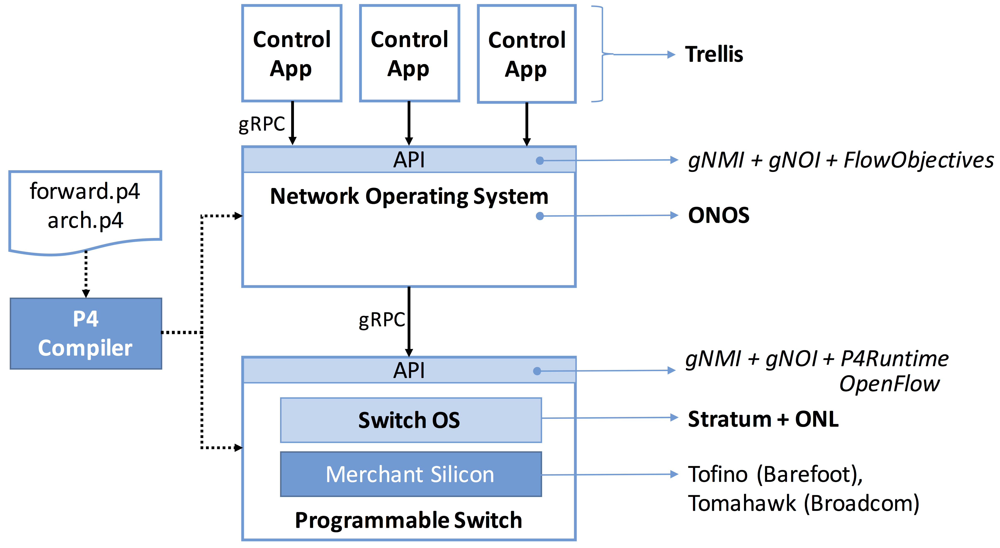
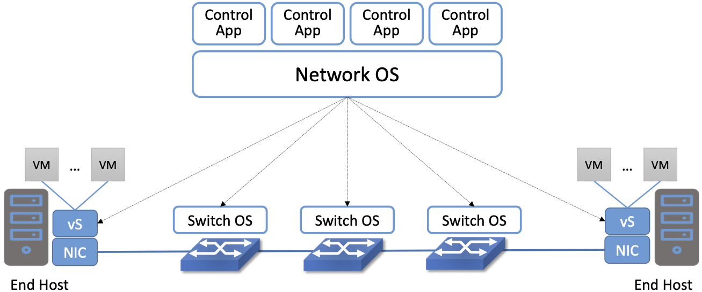
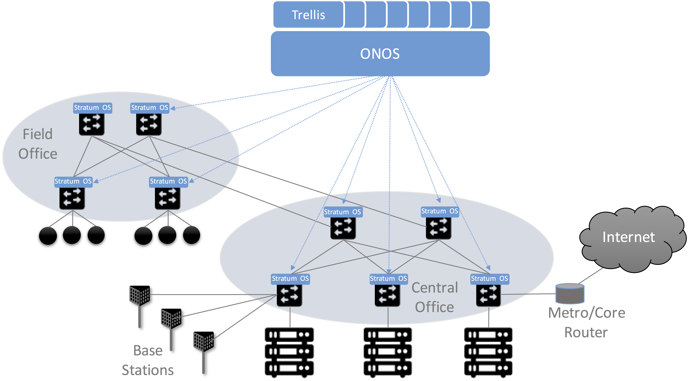

Chapter 3:  Basic Architecture
===============================

SDN is an approach to building networks that favors programmable
commodity hardware, with the intelligence that forwards packets—as
well as controls packet forwarding—implemented in software. Realizing
such a design is independent of any particular protocol stack, but
instead requires a set of open APIs and a new collection of software
components that support those APIs. This chapter introduces the basic
architecture of such an *SDN software stack*.

This chapter defines the general architecture of such a software
stack, and while there are multiple options for the specific
components and tools that can be plugged into this architecture, it
also introduces an example set. We do this to make the discussion more
concrete, but the particular components we describe two important
attributes. One, they are open source and freely available on
GitHub. Two, they are designed to work together, providing a
comprehensive solution; there are no gaps in our story. Both
attributes make it possible for *anyone* to build the same end-to-end
system that is running today in production networks.

3.1 Software Stack
-------------------

An overview of the software stack is given in :numref:`Figure %s
<fig-stack>`, which includes a *White-Box Switch* running a local
*Switch OS*, controlled by a global Network OS hosting a collection of
*Control Applications*. :numref:`Figure %s <fig-stack>` also calls out
a corresponding set of exemplar open source components (*Trellis*,
*ONOS*, and *Stratum*) on the right, as well as a related *P4
Toolchain* on the left. This chapter introduces these components, with
later chapters giving more detail.

Note the similarity between this diagram and :numref:`Figure %s
<fig-market2>` in Chapter 1, both of which include two open
interfaces: one between the Control Apps and the Network OS, and a
second between the Network OS and the underlying white-box
switches. These two interfaces are depicted as “API shims” in
:numref:`Figure %s <fig-stack>`, and in the context of the exemplar
components, correspond to a combination of *gNMI*, *gNOI* and
*FlowObjective* in the first case, and a combination of *gNMI*, *gNOI*
and either *P4Runtime* or *OpenFlow* in the second case. That gRPC is
shown as the transport protocol for these two APIs is an
implementation choice, but one that we will take for granted from here
on.

.. _fig-stack:

    Overall architecture of the SDN software stack.

It is important to keep in mind that the software components listed in
:numref:`Figure %s <fig-stack>` correspond to active open source
projects, and as a consequence, they continue to evolve (as do their
APIs). Specific versions of each component—and their associated
APIs—have been integrated and deployed into both trial and production
environments. For example, while the figure shows P4Runtime as a
candidate control interface exported by the Switch OS, there are
deployed solutions that use OpenFlow instead. (This includes the
Comcast deployment.) Similarly, while the figure shows gNMI/gNOI as
the config/ops interface to each switch, there are solutions that use
NETCONF instead.

For the purpose of this book, we do not attempt to track all possible
combinations of component versions and APIs, but opt instead to focus
on the single consistent stack enumerated in :numref:`Figure %s
<fig-stack>`, since it represents our best judgement as to the “right”
approach based on experience (so far) with earlier versions up-and-down
the stack.

3.1.1 Switch vs Host Implementation
~~~~~~~~~~~~~~~~~~~~~~~~~~~~~~~~~~~~~~~~~~~~~

The top-to-bottom view of the software stack shown in :numref:`Figure
%s <fig-stack>` is from the perspective of a single switch, but it is
important to also keep the network perspective in
mind. :numref:`Figure %s <fig-e2e>` gives such a perspective by
focusing on an end-to-end path through the network, connecting a pair
of VMs.

.. _fig-e2e:

    End-to-End Perspective of a Software-Defined Network, including
    the end hosts and the Virtual Machines (VMs) they host.

This perspective highlights two important aspects of the system. The
first re-enforces the point we’ve been making: that the Network OS
(e.g., ONOS) is network-wide, while the Switch OS (e.g., Stratum) is
per-switch.

The second is that part of the SDN software stack runs on the end
hosts. In particular, there is a *Virtual Switch (vSwitch)*\
—typically implemented in software as part of the Virtual Machine
Hypervisor running on the server—that is responsible for forwarding
packets to and from the VMs running on that server. Just like a
physical switch, the vSwitch forwards packets from input port to
output port, but these are virtual ports connected to VMs rather than
physical ports connected to physical machines.

Fortunately, we can view a vSwitch as behaving just like a physical
switch, including the APIs it supports. That a vSwitch is implemented
in software on a general-purpose processor rather than in an ASIC is
an implementation detail. While this is a true statement, being a
software switch dramatically lowers the barrier to introducing
additional features, so the feature set is both richer and more
dynamic. For example, *Open vSwitch (OvS)* is a widely-used open
source vSwitch that has been integrated with an assortment of
complementary tools. One example is DPDK, another open source
component that optimizes the path from network device to/from
processes running in user space on the host OS. Although it’s an
important topic, this book does not explore the full range of
possibilities for a vSwitch like OvS or other end-host optimizations,
but instead treats it just like any other switch along the end-to-end
path.

Another implementation detail shown in :numref:`Figure %s <fig-e2e>`
is that the host may have a *Smart Network Interface Card (SmartNIC)*
that assists (or possibly even replaces) the vSwitch. Vendors have a
long history of off-loading kernel functionality onto NICs (e.g.,
everything from computing TCP/IP checksums to supporting VMs), but in
the SDN context, the interesting possibility is to replicate the
forwarding pipeline found on the network switches. Again, there are a
range of possible implementation choices, including both FPGA and
ASIC, as well as whether the NIC is fixed-function or programmable
(using P4). For our purposes, we will treat such Smart NICs as yet
another switching element along the end-to-end path.

3.2 White-Box Switch
-------------------------

Starting at the bottom and working our way up the stack shown in
:numref:`Figures %s <fig-stack>` and :numref:`%s <fig-e2e>`, the
network data plane is implemented by an interconnected set of
white-box switches. Our focus for now is on a single switch, where the
overall network topology is dictated by the Control Applications
running at the top of the software stack. For example, we describe a
Control Application that manages a leaf-spine topology in a later
section.

The architecture is agnostic as to the switch vendor, but the full
software stack outlined in this chapter runs on switches built using
Tofino and Tomahawk switching chips manufactured by Barefoot Networks
(now an Intel company) and Broadcom, respectively. The Tofino chip
implements a programmable forwarding pipeline based on PISA, while the
Tomahawk chip implements a fixed-function pipeline.

In the case of both chips, a pair of P4 programs defines the
forwarding pipeline. The first (``forward.p4``) specifies the
forwarding behavior. The second (``arch.p4``) specifies the logical
architecture of the target forwarding chip. The P4 compiler
generates target files that are loaded into both the Network OS and
the switch. These target files are not named in :numref:`Figure %s
<fig-stack>` (we will return to the details in Chapters 4 and 5), but
both components need to know about the output because one *implements*
the forwarding behavior (the switch), and the other *controls* the
forwarding behavior (the Network OS).

We return to the details of the compiler toolchain in Chapter 4, which
includes answering the question of why we need a P4 program in the
case of a fixed-function switching chip. To preview that discussion,
P4 programs are written to an abstract model of the forwarding
pipeline, and whether the chip’s actual hardware pipeline is fixed or
programmable, we still need to know how to map the abstract pipeline
onto the physical pipeline. This is where ``arch.p4`` plays a role. As
for the role of ``forward.p4``, this program actually prescribes the
pipeline in the case of a programmable chip, whereas for the
fixed-function chip, ``forward.p4`` merely describes the pipeline. But
we still need ``forward.p4`` in both cases because the toolchain uses
it to generate the API that sits between the control and data planes.

3.3 Switch OS
-------------------

Moving up from the base hardware, each switch runs a local Switch
OS. Not to be confused with the Network OS that manages a network of
switches, this Switch OS runs on a commodity processor internal to
the switch (not shown in :numref:`Figure %s <fig-stack>`). It is
responsible for handling API calls issued to the switch, for example
from the Network OS. This includes taking the appropriate action on
the switch’s internal resources, which sometimes affects the switching
chip.

Multiple open source Switch OSes are available (including SONiC,
originally developed at Microsoft Azure), but we use a combination of
Stratum and *Open Network Linux (ONL)* as our primary example. ONL is
a switch-ready distribution of Linux (originally prepared by
BigSwitch), while Stratum (originally developed at Google) is
primarily responsible for translating between the external-facing API
and the internal switch resources. For this reason, we sometimes refer
to Stratum as a *Thin Switch OS*.

Stratum mediates all interactions between the switch and the outside
world. This includes loading the target files generated by the P4
compiler, which defines a contract between the data plane and the
control plane. This contract effectively replaces OpenFlow’s flow rule
abstraction with an auto-generated specification. The rest of the
Stratum-managed API is defined as follows:

* **P4Runtime:** An interface for controlling forwarding behavior at
  runtime. It is the key for populating forwarding tables and
  manipulating forwarding state, and it does so in a P4 program and
  hardware agnostic way. (For completeness, :numref:`Figure %s
  <fig-stack>` also lists OpenFlow as an alternative control interface.)
  
* **gNMI (gRPC Network Management Interface):** Used to set and
  retrieve configuration state. gNMI is usually paired with OpenConfig
  YANG models that define the structure of the configuration and state
  tree.
  
* **gNOI (gRPC Network Operations Interfaces):** Used to set and
  retrieve operational state, for example supporting certificates
  management, device testing, software upgrades, and networking
  troubleshooting.
  
If you recall the distinction between Control and Configuration
introduced in Chapter 1, then you will recognize P4Runtime as the
Control API and the gNMI/gNOI combination as a modern version of a
switch’s traditional Configuration API. This latter API has
historically been called the OAM interface (for “Operations,
Administration, and Maintenance”), and it has most often been
implemented as a command-line interface.

3.4 Network OS
-------------------

The Network OS is a platform for configuring and controlling a network
of white-box switches. It runs off-switch as a logically centralized
SDN controller, and manages a set of switches on a network-wide
basis. Central to this role is responsibility for monitoring the state
of those switches (e.g., detecting port and link failures),
maintaining a global view of the topology that reflects the current
state of the network, and making that view available to any interested
Control Apps. Those Control Apps, in turn, “instruct” the Network OS
to control packet flows through the underlying switches according to
whatever service they are providing. The way these “control
instructions” are expressed is a key aspect of the Network OS’s API.

Going beyond this conceptual description requires a specific Network
OS, and we use *ONOS (Open Network Operating System)* as our
exemplar. ONOS is best-of-breed in terms of performance, scalability,
and availability. At a high-level, ONOS takes responsibility for three
things:

* **Managing Topology:** Tracks inventory of network infrastructure
  devices and their interconnection to provide a shared view of the
  network environment for the rest of the platform and applications.
  
* **Managing Configuration:** Facilitates issuing, tracking, rolling
  back, and validating atomic configuration operations on multiple
  network devices. This effectively mirrors the per-switch
  configuration and operation interfaces (also using gNMI and gNOI),
  but does so at the network level rather than the device level.
  
* **Controlling Switches:** Allows shaping the data plane packet
  processing pipelines of the network switches and subsequent control
  of flow rules, group, meters and other building blocks within those
  pipelines.
  
With respect to this last role, ONOS exports a northbound
*FlowObjectives* abstraction, which generalizes Flow Rules in a
pipeline-independent way.\ [#]_ This interface, which Chapter 6
describes in more detail, is not standardized in the same way as the
control interface exported by individual switches. As with a
conventional OS running on a server, applications written to the ONOS
API do not easily port to another Network OS. The requirement is that
this interface be open and well-defined; not that there be just one
such interface. If over time there is consensus about the Network OS
interface, then applications will be more easily portable. But just as
with server operating systems, the higher one goes up the software
stack, the more difficult it becomes to reach such a consensus.

.. [#] We make no claim that FlowObjectives are an ideal interface for
       controlling a switch. They evolved out of necessity, allowing
       developers to deal with different pipelines. Defining a general
       interface is the subject of ongoing research.

Finally, although :numref:`Figure %s <fig-stack>` does not show any
details about the internals of ONOS, to better appreciate the role it
plays in the larger scheme of things, we note that the most critical
subsystem in any Network OS is a *Scalable Key/Value Store*. Because
ONOS provides a logically centralized view of the network, the key to
its performance, scalability, and availability is how it stores that
state. In the case of ONOS, this store is provided by a companion open
source project, called Atomix, which implements the RAFT consensus
algorithm. Storage services like Atomix are the cornerstone of nearly
all horizontally scalable cloud services today, as Chapter 6 describes
in more detail.

3.5 Leaf-Spine Fabric
---------------------------

Because we use ONOS as the Network OS, we are limited to ONOS-hosted
SDN Control Applications. For illustrative purposes, we use Trellis as
that Control App. Trellis implements a *leaf-spine* fabric on a
network of white-box switches. This means Trellis dictates a
particular network topology: a leaf-spine topology common to
datacenter clusters. As outlined in Section 2.3, this topology
includes a set of leaf switches, each of which serves as a Top-of-Rack
switch (i.e., it connects all the servers in a single rack), where the
leaf switches are, in turn, interconnected by a set of spine switches.

At a high level, Trellis plays three roles. First, it provides a
switching fabric that interconnects servers—and the VMs running on
those servers—in a multi-rack cluster. Second, it connects the cluster
as a whole upstream to peer networks, including the Internet, using
BGP (i.e., it behaves much like a router). Third, it connects the
cluster as a whole to downstream access networks (i.e., it terminates
access network technologies like PON and LTE/5G). In other words,
instead of thinking about Trellis as a conventional leaf-spine fabric
that’s locked away in some datacenter, Trellis is best viewed an
interconnect running at the network edge, helping to bridge
access-specific edge clouds to IP-based datacenter clouds.

In terms of implementation, Trellis actually corresponds to a suite of
Control Apps running on ONOS, as opposed to a single app. This suite
supports several control plane features, including:

* VLANs and L2 bridging
* IPv4 and IPv6 unicast and multicast routing
* DHCP L3 relay
* Dual-homing of servers and upstream routers
* QinQ forwarding/termination
* MPLS-based pseudowires.
  
For each of these features, the corresponding Control App interacts
with ONOS—by observing changes in the network topology and issuing
Flow Objectives—rather than by using any of the standard protocol
implementations found in legacy routers and switches. The only time a
legacy protocol is involved is when Trellis needs to communicate with
the outside world (e.g., upstream metro/core routers), in which case
it uses standard BGP (as implemented by the open source Quagga
server).

.. _fig-trellis:

    Trellis suite of control apps managing a (potentially distributed)
    leaf-spine fabric.

Finally, Trellis is sometimes deployed at a single site with multiple
mobile base stations connected via Trellis leaf-switches. But Trellis
can also be extended to multiple sites deeper into the network using
multiple stages of spines, as shown in :numref:`Figure %s
<fig-trellis>`. Chapter 7 describes all of this in more detail.
