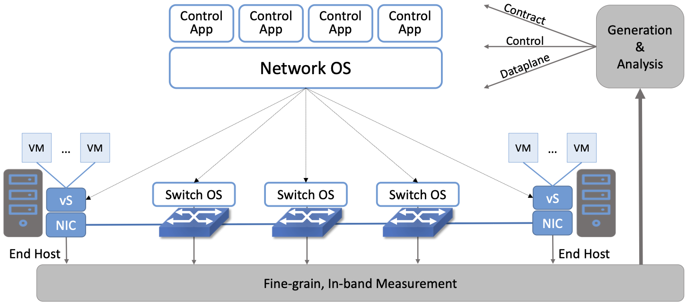
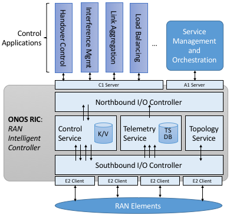

Chapter 8:  Future of SDN
===========================

It is still early days for SDN. Cloud-hosted control planes are being
deployed in production networks, but we are only just starting to see
SDN being trialed in access networks and programmable pipelines being
used to introduce new data plane functionality. As the technology
matures and the APIs stabilize we expect to see increased adoption,
but it may be new use cases still on the horizon that have the biggest
impact on the role SDN eventually plays. This chapter looks at two
promising examples.

8.1 Verifiable Networks
-----------------------

Networks are notoriously difficult to make verifiably robust and
secure against failures, attacks, and configuration mistakes. Despite
progress on application-level security, little has been done to
address the security and robustness of the underlying network
infrastructure. And despite progress making computer networks more
programmable, most networks are still built using closed/proprietary
software and complex/fixed-function hardware, whose correctness is
hard to prove and whose design has unknown provenance.

The emergence of 5G networks and applications will only exacerbate the
situation. 5G networks will connect not only smart phones and people,
but also everything from doorbells, to lights, refrigerators,
self-driving cars, and drones. If we cannot secure these networks, the
risk of cyber disasters is much worse than anything experienced to
date.

The most critical capability for securing the Internet is verifiability:
the ability to ensure that every packet in the network follows an
operator-specified path and encounters only a set of forwarding rules
within every device that the operator intended. Nothing more and
nothing less.

Experience has shown that verification works best in settings where
the overall system is constructed in a compositional (i.e.,
disaggregated) manner. Being able to reason about small pieces makes
verification tractable, and the reasoning needed to stitch the
components together into the composite system can also lead to
insights. With disaggregation as the foundation, verifiability follows
from (a) the ability to state intent, and (b) the ability to observe
behavior at fine granularity and in real-time. This is exactly the
value SDN brings to the table, which leads to optimism that
*verifiable closed-loop control* is now within reach.

.. _fig-closed-loop:

    INT generates fine-grain measurements, which in turn feed a closed
    control loop that verifies the network’s behavior.

:numref:`Figure %s <fig-closed-loop>` illustrates the basic idea.  The
software stack described in this book is augmented with the
measurement, code generation, and verification elements needed for
verifiable closed-loop control. Fine-grained measurements can be
implemented using INT (Inband Network Telemetry), which allows every
packet to be stamped by the forwarding elements to indicate the path
it took, the queueing delay it experienced, and the rules it matched.
These measurements can then be analyzed and fed back into code
generation and formal verification tools. This closed loop complements
the intrinsic value of disaggregation, which makes it possible to
reason about correctness-by-construction.

.. sidebar:: Top-Down Verification
	     
   The approach to verifying networks described in this section is
   similar the one used in chip design. At the top is a behavorial
   model; then at the register-transfer level is a Verilog or VHDL
   model; and eventually at the bottom are transistors, polygons and
   metal. Tools are used to formally verify correctness across each
   boundary and abstraction level.

   This is a model for what we are talking about here: Verifying
   across boundaries in a top-down design approach. This is made
   possible by the new SDN interfaces and abstractions defined by the
   software stack, which extends all the way to the programmable
   forwarding pipelines provided by the switching chip.

   As experience with hardware verification demonstrates, this
   approach works best in composed systems, where each minimal
   component can be verified or reliably tested on its own. Formal
   tools are then applied as components are composed at layer
   boundaries.

The goal is to enable network operators to specify a network’s
behavior top-down, and then verifying the correctness across each
interface. At the lowest level, P4 programs specify how packets are
processed; these programs are compiled to run on the forwarding plane
elements. Such an approach represents a fundamental new capability
that has not been possible in conventional designs, based on two key
insights.

First, while network control planes are inherently complicated, a P4
data plane captures *ground truth* for the network—i.e., how it
forwards packets—and is therefore an attractive platform for deploying
verification technologies. By observing and then validating behavior
at the data plane level, it is possible to reduce the trusted
computing base: the switch operating system, driver, and other
low-level components do not need to be trusted. Moreover, whereas the
control plane tends to be written in a general-purpose language and is
correspondingly complex, the data plane is necessarily simple: it is
ultimately compiled to an efficient, feed-forward pipeline
architecture with simple data types and limited state. While verifying
general-purpose software is impossible in the general case, data plane
verification is both powerful and practical.

This claim of practicality is grounded in the current
state-of-the-art.  Once the forwarding behavior is defined and known,
then forwarding table state defines forwarding behavior. For example,
if everything is known to be IPv4 forwarded, then the forwarding table
state in all routers is enough to define the network behavior. This
idea has been reduced to practice by techniques like Veriflow and
Header Space Analysis (HSA), and is now available commercially.
Knowing that this state is enough to verify networks with fixed
forwarding behavior means that we are "merely" adding one new
degree-of-freedom: allowing the network operator to program the
forwarding behavior (and evolve it over time) using P4. The use of P4
to program the data plane is key: the language carefully excludes
features such as loops and pointer-based data structures, which
typically make analysis impractical. To read more about the
opportunity, we recommend the following paper:

.. _reading_p4:
.. admonition:: Further Reading

   `p4v: Practical Verification for Programmable Data Planes
   <http://yuba.stanford.edu/~nickm/papers/p4v.pdf>`__. ACM
   SIGCOMM 2018.

The second insight is that, in addition to building tools for
analyzing network programs, it is important to also develop
technologies that provide higher levels of assurance through
*defense-in-depth*. This addresses one of the main weaknesses of
current approaches to network verification—they are based on
mathematical models of the network components, and therefore can
produce incorrect answers when those components behave in different
ways than are captured in the model. By exploiting the ability of P4
data planes to collect rich telemetry and other monitoring data, it is
possible to develop network verification tools that combine
statically-verified components with runtime verification.

.. _fig-phase3:

    Projecting into the future, with Phase 3 of SDN focusing on
    verifiable, top-down control of network behavior.

To put this all in an historical context, Section 1.3 suggests we are
now in the second phase of SDN. :numref:`Figure %s <fig-phase3>`
extends this into the future with a third phase, during which
verifiable closed loop control will empower network operators to take
full ownership of the software that defines their networks. This gives
network owners the ability to tailor their networks in ways that
differentiate them from their competitors.

8.2 SD-RAN
----------

Much of the early hype surrounding 5G is about the increase in
bandwidth it brings, but 5G’s promise is mostly about the transition
from a single access service (broadband connectivity) to a richer
collection of edge services and devices, including support for
immersive user interfaces (e.g., AR/VR), mission-critical applications
(e.g., public safety, autonomous vehicles), and the Internet-of-Things
(IoT). Many of these new applications will be feasible only if SDN
principles are applied to the Radio Access Network (RAN), resulting in
increased feature velocity. Because of this, mobile network operators
are working to make Software-Defined RAN (SD-RAN) happen.

To understand SD-RAN at a technical level, it is important to
recognize that the base stations that make up the RAN are, for all
practical purposes, packet forwarders. The set of base stations in a
given geographic area coordinate with each other to allocate the
shared—and extremely scarce—radio spectrum. They make hand-off
decisions, decide to jointly serve a given user (think of this as a
RAN variant of link aggregation), and make packet scheduling decisions
based on the observed signal quality. Today these are purely local
decisions, but transforming it into a global optimization problem is
in SDN’s wheelhouse.

The idea of SD-RAN is for each base station to report locally
collected statistics about radio transmission quality back to a
central SDN controller, which combines information from a set of base
stations to construct a global view of how the radio spectrum is being
utilized. A suite of control applications—for example, one focused on
handoffs, one focused on link aggregation, one focused on load
balancing, and one focused on frequency management—can then use this
information to make globally optimal decisions, and push control
instructions back to the individual base stations. These control
instructions are not at the granularity of scheduling individual
segments for transmission (i.e., there is still a real-time scheduler
on each base station, just as an SDN-controlled ethernet switch still
has a local packet scheduler), but they do exert near real-time
control over the base stations, with control loops measured in less
than ten milliseconds.

.. _fig-ric:

    3GPP-compliant RAN Intelligent Controller (RIC) built by adapting
    and extending ONOS.

Like the verified closed-loop control example, the scenario just
described is within reach, with a retargeting of ONOS at the SD-RAN
use case already underway. :numref:`Figure %s <fig-ric>` shows the
design, which introduces some new components, but largely builds on
the existing ONOS architecture. In some cases, the changes are
superficial. For example, ONOS adopts terminology coming out of the
3GPP and O-RAN standardization bodies,\ [#]_ most notably, that the
NOS is called a *RAN Intelligent Controller (RIC)*. In other cases,
it’s a matter of adopting standardized interfaces: the **C1**
interface by which control applications communicate with the RIC, the
**A1** interface by which the operator configures the RAN, and the
**E2** interface by which the RIC communicates with the underlying RAN
elements. The details of these interfaces is beyond the scope of this
book, but the important takeaway for our purposes is that they are no
different than supporting any other standard north- and south-facing
interface (e.g., gNMI, gNOI, OpenFlow).

.. [#] 3GPP (3rd Generation Partnership Project) has been responsible for
       standardizing the mobile cellular network ever since 3G, and
       O-RAN (Open-RAN Alliance) is a consortium of mobile network
       operators defining an SDN-based implementation strategy for 5G.

The ONOS-based RIC takes advantage of the Topology Service described
in Chapter 6, but it also introduces two new services: *Control* and
*Telemetry*. The Control Service, which builds on the Atomix key/value
store, manages the control state for all the base stations and user
devices, including which base station is serving each user device, as
well as the set of  “potential links” that could connect the device.
The Telemetry Service, which builds on a *Time Series Database
(TSDB)*, tracks all the link quality information being reported back
by the RAN elements. Various of the control applications then analyze
this data to make informed decisions about how the RAN can best meet
its data delivery objectives.

For more information about what’s involved in disaggregating 5G mobile
networks so they can be implemented in software, we recommend a
companion book:

.. _reading_5g:
.. admonition:: Further Reading

   `5G Mobile Networks: A Systems Approach
   <https://5g.systemsapproach.org/>`__. March 2020.

Finally, circling back to the previous section, applying closed-loop
verification to a disaggregated and software-defined cellular network
is the next obvious thing to do.
