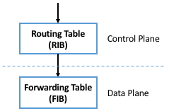

Chapter 1:  Introduction
===========================

Software-Defined Networking (SDN) is an approach to how we *implement*
networks, which matters because it impacts the pace of
*innovation*. SDN does not directly address any of the technical
challenges of routing, congestion control, traffic engineering,
security, mobility, reliability, or real-time communication, but it
does open new opportunities to create and deploy innovative solutions
to these and similar problems. Exactly how SDN accomplishes this has
both business and technical implications, which we discuss throughout
this book.

Our approach is to view SDN through a *systems lens*, which is to say,
we explore the collection of design principles that guide the journey
to realizing software-defined networks (a journey that is still in
progress), rather than to talk about SDN as though it were a point
solution. Our approach emphasizes concepts (bringing abstractions to
networking is a key part of the original case for SDN), but to keep
the discussion concrete, we also draw on our experience implementing a
collection of open source platforms over the last six years. These
platforms are being used to deliver SDN-based solutions into
production networks, including Tier-1 network operators.

This focus on the software stack is a central theme of the
book. Because SDN is an approach to building networks, a set of
software and hardware artifacts is required to put that approach into
practice.  The open source examples we draw upon are available on
GitHub, with links to both code and on-hand programming exercises
available throughout the book.

.. _code_overview:
.. admonition:: Programming Exercises

   A collection of programming exercises, tied to the material in this
   book. To get started, set up the execution environment as outlined
   `here
   <https://github.com/opennetworkinglab/ngsdn-tutorial/blob/advanced/README.md>`__.

Before getting into the details, it is helpful to understand the
origin story for SDN, which started as an effort by the Computer
Science research community to address the ossification of the
Internet, opening it up to more rapid innovation. That history is
well-documented in an article by Feamster, Rexford, and Zegura:

.. _reading_history:
.. admonition:: Further Reading

   `The Road to SDN: An Intellectual History of Programmable Networks
   <https://www.sigcomm.org/sites/default/files/ccr/papers/2014/April/0000000-0000012.pdf>`__.
   SIGCOMM CCR, April 2014.

We add two footnotes to that history. The first is a 2001 National
Academy report:

.. _reading_ossified:
.. admonition:: Further Reading

   `Looking Over the Fence at Networks: A Neighbor’s View of
   Networking Research
   <https://www.nap.edu/read/10183/chapter/1>`__. The National
   Academies Press, 2001.

This report brought the ossification of the Internet into focus as a
major challenge, and in doing so, catalyzed what turned out to be a
20-year R&D effort. The fruits of that research are now directly
impacting networks being deployed by both Cloud Providers and Internet
Service Providers.

The second is Scott Shenker’s iconic presentation making the
intellectual case for SDN:

.. _reading_shenker:
.. admonition:: Further Reading

   `The Future of Networking and the Past of Protocols
   <https://www.youtube.com/watch?v=YHeyuD89n1Y>`__.
   Open Networking Summit, October 2011.

Understanding the central thesis of Shenker’s talk—that the practice
of building and operating networks is in dire need of abstractions to
help manage complexity—is the lynchpin to also understanding the
systems, platforms, tools, and interfaces described in this book.

1.1 Market Landscape
--------------------

To fully appreciate the role and ultimate impact of SDN, it is
important to start by looking at the market landscape. SDN was in part
conceived as a way to transform the marketplace, inspired by the
transformation that the computing industry went through in previous
decades.

The computing industry was historically structured as a *vertical
market*. This meant that a customer wanting a solution to some problem
(e.g., finance, design, analysis) bought a vertically integrated
solution from a single vendor, typically a large mainframe company
like IBM. The vertically integrated solution included everything from
the underlying hardware (including processor chips), to the operating
system running on that hardware, to the application itself.

.. _fig-market1:
.. figure:: figures/Slide1.png
    :width: 600px
    :align: center

    Transformation of the vertical mainframe market to a horizontal
    marketplace with open interfaces and multiple options available at
    every level.

As shown in :numref:`Figure %s <fig-market1>`, the introduction of
microprocessors (e.g., Intel x86 and Motorola 68000) and open source
OS’s (e.g., BSD Unix and Linux), helped transform that vertical market
into a horizontal marketplace, with open interfaces spurring
innovation at every level.

SDN, when viewed as a transformative initiative, is an attempt to spur
the same sort of changes in the networking industry, which as the 2001
National Academy report observed, had ossified. As shown in
:numref:`Figure %s <fig-market2>`, the end goal is a horizontal
ecosystem with multiple network operating systems enabled on top of
white-box switches built from merchant silicon switching chips, which
in turn enable a rich marketplace of networking applications.

.. _fig-market2:
.. figure:: figures/Slide2.png
    :width: 600px
    :align: center

    Transformation of the vertical router market to a horizontal
    marketplace with open interfaces and multiple options available at
    every level.

The value of such a transformation is clear. Opening a vertically
integrated, closed, and proprietary market is a proven way to increase
the pace of innovation. Or to restate in market-centric terms: the
goal is to shift control from the vendors that sell networking
equipment to the network operators that build networks to meet their
users' needs.

To understand this opportunity in more depth, we need to get into the
technical details (which we introduce in the next section), but
appreciating the backstory of SDN as a means to transform the
networking industry is an important place to start.

1.2 Technical Landscape
-----------------------

With the understanding that SDN is an approach rather than a
point-solution, it is helpful to define the design principles at the
core of that approach. Framing the design space is the goal of this
section, but one important takeaway is that there is more than one
possible end-state. Each network operator is free to pick different
design points, and build out their network accordingly.

That said, this book makes a point of describing the most complete
application of SDN principles, which is sometimes called *pure play
SDN*. Given that the whole point of SDN is to disrupt the existing
vertical market, it should come as no surprise that incumbent vendors
would offer *hybrid* solutions that align with their established
business models and ease adoption. We sometimes call these hybrid
solutions *SDN-lite* because they take advantage of some aspects of
SDN, but not the full spectrum. Apart from pointing out the existence
of these partial solutions, we do not attempt to be encyclopedic in
our coverage of them. Our goal is to chart the full potential of SDN,
and do so with as much technical depth as today’s state-of-the-art
allows.

1.2.1 Disaggregating the Control and Data Planes
~~~~~~~~~~~~~~~~~~~~~~~~~~~~~~~~~~~~~~~~~~~~~~~~~~~~~~~~~~~~~

The seminal idea behind SDN is that networks have distinct *control*
and *data* planes, and the separation of these two planes should be
codified in an open interface. In the most basic terms, the control
plane determines the route packets should follow through the network
(for example, by running a routing protocol like BGP, OSPF, or RIP),
where the interconnected set of switches in the network implements a
data plane, making forwarding decisions at each switch on a
packet-by-packet basis.

In practice, decoupling the control and data planes manifests in
parallel but distinct data structures: the control plane maintains a
*routing table* that includes any auxiliary information needed to
select the best route at a given point in time (e.g., including
alternative paths, their respective costs, and any policy
constraints), while the data plane maintains a *forwarding table* that
is optimized for fast packet processing (e.g., determining that any
packet arriving on Port *i* with destination address *D* should be
transmitted out Port *j*, optionally with a new destination address
*D’*). The routing table is often called the *Routing Information Base
(RIB)* and the forwarding table is often called the *Forwarding
Information Base (FIB)*, as depicted in :numref:`Figure %s <fig-fib>`.

.. _fig-fib:

    Control plane (and corresponding RIB) decoupled from the data
    plane (and the corresponding FIB).

There is no controversy about the value of decoupling the network
control and data planes. It is a well-established practice in
networking, where closed/proprietary routers that pre-date SDN adopted
this level of modularity. But the first principle of SDN is that the
interface between the control and data planes should be both
well-defined and open. This strong level of modularity is often
referred to as *disaggregation*, and it makes it possible for
different parties to be responsible for each plane.

In principle then, disaggregation means that a network operator should
be able to purchase their control plane from vendor X and their data
plane from vendor Y. Although it did not happen immediately, one
natural consequence of disaggregation is that the data plane
components (i.e., the switches) become commodity packet forwarding
devices—commonly referred to as *white-box switches*—with all the
intelligence implemented in software and running in the control
plane.\ [#]_ This is exactly what happened in the computer industry, where
microprocessors became commodity. Chapter 4 describes these white-box
switches in more detail.

.. [#] By our count, over 15 open-source and proprietary disaggregated
       control planes are available today.
       
Disaggregating the control and data planes implies the need for a
well-defined *forwarding abstraction*, that is, a general-purpose way
for the control plane to instruct the data plane to forward packets in
a particular way. Keeping in mind disaggregation should **not**
restrict how a given switch vendor implements the data plane (e.g.,
the exact form of its forwarding table or the process by which it
forwards packets), this forwarding abstraction should not assume (or
favor) one data plane implementation over another.

The original interface supporting disaggregation, called *OpenFlow*,
was introduced in 2008, and although it was hugely instrumental in
launching the SDN journey, it proved to be only a small part of what
defines SDN today. Equating SDN with OpenFlow significantly
under-values SDN, but it is an important milestone because it
introduced *Flow Rules* as a simple-but-powerful way to specify the
forwarding behavior.

A flow rule is a Match-Action pair: Any packet that *Matches* the
first part of the rule should have the associated *Action* applied to
it. A simple flow rule, for example, might specify that any packet
with destination address *D* be forwarded on output port *i*. The
original OpenFlow spec allowed the header fields shown in
:numref:`Figure %s <fig-headers>` to be included in the Match half of
the rule. So for example, a Match might specify a packet's MAC header
``Type`` field equals ``0x800`` (indicating the frame carries and IP
packet) and its IP header ``DstAddr`` field be contained in some
subnet (e.g., ``192.12.69/24``).

.. _fig-headers:
.. figure:: figures/Slide3.png
    :width: 600px
    :align: center

    Header Fields Matched in Original OpenFlow Specification.

The Actions originally included *“forward packet to one or more
ports”* and *“drop packet,”* plus a *“send packet up to the control
plane”* escape hatch for any packet that requires further processing
by a *controller* (a term introduced to signify the process running in
the control plane responsible for controlling the switch). The set of
allowed Actions became more complex over time, which we will return to
later.

Building on the flow rule abstraction, each switch then maintains a
*Flow Table* to store the set of flow rules the controller has passed
to it. In effect, the flow table is the OpenFlow abstraction for the
forwarding table introduced at the beginning of this section. OpenFlow
also defined a secure protocol with which flow rules could be passed
between the controller and the switch, making it possible to run the
controller off-switch. This enabled the configuration shown in
:numref:`Figure %s <fig-flowtab>`.

.. _fig-flowtab:
.. figure:: figures/Slide4.png
    :width: 500px
    :align: center

    Controller securely passes flow rules to an OpenFlow-enabled
    switch, which maintains a Flow Table.

The OpenFlow specification grew more complicated over time (and was
certainly defined with much more precision than the previous
paragraphs), but the original idea was purposely simple. At the time
(2008), the idea of building a switch that included an “OpenFlow option”
in addition to its conventional forwarding path was a radical idea,
proposed under the pretense of enabling research. In fact, the
original OpenFlow publication was written as a call-to-action to the
research community:

.. _reading_openflow:
.. admonition:: Further Reading

   `OpenFlow: Enabling Innovation in Campus Networks
   <https://www.net.t-labs.tu-berlin.de/teaching/ss09/IR_seminar/papers/openflow-wp-latest.pdf>`__.
   SIGCOMM CCR, March 2008.

Today, the OpenFlow specification has been through multiple revisions,
and work is underway to replace it with a more flexible (i.e.,
programmable) alternative. We return to OpenFlow—and P4, the
alternative programming language—in Chapter 4.

We conclude this section by calling attention to two related but
distinct concepts: *Control* and *Configuration*. The idea of OpenFlow
(and SDN in general) is to define an interface for controlling the
data plane, which implies making real-time decisions about how to
respond to link and switch failures, as well as other data plane
events. If the data plane reports a failure, the control plane needs
to learn about this failure and provide a remedy (e.g., a new
Match/Action flow rule) generally within milliseconds. \ [#]_  Otherwise, the
disaggregation implied by SDN would not be viable.

.. [#] There are also events that require attention in sub-millisecond
       response times. In such cases it is necessary to implement the
       remedy in the data plane, and then inform the control plane,
       giving it the opportunity to re-program the data plane. Fast
       failover groups are an example of this in OpenFlow.

At the same time, operators are accustomed to configuring their
switches and routers. This has historically been done using a *Command
Line Interface (CLI)* or a management protocol like SNMP, which
looking back at :numref:`Figure %s <fig-fib>`, corresponds to the
northbound interface to the RIB (as opposed to the interface between
the RIB and the FIB). This includes installing new routes, which on
the surface seems to be equivalent to installing a new flow
rule. Would a switch be considered “SDN capable” if it merely exposed
a programmatic configuration interface in lieu of the conventional
CLI?

The answer is likely no, and it comes down to hitting the mark on both
generality and performance. While a well-defined programmatic
configuration interface is certainly an improvement over legacy CLIs,
they are intended for modifying the control plane’s RIB and setting
other device parameters (e.g., port speeds/modes) rather than
modifying the data plane’s FIB. As a consequence, such configuration
interfaces are (a) unlikely to support the full range of
programmability implied by a control/data plane interface, and (b)
unlikely to support the real-time control loop required by
control/data plane disaggregation. In short, the momentum of SDN has
had the side-effect of improving the configuration interfaces exposed
by switch and router vendors (and we describe the state-of-the-art in
such interfaces in Chapter 5), but doing so is not a substitute for
the granularity of control SDN requires.

To be clear, all elements in a switch require configuration. The data
plane requires configuration of things like port speeds. The platform
requires configuration of fans, LEDs, and other peripherals.  The
on-switch software needs to be informed what certificate it should use
when a client connects and what log level should be set. The control
plane components also require configuration. For example, the routing
agent needs to know its IP address, who its neighbors are, and if it
has any static routes. The key distinction is the purpose, but more
quantitatively, the rate of updates: configuration implies potentially
thousands of updates/day while control implies potentially thousands
of updates/sec.

1.2.2 Control Plane: Centralized vs Distributed
~~~~~~~~~~~~~~~~~~~~~~~~~~~~~~~~~~~~~~~~~~~~~~~

Having disaggregated the control and data planes, the next
consideration is how to implement the control plane. One option is to
run the software that implements the control plane *on-switch*. Doing
so implies each switch operates as an autonomous device, communicating
with its peer switches throughout the network to construct a local
routing table. Conveniently, there already exists a set of protocols
that can be used for this purpose: BGP, OSPF, RIP, and so on. This is
exactly the *distributed control plane* the Internet has employed for
the last 30+ years.

There is value in this scenario. Because disaggregation led to the
availability of low-cost white-box switches built using merchant
silicon switching chips, network operators can buy hardware from
white-box switching vendors, and then load the appropriate control
plane software from some other vendor, or possibly even use an open
source version of those protocols. Doing so lowers costs and
potentially reduces complexity (because only the required control
modules need to be loaded onto the device), but it does not
necessarily realize the pace of innovation SDN promises. This is
because the operator remains stuck in the slow-paced standardization
processes implied by today’s standardized protocols.

The alternative, which is the second design principle of SDN, is that
the control plane should be fully independent of the data plane and
logically centralized. This implies the control plane is implemented
*off-switch*, for example, by running the controller in the cloud. \ [#]_

.. [#] For completeness, we note that it is also possible to adopt a
       mixed approach, with some control functionality running
       on-switch and some running off-switch, in a cloud-hosted
       controller.

We say logically centralized because while the state collected by the
controller is maintained in a global data structure (think of this as
the centralized counterpart to the per-switch routing table), the
implementation of this data structure could still be distributed over
multiple servers, as is now the best practice for cloud-hosted,
horizontally scalable services. This is important for both scalability
and availability, where the key is that the two planes are configured
and scaled independent of each other. If you need more capacity in the
data plane you add a white-box switch. If you need more capacity in
the control plane you add a compute server (or more likely, a virtual
machine).

.. _fig-nos:
.. figure:: figures/Slide5.png
    :width: 500px
    :align: center

    Network Operating System (NOS) hosting a set of control
    applications and providing a logically centralized point of
    control for an underlying network data plane.

:numref:`Figure %s <fig-nos>` depicts the centralized control plane
associated with a distributed data plane, but goes a step further by
also introducing one of the key components implied by this approach: a
*Network Operating System (NOS)*. Like a server operating system (e.g.,
Linux, iOS, Android, Windows) that provides a set of high-level
abstractions that make it easier to implement applications (e.g.,
users can read and write files instead of directly accessing disk
drives), a NOS makes it easier to implement network control
functionality, otherwise known as *Control Apps*.

The idea behind the NOS is to abstract the details of the switches and
provide a *Network Map* abstraction to the application developer. The
NOS detects changes in the underlying network (e.g., switches, ports,
and links going up-and-down) and the control application simply
implements the behavior it wants on this abstract graph. This means
the NOS takes on the burden of collecting network state (the hard part
of distributed algorithms like Link-State and Distance-Vector routing
protocols) and the app is free to simply run the shortest path
algorithm on this graph and load the resulting flow rules into the
underlying switches.  For an introduction to Link-State and
Distance-Vector routing algorithms, see

.. _reading_routing:
.. admonition:: Further Reading

   `Routing
   <https://book.systemsapproach.org/internetworking/routing.html>`__. *Computer
   Networks: A Systems Approach*, 2020.

By centralizing this logic, the goal is to come up with a globally
optimized solution. As we discuss in later chapters, the published
evidence from cloud providers that have embraced this approach
confirms this advantage.

The idea of “collecting network state” is central to SDN and the role
played by a NOS. We are not talking about collecting the full range of
network telemetry data that is used, for example, to troubleshoot
misconfigurations or do long-term planning, but we are talking about
fine-grain meters that may require an immediate control plane
response, an obvious example being the number of bytes/packets sent
and received on each port. Protocols like OpenFlow define the means to
report such meters to the NOS, in addition to providing the means for
the NOS to install new flow rules based on the information it
collects.

.. sidebar:: Domain of Control

	The “Centralized vs Decentralized” framing of this section is
	intended to characterize one dimension of the SDN design
	space, not to indicate that network operators face an
	either-or situation. There are many factors that impact where
	a given operator comes down on this spectrum, but one place to
	start is to scope the domain to which SDN is being applied. We
	discuss example use cases in Chapter 2, but there is a natural
	evolution of networking that highlights the thought process.

	Historically, there has been one control plane instance per
	switch and they both run together on the same box. As simple
	routers grew into chassis routers, there were typically N
	control plane instances for M line cards. They ran on discrete
	hardware and talked to each other through a management
	network. As chassis routers grew into a multi-rack fabric
	built from commodity switches, SDN suggested a design that
	aggregates forwarding elements under a control plane running
	anywhere and structured as a distributed system. The advantage
	is that such a system can use modern techniques for state
	distribution and management, rather than being tied to
	standards. The key is to find domains for which it is possible
	to optimize performance with a logically centralized control
	plane.

Returning to the original question of centralized versus distributed 
control plane, proponents of the latter often base their rationale on 
the historical reason the Internet adopted distributed routing 
protocols in the first place: survival in the face of failures. The 
concern is that any centralized solution results in a single 
point-of-failure. Distributing the centralized control plane over a 
cluster of servers mitigates this concern, but it is still the case 
that the control plane is remote (i.e., off-switch), where the link 
between the two planes adds a vulnerable attack surface. The 
counter-argument is that non-SDN networks already have (and depend on) 
out-of-band management networks, so this attack surface is not a new 
one. These management networks can be used by off-switch controllers 
just as readily as by other management software. Plus, having access 
to global state (as opposed to local, per-switch state) makes it 
possible to implement a globally optimal solution. Suffice it to say,
opinons differ. 

1.2.3 Data Plane: Programmable vs Fixed-Function
~~~~~~~~~~~~~~~~~~~~~~~~~~~~~~~~~~~~~~~~~~~~~~~~~~~~~~~~~

The final dimension of the design space is whether the switches that
implement the data plane are programmable or fixed-function. To
appreciate what this means, we need to say a little more about how
switches are implemented.

The preceding discussion has implied a simple model of a switch, in
which the switch’s main processing loop receives a packet from an
input port, does a lookup of the destination address in the FIB (or
using OpenFlow terminology, in the flow table), and puts the packet on
the output port or port group indicated by the matched table
entry. This is a reasonable implementation strategy for low-end
switches (i.e., the main processing loop is implemented in software on
a general-purpose processor), but high-performance switches employ a
hardware-based *forwarding pipeline*.

We postpone an in-depth description of these pipelines until Chapter
4, but the important characteristic for now is whether that pipeline
is limited to matching a fixed set of fields in the packet headers
(e.g., the fields shown in :numref:`Figure %s <fig-headers>`) and
perform a fixed set of actions, or if the bit-patterns to be matched
and the actions to be executed are dynamically programmed into the
switch. The former are referred to as *fixed-function pipelines* and
the latter as *programmable pipelines*. But first we have to answer
the question: “What exactly is a forwarding pipeline?”

One way to think about a forwarding pipeline is that instead of a
single flow table, as suggested in the previous section, switches
actually implement a series of flow tables, each focused on a subset
of the header fields that might be involved in a given flow rule
(e.g., one table matches the MAC header, one matches the IP header,
and so on). A given packet is processed by multiple flow tables in
sequence—i.e., a pipeline—to determine how it is ultimately
forwarded. :numref:`Figure %s <fig-pipeline>` gives a generic
schematic for such a pipeline of flow tables, based on a diagram in
the OpenFlow specification. The idea is that a set of actions are
accumulated as the packet flows through the pipeline, and executed as
a set in the last stage.

.. _fig-pipeline:
.. figure:: figures/Slide6.png
    :width: 500px
    :align: center

    Simple Schematic of an OpenFlow Forwarding Pipeline.

At first glance this might not seem to be important since header
fields like those shown in :numref:`Figure %s <fig-headers>` are both
well-known and at easy-to-compute offsets in every packet a switch has
to forward (e.g., Table 0 tries to match the MAC header fields, Table
1 tries to match the IP fields, and so on). And to this point, the
initial idea of SDN was purposely data plane agnostic—SDN was entirely
focused on opening the control plane to programmability. But early
experience implementing SDN controllers exposed two problems.

The first problem was that as SDN matured from a research experiment
to a viable alternative to legacy black-box switches, performance
became increasingly important. And while flow rules were general
enough to say what forwarding behavior the controller wanted to
program into a switch, switches didn’t necessarily have the capacity
to implement that functionality in an efficient way. To ensure high
forwarding performance, flow tables were implemented using highly
optimized data structures that required specialized memories, like
*Ternary Content Addressable Memory (TCAM)*. As a consequence, they
supported only a limited number of entries, which meant the controller
had to be careful about how they were used.

In short, it proved necessary for the controller to know details about
the pipeline in order to install a set of flow rules that the switch could
map to hardware. As a consequence, many control applications were
implicitly tied to a particular forwarding pipeline.  This would be
analogous to writing a Java or Python program that can only run on an
x86 processor and is not easily ported to an ARM processor. It proved
necessary to have more control over the forwarding pipeline, and
because we don’t want to limit ourselves to a single vendor’s
pipeline, we also need an abstract way to specify a pipeline’s
behavior, that can in turn be mapped onto the physical pipeline of any
given switch.

The second problem was that the protocol stack changed in unexpected
ways, meaning that the assumption that all header fields you might
need to match against are well-known is flawed. For example, while
OpenFlow (and early forwarding pipelines) correctly include support
for VLAN tags, a cornerstone for creating virtual networks in
enterprise networks, the 4096 possible VLANs was not sufficient to
account for all the tenants that a cloud might host.

To address this problem, the IETF introduced a new standard, called
*Virtual Extensible LAN (VXLAN)*. Unlike the original approach, which
encapsulated a virtualized ethernet frame inside another ethernet
frame, VXLAN encapsulates a virtual ethernet frame inside a UDP
packet. :numref:`Figure %s <fig-vxlan>` shows the VXLAN header, along
with all the packet headers a switch might have to process to make a
forwarding decision.

.. _fig-vxlan:
.. figure:: figures/Slide7.png
    :width: 500px
    :align: center

    VXLAN Header encapsulated in a UDP/IP packet.

Adding support for VXLAN to OpenFlow is hard enough since agreeing to
standards takes time, but adding support for VXLAN to fixed-function
forwarding pipelines is an even more time-consuming endeavor:
*Hardware needs to change!* One could argue that with VXLAN we are now
done changing the protocol stack, but that's unlikely. For example,
QUIC is gaining momentum as an alternative to TCP when used with HTTP.
Another example on the horizon is MPLS vs SRv6.

Programmable forwarding pipelines, coupled with a high-level language
that can be used to program the pipeline, is one viable response to
these two issues. Both have emerged in the last few years, in the form
of a *Protocol Independent Switching Architecture (PISA)* and the *P4*
programming language. We will discuss both in more detail in Chapter
4, but the big takeaway for now is that SDN has evolved beyond its
original goal as a means to program the control plane. Today, SDN also
includes the possibility of a programmable data plane.

1.3 SDN: A Definition
---------------------

To summarize, the original definition of SDN is simple to state:

	*A network in which the control plane is physically separate
        from the forwarding plane, and a single control plane
        controls several forwarding devices*. \ [#]_

This is a succinct way of saying what Sections 1.2.1 and 1.2.2 explain
in long-form. Since that original definition, SDN has been interpreted
by different stakeholders to mean both *less* (e.g., a programmatic
configuration interface to network devices qualifies as SDN) and
*more* (e.g., SDN also includes switches with programmable forwarding
pipelines). This book covers the full spectrum by taking the more
expansive view.

.. [#] From Nick McKeown's 2013 presentation entitled *Software
       Defined Networking*.

Another way to frame SDN is to think of it as having two phases. In
Phase 1, network operators took ownership of the control plane, and
now in Phase 2, they are taking control of how packets are processed
in the data plane. Phase 2 is still a work-in-progress, but as Nick
McKeown posits, the aspirational end state is one in which:

    *"Networks will [hopefully] be programmed by many, and operated by
    few."*

Which is to say, SDN is not just about shifting control from vendors
to operators, but ultimately, it is about shifting control from
vendors to operators to users. That's the long-term goal, inspired by
what commodity servers and open source software did for the computing
industry. But we still have a ways to go, so we return to more modest
predictions about the next phase of the SDN journey in Chapter 8.

.. _reading_future:
.. admonition:: Further Reading

   `Future:Net 2019
   <https://www.vmware.com/futurenet/2019-event/>`__.
   October 2019.
  
