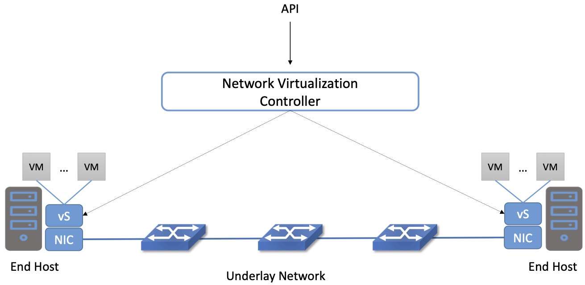
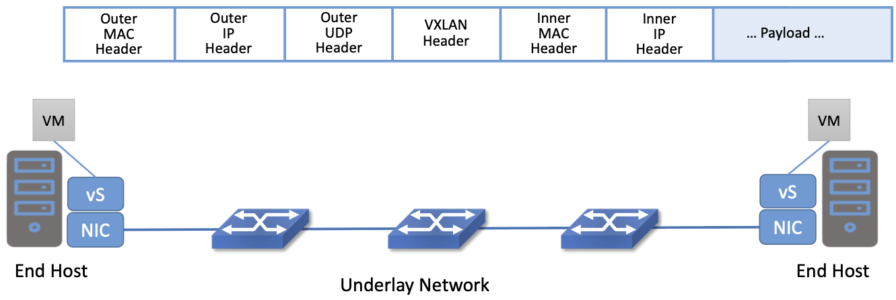
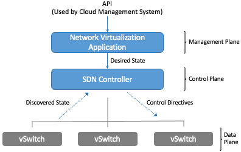
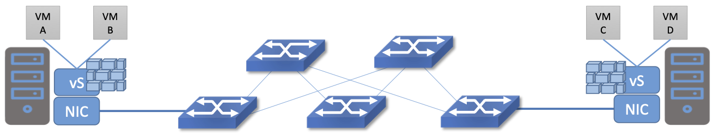

Chapter 8: Network Virtualization
=================================

As we noted in Chapter 2, Network Virtualization was actually the
first commercially successful use case of SDN. That said, it sits
somewhat apart from the rest of SDN as we have described it in this
book, mostly because network virtualization is implemented on top of
some physical network. The fact that network virtualization could be
implemented as an overlay on an existing network was a great help in
terms of deployment; at the same time, this ease of deployment meant
that it left the physical network untouched, thus not really impacting
the level of innovation in physical networks. It did, however, cause a
considerable simplification in the operation of physical networks, as
we discuss in more detail below.

Virtualization is an established field within computer science that
goes back decades, and that applies to network virtualization as
well. Virtual private networks (VPNs), for example, were implemented
using Frame Relay and ATM networks in the 1990s, and virtual LANs
(VLANs) became part of the Ethernet standards in the late
1990s. However, these technologies did not have much in common with
SDN, but instead were implemented using conventional networking
technologies. Importantly, they did not separate the control and data
planes in the manner that is considered fundamental to SDN.

The application of SDN to create virtual networks is generally
credited to the team at Nicira, as discussed in Chapter 2. The paper
that lays out the architecture of an SDN system to implement network
virtualization is the following.

.. _reading_NVP:
.. admonition:: Further Reading
                
   T. Koponen et al. `Network Virtualization in Multi-tenant Datacenters
   <https://www.usenix.org/conference/nsdi14/technical-sessions/presentation/koponen>`__.
   NSDI, April, 2014.
   

In the following sections we will see how a particular set of
technology challenges combined with the new capabilities offered by
SDN to set the stage for network virtualization as a successful SDN
use case.

8.1 Challenges
--------------

Network virtualization as we understand it today is closely linked to
the evolution of modern data centers, in which large numbers of
commodity servers communicate with each other to solve computational
tasks. These data centers are common for both large cloud providers
(AWS, Azure, Google etc.) and many enterprise organizations as
well. Some of the challenges involved in building networks for such
data centers are laid out in the “VL2” paper from Microsoft Research.

.. _reading_VL2:
.. admonition:: Further Reading

   Greenberg et al. `VL2: a scalable and flexible data center network
   <https://dl.acm.org/doi/10.1145/1594977.1592576>`__.
   SIGCOMM, August, 2009.

In such data centers, there is a substantial amount of “east-west”
traffic, i.e., server-to-server traffic, as distinct from
“north-south” traffic entering or leaving the data center. To
efficiently support high volumes of traffic between any pair of
servers in the data center, leaf-spine fabrics of the sort described
in Chapter 7 became popular due to their high cross-sectional
bandwidth and scalable layer-3 forwarding.

At the same time, server virtualization became mainstream, which had
several implications for data center operations. Provisioning virtual
machines (VMs) can be carried out entirely in software, by contrast to
installing and configuring physical servers, a time-consuming and
manual process. As the ease of provisioning a VM shrank the time to
obtain computational resources from days to minutes or seconds, this
exposed the fact that network configuration was now the “long pole”,
i.e. the slowest task to be completed before a user could put their
infrastructure to work. Hence, there was a recognition that network
configuration and provisioning needed to move towards a model more
similar to virtual compute, setting the stage for network
virtualization.

A second effect of server virtualization was to enable virtual machine
mobility. Since a VM has an IP address, this introduced some real
challenges for data center networking. If a VM were to move from one
subnet to another–an entirely reasonable thing to do–it would need to
be assigned a new IP address, which is potentially disruptive to the
applications running on it. One solution to this would be to build
larger and larger layer 2 subnets, but that is unattractive for scale
and performance reasons. Alternatively, one could restrict VMs to move
within their local subnet only, which undercuts the value of server
virtualization and could leave underutilized server resources
“stranded” on another subnet.

The approach proposed by Greenberg et al. in the reading above can be
considered a first step in network virtualization. They created a
“virtual layer 2” (VL2) network such that the addresses used by
virtual machines are decoupled from the addresses used in the physical
network, thus solving the VM mobility issue. We’ll see some more
details of how this can be done in the following sections.

Solving the problem of network configuration is a bit more
complex. Networks are not just simple subnets to connect servers; they
have a host of features that need to be configured, including VLANs
(or some equivalent construct to segment the network), firewall rules,
network address translation (NAT) rules, and so on. It is the
complexity of these tasks that made network configuration the barrier
to agility in data center configuration.

Tackling these issues of configuration and provisioning ultimately led
to the realization that SDN provided a means to simplify the creation
and management of virtual networks, just as much as it simplifies the
operation of physical networks. The key insight is that a central API
to an SDN controller provides the ideal way to specify the desired
behavior of the virtual network, with the central controller then
taking responsibility for figuring out how to implement the network
with the available resources, such as virtual switches in the
hypervisors of the data center. The core principles of SDN–separation
of data plane from control plane, and centralization of the controller
to manage a multitude of switching elements–provide the basis for this
approach. In the coming sections we will dig deeper into how this
works.

Side bar: Openstack history & hyperscalers

8.2 Architecture
----------------

.. _fig-basic-virt:

    A Basic Network Virtualization System.

The simplest possible network virtualization system is shown
in :numref:`Figure %s <fig-basic-virt>`. Virtual switches reside at
end hosts, and virtual machines connect to those virtual switches. The
network virtualization controller exposes a northbound API that
receives inputs describing the intended state of a virtual
network. For example, an API request could specify “VM1 and VM2 should
reside on the same virtual layer 2 subnet, network X”. It is the
responsibility of the controller to determine where those virtual
machines are located, and then to send control commands to the
appropriate virtual switches to create the virtual network abstraction
that is required. Let’s look more closely at that abstraction.

Since the VMs should be free to move around the data center, their IP
addresses need to be independent of the physical network topology
(indicated by the “underlay network” in the figure). In particular, we
don’t want a particular VM to be restricted in its location by the
subnet addressing of the underlying physical network. For this reason,
network virtualization systems invariably make use of an overlay
encapsulation such as VXLAN, NVGRE, etc. Encapsulations are a
low-level mechanism that solve an important problem: decoupling the
address space of the virtual network from that of the physical
network. However, it is worth noting that they are just a building
block, not a complete network virtualization solution. We will look
more closely at network virtualization overlay
encapsulations in Section 8.3.1.

.. _fig-encaps-nv:

    Encapsulation decouples virtual network addresses from physical network.

One thing to notice about virtual network encapsulation is that there
are a set of “outer” headers that are used by the physical network to
deliver the packet to the appropriate end host, and there are a set of
“inner” headers that are meaningful only in the context of a
particular virtual network. This is how encapsulation decouples the
virtual network addressing from that of the physical.

This simple example also shows one of the tasks that must be
implemented by the network virtualization controller. When a VM wants
to communicate with one of its peers in a virtual network, it needs to
apply the appropriate outer header, which is a function of the current
server location of the VM. Providing the mapping from target VM to
outer header is a natural task for the controller. In VL2 this is
referred to as a directory service.

To better understand the functions of the network virtualization
controller, we need to look a bit more closely at the definition of a
virtual network.

8.2.1 Virtual Networks Defined
~~~~~~~~~~~~~~~~~~~~~~~~~~~~~~~~~~

As noted above, the idea of virtual networks goes back a long
way. Virtual LANs (VLANs), for example, allow multiple LAN segments to
co-exists on a single physical LAN, somewhat analogous to the way
virtual memory allows processes to share physical memory. However, the
vision for virtual networks, as laid out by the Nicira team in the
NSDI paper listed above, is more closely analogous to virtual
machines.

Virtual machines provide a faithful reproduction of the features of a
physical server, complete with processor, memory, peripherals,
etc. The reproduction is so complete that an unmodified operating
system can run on the virtual machine exactly as if it were running on
a physical machine.

By analogy, virtual networks must also reproduce the full feature set
of a physical network. This means that a virtual network includes
routing, switching, addressing, and higher layer features such as NAT,
firewalling, and load balancing. Just as an unmodified operating
system can run on a VM exactly as it would on a physical machine, an
unmodified distributed application should be able to run on a virtual
network exactly as it would on a physical network. This is clearly a
more elaborate proposition than a VLAN.

Importantly, a virtual network needs to keep operating correctly even
as VMs move around. Thus we can begin to see that the role for a
network virtualization controller is to accept a specification of the
desired virtual network and then ensure that this network is correctly
implemented on the appropriate resources as conditions change, VMs
move, etc. We will formalize this role for the controller in the
following section.

8.2.2 Management, Control, and Data Planes
~~~~~~~~~~~~~~~~~~~~~~~~~~~~~~~~~~~~~~~~~~~

.. _fig-three-planes:

            
    The Three Planes of a Network Virtualization System.

We can now look more closely at the basic architecture of a network
virtualization system. In contrast to early types of virtual networks
such as VLANs and VPNs, a modern network virtualization system exposes
a northbound API by which virtual networks are created and
managed. Through calls to this API, the topology and services of a
virtual network are specified–either by a human user or by another
piece of software such as a cloud automation platform. Typical API
requests might say “create a layer 2 subnet”, “attach VM A to Subnet
X” or “apply firewall policy P to traffic entering VM B”. These API
requests lead to the creation of “desired state”–the state that the
network should be in. It is common to refer to the part of the system
that receives API requests and stores them in a desired state database
as the management plane.

At the bottom of the picture is the data plane. Commonly this is a set
of virtual switches (or vswitches) that run inside hypervisors or
container hosts. The data plane is where virtual networks are
implemented. As we saw in the example above, a virtual switch will
forward packets between VMs and the physical network, and to do it
needs to apply appropriate headers to the packets. The data plane also
has information about the current state of the system, such as the
locations of VMs, that needs to be taken into account by the higher
layers of the network virtualization system. This is indicated by the
“discovered state”.

At the heart of the system is the control plane. It sits between the
desired state and the actual state of the system. As the control plane
receives discovered state information from the data plane, it compares
this against the desired state. If the desired state does not match
the actual state, the control plane calculates the necessary changes
and pushes them to the data plane, as indicated by the “realized
state” arrow. This paradigm, of continuously reconciling actual state
with desired state, is a common one in distributed systems.

Consider a simple example. We want to create a virtual network that
connects two VMs, A and B, to a single L2 subnet. We can express that
intent by a set of API requests (create the subnet, connect A to
subnet, connect B to subnet, for example). These API requests are
accepted by the management plane and stored as desired state. The
control plane observes changes in desired state that are not yet
reflected in the actual state, so it needs to determine where A and B
are located, and the IP addresses of the relevant hypervisors. With
this information, it can determine what the encapsulation of packets
should be if A and B are to communicate with each other. From this, it
can compute a set of forwarding rules that need to be installed into
the appropriate vswitches. These rules are pushed to the vswitches as
“realized state”–they could, for example, be expressed as OpenFlow
rules pushed to the vswitches.

If, at some point later in time, one of the VMs was moved to a
different hypervisor, this information would be passed to the control
plane, which would detect that actual state no longer corresponds to
the desired state. That would trigger a fresh computation to determine
the updates that need to be pushed to the data plane, such as new
forwarding rules to the appropriate set of vswitches, and deletion of
data plane state at the hypervisor that no longer hosts one of the
VMs.

With this architecture, we can implement a rich set of features for
virtual networks. Provided the data plane has sufficient richness to
implement forwarding rules for firewalls, load balancers, etc., it is
now possible to build a network virtualization system that accurately
recreates the features of a physical network in software.

8.2.3 Distributed Services
~~~~~~~~~~~~~~~~~~~~~~~~~~~~~~~~~~

Software implementations of network functions such as firewalling,
load balancing, routing, etc., are essential aspects of network
virtualization. However, it is not simply a matter of implementing a
traditional network device in software. Consider the example of a
firewall. A conventional firewall is implemented as a “choke point”:
the network is set up in such a way that traffic must pass through the
firewall to get from one part of the network to another.

.. _fig-standard-firewall:
.. figure:: figures/Slide47.png
    :width: 450px
    :align: center

    A conventional firewall (not distributed).

Consider the example in :numref:`Figure %s
<fig-standard-firewall>`. If traffic sent from VM A to VM C needs to
be processed at a firewall in a conventional network, it needs to be
routed over a path that traverses the firewall, not necessarily the
shortest path from A to C. In the more extreme case of traffic from VM
A to VM B, which sit on the same host, the traffic from A to B needs
to be sent out of the host, across the network to the firewall, and
then back to B. This is clearly not efficient, and consumes both
network resources and, in the latter case, NIC bandwidth for the
“hairpinned” traffic. Furthermore, the firewall itself has the
potential to become a bottleneck, as all traffic requiring treatment
must pass up to that centralized device.

.. _fig-dist-firewall:

    A distributed firewall.

Now consider :numref:`Figure %s <fig-dist-firewall>`,
which illustrates a distributed firewall
implementation. Now for traffic sent from VM A to VM C, it can be
treated by a firewall function in either or both of the virtual
switches that it traverses, and still be sent over the shortest path
through the network underlay between the two hosts, without
hairpinning to an external firewall. Furthermore, traffic from VM A to
VM B need never even leave the host on which those two VMs reside,
passing only through the virtual switch on that host to receive the
necessary firewall treatment.

A significant side effect of distributing a service in this way is
that there is no longer a central bottleneck. Every time another
server is added to host some more VMs, there is a new virtual switch
with capacity to do some amount of distributed service processing. So
it’s relatively simple to scale out the amount of firewalling or
whatever other service is being delivered in this way.

This same approach applies to many other services that might formerly
have been performed in a dedicated box: routing, load balancing,
intrusion detection, etc. This is not to say that these services are
trivial to implement in a distributed manner in all cases. But with a
centralized control plane, we are able to provision and configure
these services via API (or a UI) in one location, and implement them
in a distributed manner with the efficiency and performance benefits
outlined here.

8.3 Building Blocks
--------------------

Now that we understand the architecture of network virtualization
systems, let's look at some of the building blocks used to construct
such a system.

8.3.1 Virtual Network Encapsulations
~~~~~~~~~~~~~~~~~~~~~~~~~~~~~~~~~~~~~

As we noted above, network virtualization requires some sort of
encapsulation so that the addressing in the virtual network can be
decoupled from that of the physical network. Inventing new ways to
encapsulate packets seems to be a popular pastime for network
architects and engineers, and there were a few potential candidates
available already when network virtualization appeared on the
scene. None of them quite fit the bill however, and several more have
been developed over the last decade.

While VXLAN attracted considerable attention when it was first
introduced in 2012, it was by no means the last word in network
virtualization encapsulations. After many years of experimentation and
collaboration among software and hardware vendors and other IETF
participants, an encapsulation that combined most of the desired
features was developed and standardized. The following RFC describes
GENEVE and the set of requirements that it was developed to meet.

.. _reading_Geneve:
.. admonition:: Further Reading

   J. Gross, I. Ganga and T. Sridhar (Eds.), `Geneve: Generic Network
      Virtualization Encapsulation (RFC 8926)
      <https://datatracker.ietf.org/doc/html/rfc8926>`__.

A notable feature of GENEVE is its extensibility. This represented
something of a compromise between those building software-based
systems (such as the one from Nicira) and those building hardware
endpoints designed to support network virtualization (which we’ll
cover later in this chapter). Fixed headers make life easy for
hardware, but limit flexibility for future expansion. In the end,
GENEVE included an options scheme that could be efficiently processed
(or ignored) by hardware while still giving the required
extensibility.

.. _fig-geneve:

    Geneve Header Format

As shown in the figure, Geneve looks quite similar to VXLAN, the
notable difference being the presence of a set of variable length
options. The presence of options was a critical feature that built on
the experience of earlier systems, where it was realized that the
limited space in a VXLAN header was insufficient to pass metadata
related to virtual networks from one end of a tunnel to another. An
example use of such metadata is to convey the logical source port of a
packet so that subsequent processing of that packet can take its
source port into consideration. There is a general point here that,
since virtual networks evolve over time with increasingly
sophisticated features implemented in software, it is important not to
constrain the information that can be passed around inside a virtual
network with an overly restrictive packet encapsulation.

8.3.2 Virtual Switches
~~~~~~~~~~~~~~~~~~~~~~~~~~~~~~~~~~

The Virtual Switch clearly plays a critical role in network
virtualization. It is the main component of the data plane, and the
richness of its feature set determines the ability of a network
virtualization system to accurately reproduce the features of a
physical network. The most widely deployed virtual switch is Open
vSwitch or OVS.

.. _reading_OVS:
.. admonition:: Further Reading

   B. Pfaff, et al, `The Design and Implementation of Open
   vSwitch
   <https://www.openvswitch.org/support/papers/nsdi2015.pdf>`__,
   USENIX NSDI 2015. 

Open vSwitch has been used in proprietary systems such as Nicira’s
Network Virtualization Platform and VMware NSX, as well as open source
systems such as Open Virtual Network (OVN), described below. It was
designed to have the necessary flexibility to meet the requirements of
network virtualization while also providing high performance.

.. _fig-ovs-blocks:
.. figure:: figures/Slide50.png
    :width: 450px
    :align: center

    Open vSwitch Functional Blocks

OVS is programmed by a control plane using OpenFlow, just like many
hardware switches described in previous chapters. It also receives
configuration information over a separate channel using the OVSDB
(Open vSwitch Database) protocol.

Performance in the forwarding plane has been achieved via a long
series of optimizations described in the paper above, notably a
“fast-path” in the kernel that uses a flow cache to forward all
packets in a flow after the first. The first packet in a flow is
passed to the userspace daemon ovs-vswitchd, which looks up the flow
in a set of tables. This set of tables, being implemented in software,
can be effectively unlimited in number, a distinct advantage over
hardware implementations of OpenFlow switching. This enables the high
degree of flexibility that is required in network virtualization.

Note that OVS can be used not only to forward packets between VMs and
the outside world, but can also be used in container environments, to
forward packets among containers on the same or different hosts. Thus
a network virtualization system for containers can be built from many
of the same components as one for VMs, and mixed environments (where
containers and VMs communicate in a single virtual network) are also
possible.

DPDK
Sidebar: SR-IOV

8.3.3 Virtual-to-physical gateways
~~~~~~~~~~~~~~~~~~~~~~~~~~~~~~~~~~
X86, switch-based

8.4 Example Systems
-------------------
Maybe mentions multiple examples, open and proprietary (e.g., Tungsten Fabric), but then drill down on just two.
8.4.1 OVN
8.4.2 Kubernetes
CNI + Antrea, Calico, Multus...

8.5 Impact of Network Virtualization
------------------------------------
Microsegmentation

Sidebar: But is it SDN?
Yes, because it’s software forwarding, centralized control plane, OpenFlow
No because it doesn’t change the underlying physical network

