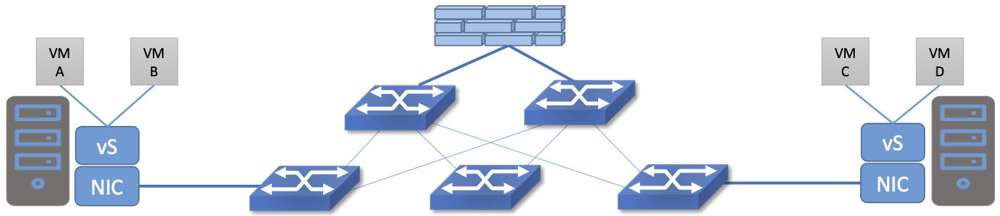
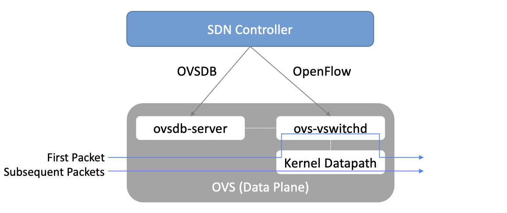

Chapter 8: Network Virtualization
=================================

As noted in Chapter 2, Network Virtualization was the first
commercially successful use case of SDN. That said, it sits somewhat
apart from the rest of SDN described in this book. This is because
network virtualization can be implemented on the servers, generally
without any cooperation from the switches in the physical network. The
fact that network virtualization can be implemented as an *overlay* on
an existing network was a great help in terms of deployment. At the
same time, this ease of deployment meant that it left the physical
network untouched, thus not really impacting the level of innovation
in physical networks. It did, however, result in considerable
simplification in how physical networks are managed, as this
chapter illustrates.

Virtualization is an established concept in computer science that goes
back decades. That applies to network virtualization as well. Virtual
private networks (VPNs), for example, were implemented using Frame
Relay and ATM networks in the 1990s, and virtual LANs (VLANs) became
part of the Ethernet standards in the late 1990s. These technologies
did not have much in common with SDN, but instead were implemented
using conventional networking technologies. Importantly, they did not
separate the control and data planes in the manner that is considered
fundamental to SDN.

The application of SDN to create virtual networks is generally
credited to the team at Nicira, as discussed in Chapter 2, with a 2014
paper by Koponen *et al.* laying out the architecture of an SDN-based
system to implement network virtualization.

.. _reading_NVP:
.. admonition:: Further Reading
                
   T. Koponen et al. `Network Virtualization in Multi-tenant Datacenters
   <https://www.usenix.org/conference/nsdi14/technical-sessions/presentation/koponen>`__.
   NSDI, April, 2014.
   

The following sections show how a particular set of technology
challenges, combined with the new capabilities offered by SDN, set the
stage for network virtualization as a successful use case of
Software-Defined Networking.

8.1 Challenges
--------------

Network virtualization as we understand it today is closely linked to
the evolution of modern datacenters, in which large numbers of
commodity servers communicate with each other to solve computational
tasks. These datacenters are common for both large cloud providers
(e.g., AWS, Azure, Google), as well as many enterprise organizations.
Some of the challenges involved in building networks for such
datacenters were laid out in the VL2 paper from Microsoft Research back
in 2009.

.. _reading_VL2:
.. admonition:: Further Reading

   Greenberg et al. `VL2: a scalable and flexible data center network
   <https://dl.acm.org/doi/10.1145/1594977.1592576>`__.
   SIGCOMM, August, 2009.

In such datacenters, there is a substantial amount of “east-west”
traffic; that is, server-to-server traffic, as distinct from
“north-south” traffic entering or leaving the datacenter. To
efficiently support high volumes of traffic between any pair of
servers in the datacenter, leaf-spine fabrics of the sort described
in Chapter 7 became popular due to their high cross-sectional
bandwidth and scalable layer-3 forwarding.

At the same time, server virtualization became mainstream, which had
several implications for datacenter operations. Provisioning virtual
machines (VMs) can be carried out entirely in software, by contrast to
installing and configuring physical servers, a time-consuming and
manual process. As the ease of provisioning a VM shrank the time to
obtain computational resources from days to minutes or seconds, it
exposed the fact that network configuration was now the "long
pole”—the slowest task to be completed before a user could put their
infrastructure to work. Hence, there was a recognition that network
configuration and provisioning needed to move towards a model more
similar to virtual compute, setting the stage for network
virtualization.

A second effect of server virtualization was to enable virtual machine
mobility. This introduced some real challenges for datacenter
networking. In the absence of network virtualization, the IP address
of a VM is drawn from the physical network on which it resides, and
must be specific to a subnet that connects to the server hosting the
VM.\ [#]_ So if a VM is to migrate to another server, either it needs
to move to a server where that subnet is also present, or it needs a
new IP address. The first choice limits where it can move within the
datacenter, which affects the efficiency of resource usage. The
second option is quite a disruptive thing: TCP connections are
dropped, and applications may need to be restarted. Furthermore, some
applications depend on layer-2 adjacency between communicating peers,
and thus depend on some set of VMs staying in a given subnet even as
they move around within the datacenter.

.. [#] Technically more than one subnet can connect to a given server
       in which case an IP address for a VM needs to be
       drawn from one of those subnets.

One proposed solution to this issue was to make layer-2 subnets ever
larger in the physical network, but that is not really a scalable
solution. Large datacenters invariably use layer-3 networking to
connect racks of servers.

The approach proposed by Greenberg, *et al.* can be considered a
first step in network virtualization. They created a *Virtual Layer 2
(VL2)* network such that the addresses used by virtual machines are
decoupled from the addresses used in the physical network, thus
solving the mobility-related issues described above. A VM draws its IP
address from a *virtual* layer 2 network, and VL2 constructs the
appropriate overlay to extend that virtual network wherever it needs
to go, even as VMs migrate across physical networks.

Solving the problem of network configuration is a bit more
complex. Networks are not just simple subnets to connect servers; they
have a host of features that need to be configured, including VLANs
(or some equivalent construct to segment the network), firewall rules,
network address translation (NAT) rules, and so on. It is the
complexity of these tasks that made network configuration the barrier
to agility in datacenter configuration.

Tackling these issues of configuration and provisioning ultimately led
to the realization that SDN provided a means to simplify the creation
and management of virtual networks, just as much as it simplifies the
operation of physical networks. The key insight is that a central API
to an SDN controller provides the ideal way to specify the desired
behavior of the virtual network, with the central controller then
taking responsibility for figuring out how to implement the network
with the available resources, such as virtual switches in the
hypervisors of the datacenter's servers. The core principles of SDN—separation
of data plane from control plane, and centralization of the controller
to manage a multitude of switching elements—provide the basis for this
approach. The coming sections dig deeper into how this
works.

..
   Side bar: Openstack history & hyperscalers

8.2 Architecture
----------------

The simplest possible network virtualization system is shown in
:numref:`Figure %s <fig-basic-virt>`. Virtual switches reside at end
hosts, and virtual machines connect to those virtual switches. The
network virtualization controller exposes a northbound API that
receives inputs describing the intended state of a virtual
network. For example, an API request could specify *“VM1 and VM2
should reside on the same virtual layer 2 subnet, network X”.* It is
the responsibility of the controller to determine where those virtual
machines are located, and then to send control commands to the
appropriate virtual switches to create the virtual network abstraction
that is required. Let’s look more closely at that abstraction.

.. _fig-basic-virt:
.. figure:: figures/Slide44.png
    :width: 600px
    :align: center

    A Basic Network Virtualization System.

Since the VMs should be free to move around the datacenter, their IP
addresses need to be independent of the physical network topology
(indicated by the underlay network in the figure). In particular, we
don’t want a particular VM to be restricted in its location by the
subnet addressing of the underlying physical network. For this reason,
network virtualization systems invariably make use of an overlay
encapsulation such as VXLAN or NVGRE. Encapsulation is a
low-level mechanism that solves an important problem: decoupling the
address space of the virtual network from that of the physical
network. However, it is worth noting that they are just a building
block, and not a complete network virtualization solution. We will look
more closely at network virtualization overlay
encapsulations in Section 8.3.1.

.. _fig-encaps-nv:
.. figure:: figures/Slide45.png
    :width: 600px
    :align: center

    Encapsulation decouples virtual network addresses from physical network.

One thing to notice about virtual network encapsulation, as
illustrated in :numref:`Figure %s <fig-encaps-nv>`, is that there are a
set of *outer* headers that are used by the physical network to
deliver the packet to the appropriate end host, and there are a set of
*inner* headers that are meaningful only in the context of a
particular virtual network. This is how encapsulation decouples the
virtual network addressing from that of the physical.

This simple example also shows one of the tasks that must be
implemented by the network virtualization controller. When a VM wants
to communicate with one of its peers in a virtual network, it needs to
apply the appropriate outer header, which is a function of the current
server location of the VM. Providing the mapping from target VM to
outer header is a natural task for the centralized controller. In VL2
this is referred to as a *directory service.*

To better understand the functions of the network virtualization
controller, we need to look a bit more closely at the definition of a
virtual network.

8.2.1 Virtual Networks Defined
~~~~~~~~~~~~~~~~~~~~~~~~~~~~~~~~~~

As noted above, the idea of virtual networks goes back a long
way. Virtual LANs (VLANs), for example, allow multiple LAN segments to
co-exists on a single physical LAN, somewhat analogous to the way
virtual memory allows processes to share physical memory. However, the
vision for virtual networks, as laid out by the Nicira team in the
NSDI paper, is more closely analogous to virtual machines.

Virtual machines provide a faithful reproduction of the features of a
physical server, complete with processor, memory, peripherals, and
so on. The reproduction is so complete that an unmodified operating
system can run on the virtual machine exactly as if it were running on
a physical machine.

By analogy, virtual networks must also reproduce the full feature set
of a physical network. This means that a virtual network includes
routing, switching, addressing, and higher layer features such as NAT,
firewalling, and load balancing. Just as an unmodified operating
system can run on a VM exactly as it would on a physical machine, an
unmodified distributed application should be able to run on a virtual
network exactly as it would on a physical network. This is clearly a
more elaborate proposition than a VLAN.

Importantly, a virtual network needs to keep operating correctly even
as VMs move around. Thus, we can begin to see that the role for a
network virtualization controller is to accept a specification of the
desired virtual network and then ensure that this network is correctly
implemented on the appropriate resources as conditions change and VMs
move. We formalize this role for the controller in the
next section.

8.2.2 Management, Control, and Data Planes
~~~~~~~~~~~~~~~~~~~~~~~~~~~~~~~~~~~~~~~~~~~

We can now look more closely at the basic architecture of a network
virtualization system. In contrast to early types of virtual networks
such as VLANs and VPNs, a modern network virtualization system exposes
a northbound API by which virtual networks are created and
managed. Through calls to this API, the topology and services of a
virtual network are specified—either by a human user or by another
piece of software such as a cloud automation platform. Typical, API
requests might say *“Create a layer 2 subnet”*, *“Attach VM A to
subnet X”* or *“Apply firewall policy P to traffic entering VM B”*. As
shown in :numref:`Figure %s <fig-three-planes>`, these API requests
lead to the creation of *desired state*—the state that the network
should be in. It is common to refer to the part of the system that
receives API requests and stores them in a desired state database as
the management plane.

.. _fig-three-planes:
.. figure:: figures/Slide46.png
    :width: 500px
    :align: center
            
    The Three Planes of a Network Virtualization System.

At the bottom of :numref:`Figure %s <fig-three-planes>` is the data
plane. Commonly, this is a set of *Virtual Switches (vSwitches)* that
run inside hypervisors or container hosts. The data plane is where
virtual networks are implemented. As we saw in the example, a
virtual switch forwards packets between VMs and the physical network,
and to do it needs to apply appropriate headers to the packets. The
data plane also has information about the current state of the system,
such as the locations of VMs, that needs to be taken into account by
the higher layers of the network virtualization system. This is
indicated by the *discovered state*.

At the heart of the system is the control plane. It sits between the
desired state and the actual state of the system. As the control plane
receives discovered state information from the data plane, it compares
this against the desired state. If the desired state does not match
the actual state, the control plane calculates the necessary changes
and pushes them to the data plane, as indicated by the *control
directives* arrow. This paradigm, of continuously reconciling actual state
with desired state, is a common one in distributed systems.

The mapping between this architecture (:numref:`Figure %s
<fig-three-planes>`) and the one depicted in :numref:`Figures %s
<fig-stack>` and :numref:`%s <fig-e2e>` in Chapter 3 is
straightforward. At the base is a distributed data plane, be it
assembled from bare-metal switches or software switches, on top of
which a centralized controller collects operational state and issues
control directives. When implemented in a general, use-case agnostic
way, this controller is called a Network OS. The Nicira team built an
early network OS called Onix, which can be thought of as a precursor of
ONOS. At the top-most level is
a management layer that serves API requests, and understands the abstraction of
a virtual network. This management layer can be thought of as an
application that runs on the network OS. In short, the
architecture presented in this Chapter is purpose-built to support
virtual networks, whereas the one outlined in Chapter 3 is intended to
be general-purpose, and in fact, there was at one time a ONOS-based
virtual network application, called *Virtual Tenant Network (VTN)*,
that was integrated with OpenStack. VTN is no longer being maintained,
due in part to the availability of other network virtualization subsystems
that integrate with container management systems like Kubernetes.

Consider a simple example. We want to create a virtual network that
connects two VMs, A and B, to a single L2 subnet. We can express that
intent by a set of API requests; for example, create the subnet, connect A to
subnet, connect B to subnet, for example. These API requests are
accepted by the management plane and stored as desired state. The
control plane observes changes in desired state that are not yet
reflected in the actual state, so it needs to determine where A and B
are located, and the IP addresses of the relevant hypervisors. With
this information, it determines what the encapsulation of packets
should be if A and B are to communicate with each other. From this, it
computes a set of forwarding rules that need to be installed into
the appropriate vSwitches. These rules are pushed to the vSwitches as
realized state. They could, for example, be expressed as OpenFlow
rules.

If at some later in time, one of the VMs moves to a different
hypervisor, this information is passed to the control plane, which
detects that actual state no longer corresponds to the desired
state. That triggers a fresh computation to determine the updates that
need to be pushed to the data plane, such as new forwarding rules to
the appropriate set of vSwitches, and deletion of data plane state at
the hypervisor that no longer hosts one of the VMs.

With this architecture, we can implement a rich set of features for
virtual networks. Provided the data plane has sufficient richness to
implement forwarding rules for firewalls, load balancers, and so on,
it is now possible to build a network virtualization system that
accurately recreates the features of a physical network in software.

8.2.3 Distributed Services
~~~~~~~~~~~~~~~~~~~~~~~~~~~~~~~~~~

Software implementations of network functions such as firewalling,
load balancing, and routing are essential aspects of network
virtualization. However, it is not simply a matter of implementing a
traditional network device in software. Consider the example of a
firewall. A conventional firewall is implemented as a *choke point:*
the network is set up in such a way that traffic must pass through the
firewall to get from one part of the network to another.

.. _fig-standard-firewall:

    A conventional firewall (not distributed).

Consider the example in :numref:`Figure %s
<fig-standard-firewall>`. If traffic sent from VM A to VM C needs to
be processed at a firewall in a conventional network, it needs to be
routed over a path that traverses the firewall, not necessarily the
shortest path from A to C. In the more extreme case of traffic from VM
A to VM B, which sit on the same host, the traffic from A to B needs
to be sent out of the host, across the network to the firewall, and
then back to B. This is clearly not efficient, and consumes both
network resources and, in the latter case, NIC bandwidth for the
hairpinned traffic. Furthermore, the firewall itself has the
potential to become a bottleneck, as all traffic requiring treatment
must pass up to that centralized device.

.. _fig-dist-firewall:
.. figure:: figures/Slide48.png
    :width: 600px
    :align: center

    A distributed firewall.

Now consider :numref:`Figure %s <fig-dist-firewall>`, which
illustrates a distributed firewall implementation. In this case,
traffic sent from VM A to VM C can be processed by a firewall function
at either (or both) of the virtual switches that it traverses, and still
be sent over the shortest path through the network underlay between
the two hosts, without hairpinning to an external firewall.
Furthermore, traffic from VM A to VM B need never even leave the host
on which those two VMs reside, passing only through the virtual switch
on that host to receive the necessary firewall treatment.

A significant side effect of distributing a service in this way is
that there is no longer a central bottleneck. Every time another
server is added to host some more VMs, there is a new virtual switch
with capacity to do some amount of distributed service
processing. This means it is relatively simple to scale out the amount
of firewalling (or whatever other service is being delivered) in this
way.

This same approach applies to many other services that might formerly
have been performed in a dedicated box: routing, load balancing,
intrusion detection, and so on. This is not to say that these services
are trivial to implement in a distributed manner in all cases. But
with a centralized control plane, we are able to provision and
configure these services via an API (or a GUI) in one location, and
implement them in a distributed manner with the efficiency and
performance benefits outlined here.

8.3 Building Blocks
--------------------

Now that we understand the architecture of network virtualization
systems, let's look at some of the building blocks used to construct
such a system.

8.3.1 Virtual Network Encapsulation
~~~~~~~~~~~~~~~~~~~~~~~~~~~~~~~~~~~

As we noted above, network virtualization requires some sort of
encapsulation so that the addressing in the virtual network can be
decoupled from that of the physical network. Inventing new ways to
encapsulate packets seems to be a popular pastime for network
architects and engineers, and there were a few potential candidates
available already when network virtualization appeared on the
scene. None of them quite fit the bill however, and several more have
been developed over the last decade.

While VXLAN attracted considerable attention when it was first
introduced in 2012, it was by no means the last word in network
virtualization encapsulation. After many years of experimentation and
collaboration among software and hardware vendors and other IETF
participants, an encapsulation that combined most of the desired
features was developed and standardized. The following RFC describes
GENEVE and the set of requirements that it was developed to meet.

.. _reading_Geneve:
.. admonition:: Further Reading

   J. Gross, I. Ganga and T. Sridhar (Eds.), `Geneve: Generic Network
   Virtualization Encapsulation (RFC 8926)
   <https://datatracker.ietf.org/doc/html/rfc8926>`__.

A notable feature of GENEVE is its extensibility. This represented
something of a compromise between those building software-based
systems (such as the one from Nicira) and those building hardware
endpoints designed to support network virtualization (which we’ll
cover later in this chapter). Fixed headers make life easy for
hardware, but limit flexibility for future expansion. In the end,
GENEVE included an options scheme that could be efficiently processed
(or ignored) by hardware while still giving the required
extensibility.

.. _fig-geneve:
.. figure:: figures/Slide49.png
    :width: 550px
    :align: center

    GENEVE Header Format.

As shown in :numref:`Figure %s <fig-geneve>`, GENEVE looks
quite similar to VXLAN, the notable difference being the presence of a
set of variable length options. The presence of options was a critical
feature that built on the experience of earlier systems, where it was
realized that the limited space in a VXLAN header was insufficient to
pass metadata related to virtual networks from one end of a tunnel to
another. An example use of such metadata is to convey the logical
source port of a packet so that subsequent processing of that packet
can take its source port into consideration. There is a general point
here that, since virtual networks evolve over time with increasingly
sophisticated features implemented in software, it is important not to
constrain the information that can be passed around inside a virtual
network with an overly restrictive packet encapsulation.

8.3.2 Virtual Switches
~~~~~~~~~~~~~~~~~~~~~~~~~~~~~~~~~~

The Virtual Switch clearly plays a critical role in network
virtualization. It is the main component of the data plane, and the
richness of its feature set determines the ability of a network
virtualization system to accurately reproduce the features of a
physical network. The most widely deployed virtual switch is *Open
vSwitch (OVS).*

.. _reading_OVS:
.. admonition:: Further Reading

   B. Pfaff, et al, `The Design and Implementation of Open
   vSwitch
   <https://www.openvswitch.org/support/papers/nsdi2015.pdf>`__,
   USENIX NSDI 2015. 

Open vSwitch has been used in proprietary systems such as Nicira’s
Network Virtualization Platform and VMware NSX, as well as open source
systems such as *Open Virtual Network (OVN)*. It was designed to have
the necessary flexibility to meet the requirements of network
virtualization while also providing high performance.

.. _fig-ovs-blocks:

    Open vSwitch Functional Blocks.

As depicted in :numref:`Figure %s <fig-ovs-blocks>`, OVS is programmed
by the control plane using OpenFlow, just like many hardware switches
described in previous chapters. It also receives configuration
information over a separate channel using the *Open vSwitch Database
(OVSDB)* protocol, which is to say, OVSDB effectively serves the same
purpose as gNMI/gNOI does for a hardware-based data plane. Again, the
mapping between these building blocks and the components described in
earlier chapters is straightforward, the differences in terminology and
details largely being attributed to network virtualization evolving as a
purpose-built solution.

Performance in the forwarding plane has been achieved via a long
series of optimizations described in the Pfaff paper, notably a
fast-path in the kernel that uses a flow cache to forward all packets
in a flow after the first. The first packet in a flow is passed to the
userspace daemon ``ovs-vswitchd``, which looks up the flow in a set of
tables. This set of tables, being implemented in software, can be
effectively unlimited in number, a distinct advantage over hardware
implementations of OpenFlow switching. This enables the high degree of
flexibility that is required in network virtualization. At the same
time, there is also an effort to unify software- and hardware-based
forwarding elements, using P4 as the *lingua franca* for writing packet
forwarders. This also brings P4Runtime into the mix as the
auto-generated interface for controlling the data plane.

Note that OVS can be used not only to forward packets between VMs and
the outside world, but can also be used in container environments, to
forward packets among containers on the same or different hosts. Thus
a network virtualization system for containers can be built from many
of the same components as one for VMs, and mixed environments (where
containers and VMs communicate in a single virtual network) are also
possible.

8.3.3 Performance Optimizations
~~~~~~~~~~~~~~~~~~~~~~~~~~~~~~~

Since the virtual switch sits in the data path for all traffic
entering of leaving VMs and containers in a virtual network, the
performance of the virtual switch is critical. The OVS paper from 2015
discusses a number of performance optimizations made over the years,
but approaches to improving vSwitch performance warrant further
discussion.

The first is *DPDK (Data Path Development Kit)*, a set of libraries
developed for the Intel x86 platform to improve performance of
data-moving operations, including virtual switching. Many of the
concepts are straightforward (e.g., packets can be processed in
batches, context switches are avoided) but the set of optimizations is
large and, when applied properly, effective. It has been successfully
used to implement OVS with performance gains that can be significant,
depending on the exact operating environment.

One such environment is using OVS to forward packets between a virtual
and a non-virtual network, which typically happens when a VM needs to
communicate with something outside the virtual network. This could be,
for example, an unvirtualized server such as a mainframe or database,
or some device on the public Internet. This scenario is referred to as
a Virtual-to-Physical Gateway, and it is a good candidate for DPDK
because it has little to do other than forward packets (i.e., no other
CPU-bound processing is involved). In this setting, experiments
reported by RedHat Developer shows OVS-DPDK is able to forward over
16Mpps on a high-end Intel processor. (This is compared to a
forwarding rate closer to 1Mpps with OVS alone.)

.. _reading_OVS-perf:
.. admonition:: Further Reading

   RedHat Developer. `Measuring and Comparing Open vSwtich Performance
   <https://developers.redhat.com/blog/2017/06/05/measuring-and-comparing-open-vswitch-performance>`__,
   June 2017.

The second is *SR-IOV (Single Root IO Virtualization)*, a hardware
feature designed to improve IO performance between VMs and the outside
world. The basic idea is that a single physical NIC presents itself to
the hypervisor as a set of virtual NICs, each of which has its own set
of resources. Each VM could then have its own virtual NIC, and bypass
the hypervisor completely, which in principle would improve
performance. However, this isn't really a useful approach for network
virtualization, because the virtual switch is bypassed. Much of the
value of network virtualization comes from the flexibility of a
programmable virtual switch, so bypassing it runs counter to the
direction of network virtualization.

On the other hand, there is value in recognizing that the NIC has a
role to play in the end-to-end story. There is a long tradition of
offloading certain functions from the server to the NIC, with *TCP
Segmentation Offload (TSO)* being a notable example. As NICs have
gained more capability in recent years with the rise of SmartNICs, the
potential exists to move more of the vSwitch capability to the NIC
with a potential performance gain. The challenge is one of trading
flexibility for performance, as SmartNICs are still more
resource-constrained than a general purpose CPU. The latest generation
of SmartNICs are reaching a level of sophistication where offloading
some or all of the vSwitch functions could be effective.\ [#]_ 

.. [#] As an aside, P4 is gaining traction as a way to program
     SmartNICs, suggesting the possibility of convergence in how the
     data plane—whether implemented as a vSwitch, a SmartNIC, or a
     bare-metal switch—exports its capabilities to the control plane.

Finally, it is worth noting that even a well-implemented software
switch on general-purpose hardware is going to perform relatively
poorly compared to a dedicated switching hardware, and for this reason,
there have also been implementations of gateways that leverage such
bare-metal switches. One example, which took advantage of the VXLAN
implementations on many top-of-rack switches, is described in a paper
by Davie, *et al.*

.. _reading_OVSDB:
.. admonition:: Further Reading
                
   B. Davie, et al. `A Database Approach to SDN Control Plane
   Design <https://dl.acm.org/doi/10.1145/3041027.3041030>`__.
   Computer Communications Review, January 2017.

As in many other networking environments, there is a trade-off between
the flexibility of fully programmable devices and the performance of
less flexible, dedicated hardware. In most commercial deployments of
network virtualization, the more flexible approach of general purpose
hardware has been preferred. Over time, the trick will be to identify
the relatively fixed (but universally applicable) subset of that
functionality that provides the biggest performance benefit when
implemented in hardware.

8.4 OVN (Open Virtual Network)
-------------------
There have been several successful implementations of network
virtualization systems, of which we have already mentioned several. In
this section we will explore the Open Virtual Network (OVN) system as
a well-documented open source implementation of network
virtualization.

OVN was built as a set of enhancements to OVS, leveraging OVS for the
data plane and OVSDB for the control and management planes. The high
level architecture of OVN is shown in :numref:`Figure %s
<fig-ovn-arch>`.

.. _fig-ovn-arch:

    OVN High-level Architecture.

OVN is assumed to operate in an environment where a cloud management
system (CMS) is responsible for the creation of virtual networks. This is
likely to be OpenStack, which was the first CMS to be supported by
OVN. The OVN/CMS plugin is responsible for mapping abstractions that
match those of the CMS with generic virtual network abstractions that
can be stored in the *Northbound Database*. OVN uses OVSDB as its
database of this part of the system. We can think of the plugin as the
management plane and the Northbound DB is the desired state repository.

The control plane of OVN is a little more complicated than that shown
in the generic architecture of :numref:`Figure %s
<fig-three-planes>`. Significantly, it is divided into a centralized
component, known as *ovn-northd*, and a distributed component that
runs on every hypervisor, called the *OVN controller*. ovn-northd
translates the logical network configuration, expressed in terms of
conventional network concepts like switching and routing, into logical
datapath flows, which it stores in the *OVN Southbound
Database*. Logical data path flows provide an abstract representation
of the forwarding rules that will eventually be populated in the data
plane, specified in a way that is independent of the physical
location of VMs. So, for example, if VM A and VM B are on the same
logical switch, there will be a logical datapath flow to forward
packets sent by A to B stored in the OVN Southbound database. But
there is not enough information to actually forward packets in this
flow, because that depends on which hypervisors currently host those
VMs.  Providing the binding of physical hypervisor nodes to VMs is a
task performed by the OVN controller running on the appropriate
hypervisor.

When it comes to programming the data plane, the OVN controller for
each hypervisor queries the OVN Southbound DB to identify the logical
flows that are relevant to it, based on the VMs that it is currently
hosting. Combined with the information provided by other hypervisors
regarding the location of other VMs, it is able to construct the rules
that need to be programmed into the instance of OVS that is running
locally on the hypervisor in question. Continuing with the example 
above, if VM A is on hypervisor 1, and VM B is on hypervisor 2, then
hypervisor 1 needs flow rule in OVS to forward packets from VM A to
VM B. It is able to see this by looking at the logical flows in OVN
Southbound DB, and it is able to determine the details of how to
encapsulate packets destined for VM B by looking for binding
information provided by hypervisor 2.

Everything discussed up to this point has assumed that we are talking
about VMs as the endpoints for our virtual networks, but everything
that works for VMs also works for containers (glossing over some
implementation details). We can connect a set of container hosts to
the OVN Southbound DB and they can create flow rules for their OVS instances to
build virtual networks for the containers they are hosting. In this
case, the "cloud management system" that OVN integrates with is likely
to be a container management system such as Kubernetes.

8.5 Microsegmentation
---------------------

Network virtualization has certainly had an impact on networking,
particularly in the datacenter, in the years since Nicira's first
product. Both Cisco and VMware have periodically reported the adoption
rates for network virtualization and the technology is now widespread
in Telcos and large enterprise datacenters. It is also ubiquitous in
the datacenters of large cloud companies, as an essential component of
delivering infrastructure as a service.

..
  May eventually generalize to "Impact of Network Virtualization" with
  multiple subsections, but at this point there is only one impact, so
  we make it a top-level section.
  
One of the interesting side-effects of network virtualization is that
it enabled a change in the way security is implemented in the
datacenter. As noted above, network virtualization enables security
features to be implemented in a distributed manner, in software. It
also makes it relatively straightforward to create a large number of
isolated networks, compared to the traditional approach of configuring
VLANs by hand. These two factors combined to lead to the idea of
*microsegmentation*.

Microsegmentation stands in contrast to traditional approaches to
segmenting networks, in which relatively large sets of machines would
connect to a "zone" and then firewalls would be used to filter traffic
passing between zones. While this made for relatively simple network
configuration, it meant that lots of machines would be in the same
zone even if there was no need for them to communicate. Furthermore,
the complexity of firewall rules would grow over time as more and more
rules would need to be added to describe the traffic allowed to pass
from one zone to another.

By contrast, network virtualization allows for the creation of
microsegments, which are narrowly defined virtual networks that
determine both which machines can communicate with each other and how
they can do so. For example, a three-tier application can have
its own microsegmentation policy which says that the machines in the
web-facing tier of the application can talk to the machines in the
application tier on some set of specified ports, but that web-facing
machines may not talk to each other. This is a policy that was
difficult to implement in the past, because all the web-facing
machines would sit on the same network segment.

Prior to microsegmentation, the
complexity of configuring segments was such that machines
from many applications would likely sit on the same segment, creating
opportunities for an attack to spread from one application to
another. The lateral movement of attacks within datacenters has been
well documented as a key strategy of successful cyber-attacks over many
years.

Consider the arrangement of VMs and the firewall in :numref:`Figure %s
<fig-standard-firewall>`. Suppose that, without network
virtualization, we wanted to put VM A and VM B in different segments
and apply a firewall rule for traffic going from VM A to VM B. We
would have to configure two VLANs in the physical network, connect A
to one of them, and B to the other, and then configure the routing
such that the path from the first VLAN to the second passed through
the firewall. If at some point VM A was moved to another server, we'd
have to make sure the appropriate VLAN reached that server, connect VM
A to it, and ensure that the routing configuration was still forcing
traffic through the firewall. This situation is admittedly a little
contrived, but it demonstrates why microsegmentation was effectively
impossible before the arrival of network virtualization.

Microsegmentation has become an accepted best practice for datacenter
networking, providing a starting point for "zero-trust"
networking. This illustrates the far-reaching impact of network
virtualization. 

8.6 Is Network Virtualization SDN?
----------------------------------

At the very start of this chapter we observed that Network
Virtualization is the most successful early application of SDN. But
is it really SDN? There has been considerable debate on this topic,
which reflects that there has been plenty of argument about exactly
what SDN is.
             
The main argument against Network Virtualization's inclusion in SDN is
that it didn't change the way physical networks are built. It simply
runs as an overlay on top of a standard L2/L3 network, which might run
distributed routing protocols and be configured one box at a
time. This argument seems to be a less prevalent view now that network
virtualization has become so widespread, but it misses the point.

Simply stated, Network Virtualization adheres to the core
architectural principles laid out by SDN's inventors (and summarized
in Section 1.3). There is a clear separation between control and data
planes, with a centralized controller responsible for a distributed
set of forwarding elements. It even uses OpenFlow as one possible
control interface, although that was always an implementation detail
and not fundamental to SDN. Finally, the fact that network
virtualization uses a completely programmable forwarding plane, as
exemplified by OVS, also places it squarely in the SDN universe.

The differences between Network Virtualization and the other use cases
described in this book can all be described as implementation choices,
with the dependency on software switches rather than hardware switches
being pivotal. This use of software-based switches accelerated
adoption and deployment, and opened the door to more powerful
forwarding functions (albeit at the cost of being able to prove
properties about how those functions perform and behave at runtime). It
is also the case that these software-based implementations evolved in
a way that was optimized for Network Virtualization, as opposed pursuing
the general-purpose, use-case agnostic approach embodied in the
SDN software stack introduced in Chapter 3.

None of this should come as a surprise. SDN has always been an
approach to building and operating networks, applied to isolated
domains where it provides value. There is no requirement of
universality. (See the *Domain of Control* sidebar in Chapter 1.)
Datacenter underlays, as exemplified by leaf-spine switching fabrics,
are one such domain. Virtual networking overlays are another such
domain. Both are even deployed simultaneously in the same datacenters,
without either being aware that the other exists. Going forward, it
will be interesting to see how many mechanisms these two domains come
to share (e.g., a common Network OS, a common language for writing
forwarding functions, a common toolchain to generate the control
interface). It will also be interesting to see if the line separating
the two domains begins to blur, which will happen as soon as an
overlay-aware underlay / underlay-aware overlay is shown to provide
value.
