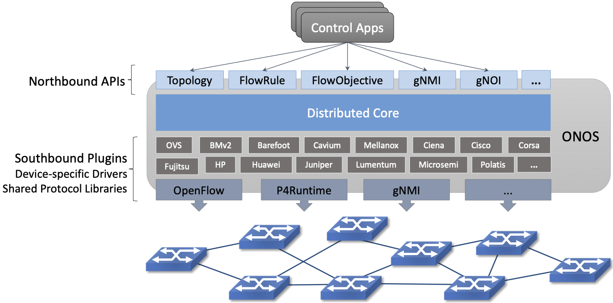
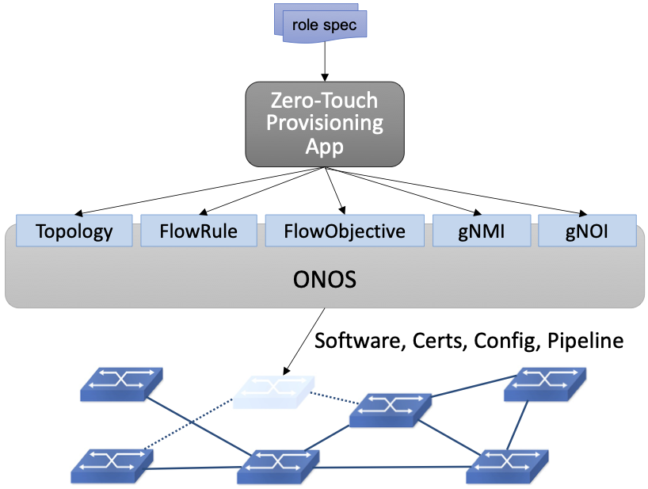
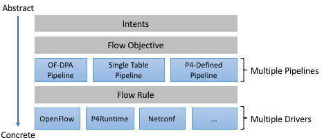
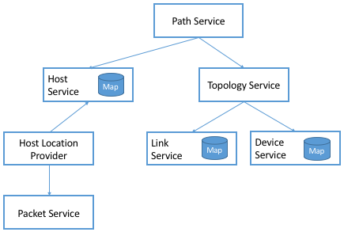
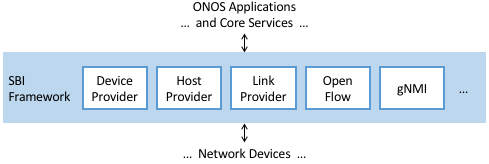

Chapter 6:  Network OS
======================

We are now ready to move from a single switch with purely local state,
to the global, network-wise view maintained by a Network Operating
System. The best way to think about a NOS is that it is like any other
horizontally scalable cloud application. It consists of a collection
of loosely coupled subsystems—as is often associated with a
micro-service architecture—including a scalable and highly available
key/value store.

This chapter describes the overall structure of a NOS using ONOS as a
reference implementation. The focus is on the core abstractions that
have emerged from experience implementing a wide range of control
applications on top of ONOS, and using ONOS to manage an equally wide
range of network devices. This chapter also discusses the critically
important issues of scalable performance and high availability.

6.1 ONOS Architecture
---------------------

The overall architecture for ONOS is shown in :numref:`Figure %s
<fig-onos>`. It consists of three main layers:

1. A collection of Northbound Interfaces (NBI) that applications use to
   stay informed about the network state (e.g. traverse topology graph,
   intercept network packets) and also to control the network data plane
   (e.g. program flow objectives via FlowObjective API introduced in
   Chapter 3).

2. A Distributed Core that is responsible for managing network state
   and notifying applications about relevant changes in that
   state. Internal to the core is a scalable key/value store called
   Atomix.
   
3. A Southbound Interface (SBI) constructed from a collection plugins
   including shared protocol libraries and device-specific drivers.
   
.. _fig-onos:

    Three-layer architecture of ONOS, hosting a set of control
    applications.

As :numref:`Figure %s <fig-onos>` suggests, the design is highly
modular, with a given deployment configured to include the subset of
modules it requires. We delay a discussion about the exact form for
the modularity (e.g., Karaf, Kubernetes) until the concluding section,
where we take up the issue of scalability. Until then, the focus is
on the functional organization of ONOS.

There are three other things to note about :numref:`Figure %s
<fig-onos>` before we get into the details about each layer. The first
is the breadth of the NBI. If you think of ONOS as an operating
system, this makes sense: All access to the underlying hardware,
whether by a control program or a human operator, is mediated by
ONOS. This means the union of all northbound APIs must be sufficient
to configure, operate, and control the network. For example, the NBI
includes gNMI and gNOI for configuration and operations,
respectively. It also means the NBI includes a Topology API that
Control Applications use to learn about changes in the underlying
network state (e.g., ports coming up and down), along with the
FlowObjective API used to control the underlying switches.

As an aside, while we generally characterize the applications that run
on top of a Network OS as implementing the network control plane,
there are actually a wide assortment of apps running on ONOS,
implementing everything from a GUI that can be used to monitor the
state of the network, to a traditional CLI that operators can use to
issue directives.

Among the applications sitting on top of ONOS is a zero-touch
management plane that provisions new hardware added to the network,
making sure the right software, certificates, configuration
parameters, and pipeline definition are installed. This example is
illustrated in :numref:`Figure %s <fig-ztp>`, where one takeaway is
that ONOS does not have a fixed NBI: there are potentially multiple
layers of applications and services running on ONOS, each providing
some value on top of the applications and services below it. Declaring
zero-touch provisioning to be *in* ONOS versus *on* ONOS is an
arbitrary statement, which points to an important way in which ONOS is
*not* like a conventional operating system: There is no
syscall-equivalent interface demarking the boundary between a
privileged kernel and multiple user domains. In other words, ONOS
currently operates in a single trust domain.

.. _fig-ztp:

    Example of a Zero-Touch Provisioning (ZTP) application taking a
    “role spec” for a switch being installed as input, with ONOS
    provisioning the switch accordingly.

The second thing to note about :numref:`Figure %s <fig-onos>` is that
ONOS maps an abstract specification of behavior the control
application wants to impose on the network onto the concrete
instructions that need to be communicated to each switch in the
network. Applications can select from a variety of means of how to
affect the network operation. Some applications use high-level
*Intents*, which are network-wide, topology-independent programming
constructs. Others that require finer-grained control use Flow
Objectives, which are device-centric programming constructs. Flow
Objectives are much like Flow Rules, except they are
pipeline-independent. Applications use them to control both
fixed-function and programmable pipelines. As highlighted in
:numref:`Figure %s <fig-layers>`, doing this job in the face of varied
forwarding pipelines is a complexity ONOS is explicitly designed to
address.

.. _fig-layers:

    ONOS manages the mapping of an abstract specification of
    network-wide behavior to a collection of per-device instructions.

The third thing to notice about :numref:`Figure %s <fig-onos>` is that
information flows both “down” and “up” through ONOS. It’s easy to
focus on applications using the ONOS NBI to control the network, but
it is also the case that the southbound plugins pass information about
the underlying network up to the ONOS core. This includes intercepting
packets, discovering devices and their ports, reporting link quality,
and so on. These interactions between the ONOS core and the network
devices are handled by a set of adaptors (e.g., OpenFlow, P4Runtime),
which hide the details of communicating with the devices, thereby
insulating the ONOS core and the applications running on top of it
from the diversity of network devices. For example, ONOS is being used
to control black-box switches, white-box switches, optical devices,
and cellular base stations.

6.2 Distributed Core
--------------------

The ONOS core is comprised of a number of subsystems, each responsible
for a particular aspect of network state (e.g. topology, host
tracking, packet intercept, flow programming). Each subsystem
maintains its own *service abstraction*, where its implementation is
responsible for propagating the state throughout the cluster.

Many ONOS services are built using distributed tables (maps), which
are in turn implemented using a distributed key/value store. The store
itself will be familiar to anyone that has looked at how modern cloud
services are designed—it scales across a distributed set of servers,
and implements the Raft consensus algorithm to achieve fault-tolerance
in the face of failures. If you are unfamiliar with Raft, a good
introduction is available at:

.. _reading_p4:
.. admonition:: Further Reading 

   `The Raft Consensus Algorithm <https://raft.github.io/>`__. 

ONOS uses Atomix as its store, where Atomix goes beyond the core Raft
algorithm to provide a rich set of programming primitives that ONOS
uses to manage the distributed state and make it easy for control apps
to access.

This is a common design paradigm. What’s unique about ONOS—or any
Network OS, for that matter—is the set of maps it defines: the
semantics of the keys it stores and the types of the values associated
with those keys. It is this data model that makes a Network OS a
Network OS (and not a ride-share application or a social network).
This section mostly focuses on this set of data models and the
corresponding services built around them, although we start with a
brief introduction to the primitives that Atomix supports.

6.2.1 Atomix Primitives
~~~~~~~~~~~~~~~~~~~~~~~

The preceding discussion introduced Atomix as a key/value store, which
it is, but it is also accurate to describe Atomix as a general tool
for building distributed systems. It is a Java-based system that
includes support for:

* Distributed data structures, including maps, sets, trees, and counters.
* Distributed communication, including direct messaging and publish/subscribe.
* Distributed coordination, including locks, leader elections, and barriers.
* Managing group membership.

For example, Atomix includes ``AtomicMap`` and ``DistributedMap``
primitives. Both extend Java’s ``Map`` utility with additional
methods. In the case of ``AtomicMap``, the primitive performs atomic
updates using optimistic locks, such that all operations are
guaranteed to be atomic (and each value in a map has a monotonically
increasing version number). In contrast, the ``DistributedMap``
primitive supports eventual consistency rather than guarantee
consistency. Both primitives support event-based notifications of
changes to the corresponding map. Clients can listen for
inserted/updated/removed entries by registering event listeners on a
map.

Maps are the workhorse primitive used by ONOS, as we will see in the
next subsection. We conclude this section by looking at another role
that Atomix plays in ONOS: coordinating all the ONOS instances. There
are two aspects to this coordination.

First, as a horizontally scalable service, the number of ONOS
instances running at any given time depends on the workload and the
level of replication needed to guarantee availability in the face of
failures. The Atomix *group membership* primitive is used to determine
the set of available instances, making it possible to detect new
instances that have been spun and existing instances that have
failed. (Note that the set of ONOS instances are distinct from the set
of Atomix instances, with both able to scale independently. This and
the next paragraph are focused on the ONOS instances.)

Second, the primary job of each instance is to monitor and control a
subset of the physical switches in the network. The approach ONOS
takes is to elect a master instance for each switch, where only the
master issues (writes) control instructions to a given switch. All the
instances are able to monitor (read) switch state. The instances then
use the Atomix *leader-election* primitive to determine the master for
each switch. Should an ONOS instance fail, the same primitive is used
to elect a new master for the switches. The same approach is applied
when a new switch comes on-line.

6.2.2 Services
~~~~~~~~~~~~~~

ONOS builds on Atomix by defining a core set of tables (maps), which
are in turn packaged as a collection of *services* available to
control applications (and other services). A table and a service are
two ways of looking at the same things: one is a collection of
key/value pairs and the other is the interface through which
applications and other services interact with those pairs.
:numref:`Figure %s <fig-services1>` depicts the respective layers,
where the middle three components—Topology, Link, and Device—are
example ONOS services.

.. _fig-services1:

    ONOS provides a set of services, such as the Topology, Device, and
    Link Services, on top of a corresponding table (Map) implemented
    in Atomix.

Note that the Topology Service in :numref:`Figure %s <fig-services1>`
does not have an associated map, but instead indirectly accesses the
maps defined by the Link and Device Services. The Topology Service
caches the resulting network graph in memory, which gives applications
a low-latency, read-only way access to network state. The Topology
Service also computes a spanning tree of the graph to ensure that all
applications see the same broadcast tree.

As a whole, ONOS defines an inter-connected graph of services, with
:numref:`Figure %s <fig-services1>` showing just a small
subgraph. :numref:`Figure %s <fig-services2>` expands on that view to
illustrate some other aspects of the ONOS core, this time simplified
to show the Atomix maps as an attribute of some (but not all) of the
services. There are several things of note about this example.

.. _fig-services2:

    Dependency graph of services (some with their own key/value maps)
    involved in building a Path Service.

First, the Path Service, which applications can query to learn
end-to-end paths between host pairs, depends on both the Topology
Service (which tracks the network graph) and a Host Service (which
tracks the hosts connected to the network). Note that arrow
directionality implies dependency, but as we saw in :numref:`Figure %s
<fig-services2>`, information flows in both directions.

Second, the Host Service has both a north-bound and a south-bound
interface. The Path Service uses its north-bound interface to read
host-related information, while the Host Location Provider uses its
south-bound interface to write host-related information. The Host
Service itself is little more than a wrapper around the Atomix Map
that stores information about hosts. We return to the *Provider*
abstraction in Section 6.4, but in a nutshell, they are modules that
interact with the underlying network devices.

Third, the Host Location Provider snoops network traffic—for example,
intercepting ARP, NDP, and DHCP packets—to learn about hosts connected
to the network, which it then provides to the Host Service. The Host
Location Provider, in turn, depends on a Packet Service to help it
intercept those packets. The Packet Service defines a
device-independent means for other ONOS services to instruct the
underlying switches to capture and forward select packets to the
control plane. ONOS services can also use the Packet Service to inject
packets into the data plane.

Finally, while the service graph depicted in :numref:`Figure %s
<fig-services2>` is designed to discover the network topology, there
are many scenarios where the topology is fixed, and known *a
priori*. This often happens when the control plane is tailored for a
particular topology, as is the case for the leaf-spine topology
discussed throughout this book. For such scenarios, the Topology
Service accepts configuration instructions from a control application
(or high-level service) sitting above it in the dependency graph.\ [#]_
ONOS includes such a configuration service, called *Network Config*,
as depicted in :numref:`Figure %s <fig-services3>`. Network Config, in
turn, accepts configuration directives from either a human operator or
an automated orchestrator, such as the example ZTP control application
from :numref:`Figure %s <fig-ztp>`.

.. [#] The Topology Service still collects ground-truth information
       from the underlying network, verifies that it matches the
       configuration directives passed in from above, and notifies the
       Network Config Service when there is a discrepancy.

.. _fig-services3:

    Network Config Service, supporting both provisioning applications
    and human operators.

The sequence of examples we just walked through (:numref:`Figures %s
<fig-services1>`, :numref:`%s <fig-services2>`, and :numref:`%s
<fig-services3>`) illustrate the basics of how ONOS is built from
parts. For completeness, the following gives a summary of the most
commonly used ONOS services:

  **Host:** Records end systems (machine or virtual machine) connected
  to the network. Populated by one or more host discovery apps,
  generally by intercepting ARP, NDP, or DHCP packets.

  **Device:** Records infrastructure device-specific information
  (switches, ROADMs, etc.), including ports. Populated by one or more
  device discovery apps.

  **Link:** Records attributes of links connecting pairs of
  infrastructure devices/ports. Populated by one or more link
  discovery apps (e.g., by emitting an intercepting LLDP packets).

  **Topology:** Represents the network as a whole using a graph
  abstraction. It is built on top of the Device and Link services and
  provides a coherent graph comprised of infrastructure devices as
  vertices and infrastructure links as edges. The graph converges on the
  network topology using eventual consistency approach as events about
  device and link inventory are received.

  **Mastership:** Runs leadership contests (using Atomix leader-election
  primitive) to elect which ONOS instance in the cluster should be the
  master for each infrastructure device. In cases when an ONOS instance
  fails (e.g., server power failure), it makes sure a new master is
  elected as soon as possible for all devices left without one.

  **Cluster:** Manages ONOS cluster configuration. It provides
  information about the Atomix cluster nodes as well as about all peer
  ONOS nodes. Atomix nodes form the actual cluster that is the basis
  for consensus, while the ONOS nodes are effectively mere clients
  used to scale control logic and I/O to network devices. Entries set
  by ONOS using Atomix membership primitive.

  **Network Config:** Prescribes meta-information about the network,
  such as devices and their ports, hosts, links, etc. Provides outside
  information about the network and how the network should be treated by
  ONOS core and applications. Set by orchestrator apps, the ZTP control
  application, or manually by an operator.

  **Component Config:** Manages configuration parameters for various
  software components in the ONOS core and applications. Such
  parameters (i.e. how to treat foreign flow rules, address or DHCP
  server, polling frequency, and so on) allow for tailoring the
  behavior of the software. Set by the operator according to the needs of
  the deployment.

  **Packet:** Allows the core services and applications to intercept
  packets (packet in) and to emit packets back into the network. This
  is the basis for most of the host and link discovery methods (e.g.,
  ARP, DHCP, LLDP).

The above services are used by nearly every application because they
offer information about the network devices and their topology. There
are, however, many more services, including ones that allow
applications to program the behavior of the network using different
constructs and different levels of abstraction. We discuss some of
these in more depth in the next section, but for now we note that they
include:

  **Route:** Defines a prefix to nexthop mapping. Set either by a
  control app or manually configured by an operator.

  **Mcast:** Defines group IP, source and sink locations. Set by a
  control app or manually configured by an operator.

  **Group:** Aggregates ports or actions in a device. Flow entries can
  point to a defined group to allow sophisticated means of forwarding,
  such as load-balancing between ports in a group, failover among
  ports in a group, or multicast to all ports specified in a group.  A
  group can also be used for aggregating common actions of different
  flows, so that in some scenarios only one group entry is required to
  be modified for all the referencing flow entries instead of having
  to modify all of them.

  **Meter:** Expresses a rate-limit to enforce a quality of service
  for select network traffic handled by a device.

  **Flow Rule:** Provides a device-centric, match/action pair for
  programming the data-plane forwarding behavior of a device. It
  requires that flow rule entries be composed in accordance with the
  device's table pipeline structure and capabilities.

  **Flow Objective:** Provides a device-centric abstraction for
  programming the forwarding behavior of a device in a
  pipeline-agnostic manner. It relies on the Pipeliner subsystem (see
  next section) to implement the mapping between table-agnostic flow
  objectives and table-specific flow rules or groups.

  **Intent:** Provides a topology-agnostic way to establish flows
  across the network. High-level specifications, call *intents*,
  indicate various hints and constraints for the end-to-endpath,
  including the type of traffic and the source and destination hosts,
  or ingress and egress ports to request connectivity. The service
  provisions this connectivity over the appropriate paths and then
  continuously monitors the network, changing the paths over time to
  continue meeting the objectives prescribed by the intent in the face
  of varying network conditions.

Each of the above services comprises its own distributed store and
notification capabilities. Individual applications are free to extend
this set with their own services and to back their implementations
with their own distributes stores. This is why ONOS provides
applications with direct access to Atomix primitives, such as
``AtomicMaps`` and ``DistributedMaps``. We will see examples of such
extensions in the next Chapter when we take a closer look at Trellis.

6.3 Northbound Interface
------------------------

The ONOS NBI has multiple parts. First, for every service included in
a given configuration of ONOS, there is a corresponding API. For
example, the “Topology” interface shown in :numref:`Figure %s
<fig-onos>` is exactly the API offered by the Topology Service shown
in :numref:`Figure %s <fig-services1>`. Second, because ONOS permits
applications to define and use their own Atomix primitives, it is fair
to consider the Atomix programmatic interface as another part of the
ONOS NBI. Third, the ONOS NBI includes gNMI and gNOI. These are
standardized interfaces, defined independent of ONOS, but supported as
part of the ONOS NBI. Note that the implementation sitting behind gNMI
and gNOI are also Atomix-based maps. Finally, and most interestingly,
ONOS offers a set of interfaces for controlling the underlying
switches. :numref:`Figure %s <fig-onos>` depicts two: Flow Rules and
Flow Objectives. The first is borrowed from OpenFlow, and hence, is
pipeline-aware. The second is pipeline-agnostic, and the focus of the
rest of this section.

There are three types of flow objectives: *Filtering*, *Next*, and
*Forwarding*. Filtering objectives determine whether or not traffic
should be permitted to enter the pipeline, based on a traffic
*Selector*. This selector abstracts the "match" part of a match-action
rule. Next objectives indicate what kind of *Treatment* the traffic
should receive. This treatment abstracts the "action" part of a
match-action rule.  Forwarding objectives determine which traffic is
to be allowed to egress the pipeline, effectively adding a second
opportunity apply a match rule to the traffic.

The challenge is to map these pipeline-agnostic objectives onto
pipeline-dependent rules. In ONOS, this mapping is managed by the Flow
Objective Service, as depicted in :numref:`Figure %s
<fig-flowobj>`. For simplicity, the example focuses on the selector
(match) specified by a Filtering objective, where the key is to
express the fact that you want to match on a particular switch port,
MAC address, VLAN tag, and IP address without regard for which
sequence of pipeline tables implements such a combination.

.. _fig-flowobj:

    Flow Objective Service manages the mapping of pipeline-agnostic
    objectives onto pipeline-specific rules.

Internally, ONOS manages the binding between the pipeline-agnostic
objectives and the device-specific handlers. These handlers are
implemented using the ONOS device driver mechanism. The device driver
behavior that abstracts the implementation of how flow objective
directives should map to flow rule operations is called *Pipeliner*.
:numref:`Figure %s <fig-flowobj>` shows Pipeliners for two example
switch pipelines.

Each Pipeliner is able to map Flow objectives onto both Flow Rules (in
the case of fixed-function pipelines) and P4-programmed pipelines. The
example given in :numref:`Figure %s <fig-flowobj>` assumes the former
case, which implies a mapping to OpenFlow 1.3. In the latter case,
Pipeliner leverages *Pipeconf*, a structure that maintains
associations among the following elements:

1. A model of the pipeline for each target switch.
2. A target-specific driver needed to to deploy flow instructions to the switch.
3. A pipeline-specific translator to map Flow Objectives into the target pipeline.

Pipeconf maintains these bindings using information extracted from the
``.p4info`` file output by the P4 compiler, as described in Section
5.2.

Today, the “model” identified in (1) is ONOS-defined, meaning the
end-to-end workflow for a developer involves being aware of both a P4
architecture model (e.g., ``v1model.p4``) when programming the data
plane and this ONOS model when programming the control plane using
Flow Objectives. Eventually, these various layers of pipeline models
will be unified, and in all likelihood, specified in P4.

Programmatically, Flow Objectives are a data structure, packaged with
associated constructor routines. The control application builds a list
of objectives and passes them to ONOS to be executed. The following
code example shows Flow Objectives being constructed to specify an
end-to-end flow through the network. The process of applying them to
the underlying devices is done elsewhere, and not included in the
example.

.. code:: java

    public void createFlow(TrafficSelector originalSelector, 
                       TrafficTreatment originalTreatment,
                       ConnectPoint ingress, ConnectPoint egress,
                       int priority, boolean applyTreatment,
                       List<Objective> objectives,
                       List<DeviceId> devices) {
        TrafficSelector selector = DefaultTrafficSelector.builder(originalSelector)
                .matchInPort(ingress.port())
                .build();

        // Optionally apply the specified treatment
        TrafficTreatment.Builder treatmentBuilder;
        if (applyTreatment) {
            treatmentBuilder = DefaultTrafficTreatment.builder(originalTreatment);
        } else {
            treatmentBuilder = DefaultTrafficTreatment.builder();
        }

        objectives.add(DefaultNextObjective.builder()
                .withId(flowObjectiveService.allocateNextId())
                .addTreatment(treatmentBuilder.setOutput(egress.port()).build())
                .withType(NextObjective.Type.SIMPLE)
                .fromApp(appId)
                .makePermanent()
                .add());
        devices.add(ingress.deviceId());

        objectives.add(DefaultForwardingObjective.builder()
                .withSelector(selector)
                .nextStep(nextObjective.id())
                .withPriority(priority)
                .fromApp(appId)
                .makePermanent()
                .withFlag(ForwardingObjective.Flag.SPECIFIC)
                .add());
        devices.add(ingress.deviceId());
    }

The above example creates a Next objective and a Forwarding objective,
with the Next objective applying a Treatment to the flow. Minimally,
that Treatment sets the output port, but optionally, it also applies
the ``originalTreatment`` passed in as an argument to ``createFlow``.

6.4 Southbound Interface
------------------------

A critical part of ONOS’s flexibility is its ability to accommodate
different control protocols. While the nature of control interactions
and associated abstractions was certainly inspired by the OpenFlow
protocol, ONOS is designed to ensure that the core (and the
applications written on top of the core) are insulated from the
specifics of the control protocol.

This section takes a closer look at how the ONOS accommodates multiple
protocols and heterogeneous network devices. The basic approach is
based on a plugin architecture, with two types of plugins: *Protocol
Providers* and *Device Drivers*. The following subsections describe
each, in turn.

6.4.1 Provider Plugins
~~~~~~~~~~~~~~~~~~~~~~

ONOS defines a Southbound Interface (SBI) plugin framework, where each
plugin defines some southbound (network facing) API. Each plugin,
called a *Protocol Provider*, serves as a proxy between the SBI and
the underlying network, where there is no limitation of what control
protocol each can use to communicate with the network. Providers
register themselves with the SBI plugin framework, and can start
acting as a conduit for passing information and control directives
between ONOS applications and core services (above) and the network
environment (below), as illustrated in :numref:`Figure %s <fig-plugins>`.

.. _fig-plugins:

    ONOS Southbound Interface (SBI) is extended by Provider Plugins.
    
:numref:`Figure %s <fig-plugins>` includes two general kinds of
Provider plugins. The first type are protocol-specific, with OpenFlow
and gNMI being typical examples. Each of these Providers effectively
bundles the API with the code that implements the corresponding
protocol. The second type—of which *DeviceProvider*, *HostProvider*,
and *LinkProvider* are the examples shown in the figure—interact
indirectly with the environment using some other ONOS service. We saw
an example of this in Section 6.2.2, where Host Location Provider (an
ONOS service) sits behind *HostProvider* (an SBI plugin); the latter
defines the API for host discovery and the former defines one specific
approach to discovering hosts (e.g., using Packet Service to intercept
ARP, NDP and DHCP packets). Similarly, Lldp Link Provider
(corresponding to the *LinkProvider* SBI plugin) uses Packet Service
to intercept LLDP and BDDP packets to surmise links between
infrastructure devices.

6.4.2 Device Drivers
~~~~~~~~~~~~~~~~~~~~

In addition to insulating the core from protocol specifics, the SBI
framework also supports Device Drivers plugins as a mechanism to
insulate code (including Providers) from device-specific variations. A
Device Driver is a collection of modules, each of which implements a
very narrow facet of control or configuration capabilities. As with
the Protocol Providers, no limitations are placed on how the device
driver chooses to implement those capabilities. Device drivers are
also deployed as ONOS applications, which allows them to be installed
and uninstalled dynamically allowing operators to introduce new device
types and models on the fly.

6.5 Scalable Performance
------------------------

ONOS is a logically centralized SDN controller, and as such, must
ensure that it is able to respond to a scalable number of control
events in a timely way. It must also remain available in the face of
failures. This section describes how ONOS scales to meet these
performance and availability requirements. But first the numbers,
where ONOS represents the state-of-the-art in centralized network
control:

* **Scale:** ONOS supports up to 50 network devices; 5000 network
  ports; 50k subscribers, 1M routes; and 5M flow rules/groups/meters.
  
* **Performance:** ONOS supports up to 10k configuration ops/day; 500k
  flow ops/sec (sustained); 1k topology events/sec (peak); 50ms to
  detect port/switch up events; 5ms to detect port/switch down events;
  3ms for flow ops; and 6ms for hand-over events (RAN).
  
Production deployments run at least three instances of ONOS, but this
is more for availability than performance. Each instance runs on a
32-Core/128GB-RAM server, and is deployed as a Docker container using
Kubernetes. Each instance bundles an identical (but configurable)
collection of core services, control applications, and protocol
providers, where ONOS uses Karaf as its internal modularity framework.
The bundle also includes Atomix, although ONOS supports an optional
configuration that scales the key/value store independently from the
rest of ONOS.

A refactoring of ONOS to more closely adhere to a microservice
architecture is also underway. The new version, called µONOS,
leverages ONOS’s existing modularity, but packages and scales
different subsystems independently. This includes encapsulating Atomix
in its own microservice, as well as running each control application
and southbound adaptor as a separate microservice. It also means
partitioning the core into distinct microservices corresponding to
Topology Management (exporting a Network Graph API), Control
Management (exporting a P4Runtime API), Configuration Management
(exporting a gNMI API), and Operations Management (exporting a gNOI
API).
