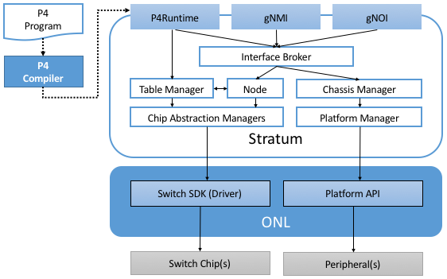
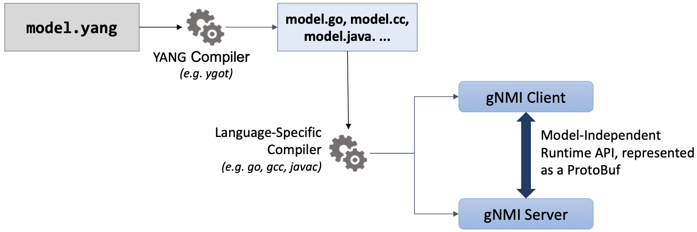

Chapter 5:  Switch OS
======================

This chapter describes the operating system running on every white-box
switch, where equating a bare-metal switch with a bare-metal server is
a good mental model: It has a general-purpose processor running a
Linux-based OS, plus a “packet forwarding accelerator” similar in
spirit to a GPU.

The most common foundation for this Switch OS is *Open Network Linux
(ONL)*, an open source project of the Open Compute Project. ONL starts
with the Debian distribution of Linux, and augments it with support
for hardware that is unique to switches, including the *Small
Form-factor Pluggable (SFP)* interface module shown in :numref:`Figure
%s <fig-switch>`.

This chapter does not go into these low-level device driver details,
but instead focuses on the *Northbound Interface (NBI)* exported by
the Switch OS to the control plane, whether that control plane runs
on-switch (as a program running in user space on top of the Switch OS)
or off-switch (as an SDN controller like ONOS). And as introduced in
Chapter 3, we will use Stratum as our concrete example of the layer of
software that implements this NBI on top of ONL. Stratum is sometimes
called a *Thin Switch OS*, where the operative word is “thin” because
it essentially implements an API shim. What’s interesting about the
shim is the set of APIs it supports, and correspondingly, the vast
majority of this chapter focuses on those APIs.

5.1 Thin Switch OS
---------------------

This section describes the set of components that implement an
SDN-ready Northbound Interface for the Switch OS running on a
white-box switch. The details are drawn from Stratum, an open source
project at the ONF that started with production-quality code made
available by Google. :numref:`Figure %s <fig-stratum>` gives a
high-level overview of Stratum, and to re-emphasize, it’s the exposed
interfaces—P4Runtime, gNMI, and gNOI—that are the important take-aways
of this chapter. We show these few implementation details in this
section only as a way of grounding the description of an end-to-end
workflow for developers implementing SDN-based solutions.

.. _fig-stratum:

    High-level schematic of Stratum, a Thin Switch OS running on top
    of Open Networking Linux.

Stratum exports three primary Northbound Interfaces: (1) P4Runtime is
used to control the switch’s forwarding behavior; (2) gNMI is used to
configure the switch; and (3) gNOI is used to access other operational
variables on the switch. All three interfaces are gRPC services (not
shown), which implies there is a corresponding set of *Protocol
Buffers (protobufs)* that specify the API methods and supported
parameters of each. A tutorial on gRPC and protobufs is beyond the
scope of this book, but a brief introduction to both can be found
elsewhere:

.. _reading_grpc:
.. admonition:: Further Reading

   `gRPC
   <https://book.systemsapproach.org/ee/rpc.html#grpc>`__.
   Computer Networks: A Systems Approach, November 2019.

   `Protocol Buffers
   <https://book.systemsapproach.org/e2e/presentation.html#protobufs>`__.
   Computer Networks: A Systems Approach, November 2019.

The important take-away is that by using protobufs and gRPC, Stratum
need not be concerned with the long list of formatting, reliability,
backwards compatibility, and security challenges that protocols
(including OpenFlow) have historically spent a great deal of time
worrying about. In addition, protobufs serve as a well-defined target
for the code generated by the P4 compiler, which is to say, the P4
toolchain outputs protobufs that specify the types and arguments for
the P4Runtime interface. This API, along with the client- and
server-side stubs that implement it, are (mostly) auto-generated.
Section 5.2 describes the toolchain for creating this
runtime contract in more detail.

Below Stratum, the architecture takes advantage of two components. The
first is a *Software Development Kit (SDK)* for the on-board switching
chip(s). These are provided by the switch vendor, and in the case of
Broadcom, it roughly corresponds to the OF-DPA layer described in
Section 4.5. Barefoot provides a similar SDK for their Tofino
chip. You can think of these SDKs as similar to device drivers in a
traditional OS: they are used to indirectly read and write memory
locations on the corresponding chip. The second is the *ONL Platform
(ONLP)*, which exports the Platform API shown in :numref:`Figure %s
<fig-stratum>`. This API provides access hardware counters, monitors,
status variables, and so on.

As a simple example, which helps illustrate the fundamental difference
between fixed-function and programmable pipelines, Broadcom's SDK
defines a ``bcm_l3_route_create`` method to update the L3 forwarding
table, whereas Barefoot's corresponding pipeline-independent method is
``bf_table_write``.

Internal to Stratum, the rest of the components shown in
:numref:`Figure %s <fig-stratum>` are primarily designed to make
Stratum vendor-agnostic. In the case of a programmable chip like
Tofino, Stratum is largely pass-through: P4Runtime calls that come
from above are directly passed through to the Barefoot SDK. In the
case of a fixed-function chip like Tomahawk, Stratum maintains the
runtime state it needs to translate the P4Runtime calls into their
Broadcom SDK counterpart. To a first approximation, this implies
mapping P4Runtime calls to update table entries in a program like
``switch.p4`` (Section 4.5.1) into Broadcom SDK calls to update
entries in one of the ASIC tables.

5.2 P4Runtime
-----------------

You can think of the P4Runtime interface shown in :numref:`Figure %s
<fig-stratum>` as the server-side RPC stub for controlling the
switch. There is a corresponding client-side stub, which is similarly
included in the SDN Controller. Together, they implement the
*P4Runtime Contract* between the controller and the switch. The
toolchain for generating this contract is shown in :numref:`Figure %s
<fig-toolchain>`, where as in earlier figures, we represent the
original P4 forwarding program as an abstract graph rather than with
actual P4 source code.

.. _fig-toolchain:

    P4 toolchain achieves ASIC-independence and auto-generates
    P4Runtime Contract (represented as a Protocol Buffer
    specification).

One key takeaway from :numref:`Figure %s <fig-toolchain>` is that the
P4 compiler generates both the binary that is loaded into each
switching chip, and the *runtime interface* used to control the
switching chip (indirectly via the Switch OS).\ [#]_ The compiler does
this with the help of a vendor-specific backend, where :numref:`Figure
%s <fig-toolchain>` shows two possible examples. Note that these
vendor-specific backends have to be written for a specific
architecture model (as defined by ``arch.p4`` in this example).  In
other words, today it is a combination of the P4 language, the
ASIC-specific backend, and the architecture model that defines the
programming environment for injecting functionality into the data
plane.

.. [#] When we say the binary is loaded into the switching chip, we
       are adopting familiar terminology from general-purpose
       processors. The exact process is ASIC-specific, and might
       include initializing various on-chip tables via the SDK.

The final piece of the end-to-end story is the connection between the
runtime contract and the original program loaded into the data
plane. Using the simple forwarding program presented in Section 4.4 as
an example, we see that ``forward.p4`` defines a lookup table, which
we restate here:

.. code-block:: c

    table ipv4_lpm {
        key = {
            hdr.ipv4.dstAddr: lpm;
        }
        actions = {
            ipv4_forward;
            drop;
            NoAction;
        }
        size = 1024;
        default_action = drop();

Correspondingly, the file ``forward.p4info`` output by the compiler
*specifies* the P4Runtime Contract. As shown in the following example,
it contains enough information to fully inform both the controller and
switch on how to format and interpret the set of gRPC methods needed
to insert, read, modify, and delete entries in this table. For
example, the ``table`` definition identifies the field to match
(``hdr.ipv4.dstAddr``) and the type of match (``LPM``), along with the
three possible ``actions``.

.. code-block:: proto

	actions {
	    preamble {
	        id: 16800567
	        name: "NoAction"
	        alias: "NoAction"
	    }
	}
	actions {
	    preamble {
	        id: 16805608
	        name: "MyIngress.drop"
	        alias: "drop"
	    }
	}
	actions {
	    preamble {
	        id: 16799317
	        name: "MyIngress.ipv4_forward"
	        alias: "ipv4_forward"
	    }
	    params {
	        id: 1
	        name: "dstAddr"
	        bitwidth: 48
	    }
	    params {
	        id: 2
	        name: "port"
	        bitwidth: 9
	    }
	}
	tables {
	    preamble {
	        id: 33574068
	        name: "MyIngress.ipv4_lpm"
	        alias: "ipv4_lpm"
	    }
	    match_fields {
	        id: 1
	        name: "hdr.ipv4.dstAddr"
	        bitwidth: 32
	        match_type: LPM
	    }
	    action_refs {
	        id: 16799317
	    }
	    action_refs {
	        id: 16805608
	    }
	    action_refs {
	        id: 16800567
	    }
	    size: 1024
	}

The gRPC toolchain takes over from there. For this to work, the
toolchain must be aware of which P4 language elements are
controllable, and hence, available to be “exposed” by
``p4runtime.proto``. Such information is contained in
``forward.p4info``, which specifies exactly the set of controllable
elements and their attributes as defined in the source P4 program. (In
principle, there is no need to create such P4Info file, as the
controller and switch can use the source P4 program to derive all the
information they need to handle P4Rutime methods. However, P4Info
makes that much easier by extracting the relevant information from the
P4 program and providing them in a more structured protobuf-defined
format, which is straightforward to parse by using a protobuf
library.) The table element is one obvious example, but there are
others, including ``counters`` and ``meters``, which are used to
report status information up to the controller and to allow the
controller to specify a QoS rate, respectively, but neither are
included in our example program.

Finally, a controller actually writes an entry to this table. While in
general this controller would run on top of ONOS, and so indirectly
interact with the switch, we can look at a simpler example in which a
Python program implements the controller, and writes an entry directly
into the table (assisted by a P4Runtime library).

.. code-block:: py

	import p4runtime_lib.helper
	...
	table_entry = p4info_helper.buildTableEntry(
	    table_name="MyIngress.ipv4_lpm",
	    match_fields={
	        "hdr.ipv4.dstAddr": (dst_ip_addr, 32)
	    },
	    action_name="MyIngress.ipv4_forward",
	    action_params={
	        "dstAddr": next_hop_mac_addr,
	        "port": outport,
	    })
	ingress_sw.WriteTableEntry(table_entry)

5.3 gNMI and gNOI
--------------------

A core challenge of configuring and operating any network device is to
define the set of variables available for operators to ``GET`` and
``SET`` on the device, with the additional requirement that this
dictionary of variables be uniform across devices (i.e., be
vendor-agnostic). The Internet has already gone through one
decades-long exercise defining such a dictionary, resulting in the
*Management Information Base (MIB)* used in conjunction with SNMP. But
the MIB was more focused on *reading* device status variables than
*writing* device configuration variables, where the latter has
historically been done using the device’s *Command Line Interface
(CLI)*. One consequence of the SDN transformation is to nudge the
industry towards support for programmatic configuration APIs. This
means revisiting the information model for network devices.

The main technical advance that was not prevalent in the early days of
SNMP and MIB is the availability of pragmatic modeling languages,
where YANG is the leading choice to have emerged over the last few
years. YANG—which stands for *Yet Another Next Generation*, a name
chosen to poke fun at how often a do-over proves necessary—can be
viewed as a restricted version of XSD, which is a language for
defining a schema for XML. YANG defines the structure of the data, but
unlike XSD, it is not XML-specific. Instead, YANG can be used in
conjunction with different over-the-wire message formats, including
XML, but also protobufs and JSON. If these acronyms are unfamiliar, or
the distinction between a markup language and a schema for a markup
language is fuzzy, a gentle introduction is available here:

.. _reading_xml:
.. admonition:: Further Reading

   `Markup Languages (XML)
   <https://book.systemsapproach.org/data/presentation.html#markup-languages-xml>`__.
   Computer Networks: A Systems Approach, November 2019.

What’s important about going in this direction is that the data model
that defines the semantics of the variables available to be read and
written is available in a programmatic form; it’s not just text in a
standards document. Moreover, while it is true that all hardware
vendors promote the unique capabilities of their products, it is not a
free-for-all with each vendor defining a unique model. This is because
the network operators that buy network hardware have a strong
incentive to drive the models for similar devices towards convergence,
and vendors have an equally strong incentive to adhere to those
models. YANG makes the process of creating, using, and modifying
models programmable, and hence, adaptable to this iterative process.

This is where an industry-wide standardization effort, called
*OpenConfig*, comes into play. OpenConfig is a group of network
operators trying to drive the industry towards a common set of
configuration models using YANG as its modeling language. OpenConfig
is officially agnostic as to the over-the-wire protocol used to access
on-device configuration and status variables, but gNMI (gRPC Network
Management Interface) is one approach it is actively pursuing. And as
you might guess from its name, gNMI uses gRPC (which in turn runs on
top of HTTP/2). This means gNMI also adopts protobufs as the way it
specifies the data actually communicated over the HTTP
connection. Thus, gNMI is intended as a standard management interface
for network devices.

For completeness, note that NETCONF is another of the post-SNMP
protocols for communicating configuration information to network
devices. OpenConfig also works with NETCONF, but our reading of the
tea leaves points to gNMI as the future transport protocol, and so it
is the one we highlight in our description of the full SDN software
stack.

.. sidebar:: Cloud Best-Practices

	Our commentary on OpenConfig vs NETCONF is grounded in a
	fundamental tenant of SDN, which is about bringing best
	practices in cloud computing to the network. It involves big
	ideas like implementing the network control plane as a
	scalable cloud service, but it also includes more narrow
	benefits, such as using modern transport protocols like
	gRPC/protobufs.

	The advantages in this particular case are tangible: (1)
	improved and optimized transport using HTTP/2 and
	protobuf-based marshalling instead of SSH plus hand-code
	marshalling; (2) binary data encodings instead of text-based
	encoding; (3) diff-oriented data exchange instead of
	snapshot-based responses; and (4) native support for server
	push and client streaming

OpenConfig defines a hierarchy of object types. For example, the YANG
model for network interfaces looks like this:

.. code-block:: xml

	Module: openconfig-interfaces
		+--rw interfaces	 							
			+--rw interface*   [name]
				+--rw name
				+--rw config
			 	 |   ...	
				+--ro state
				 |    ...	 							
				+--rw hold-time	
				 |    ...	 
				+--rw subinterfaces 							
			    	 |    ... 

This is a base model that can be augmented, for example, to model an Ethernet interface:

.. code-block:: xml

	Module: openconfig-if-ethernet
		augment /ocif:interfaces/ocif:interface:
			+--rw ethernet
			+--rw config
			 |	+--rw mac-address?
			 |	+--rw auto-negotiate?
			 |	+--rw duplex-mode?
			 |	+--rw port-speed?
			 |	+--rw enable-flow-control? 
			+--ro state
				+--ro mac-address?
				+--ro auto-negotiate?
				+--ro duplex-mode?
				+--ro port-speed?
				+--ro enable-flow-control?
				+--ro hw-mac-address?
				+--ro counters
				       ...

Other similar augmentations might be defined to support link
aggregation, IP address assignment, VLAN tags, and so on.

Each model in the OpenConfig hierarchy defines a combination of
configuration state that can be both read and written by the client
(denoted ``rw`` in the examples), and operational state that reports
device status (denoted ``ro`` in the examples, indicating it is
read-only from the client side). This distinction between declarative
configuration state and runtime feedback state is a fundamental aspect
of any network device interface, where OpenConfig is explicitly
focused on generalizing the latter to include network telemetry data
the operator needs to track.

Having a meaningful set of models is necessary, but a full
configuration system includes other elements as well. In our case,
there are three important points to make about the relationship
between Stratum and the OpenConfig models.

The first is that Stratum depends on a YANG toolchain. :numref:`Figure
%s <fig-yang>` shows the steps involved in translating a set of
YANG-based OpenConfig models into the client-side and server-side gRPC
stubs used by gNMI. The gNMI Server shown in the figure is the same as
the gNMI interface portal shown in :numref:`Figure %s
<fig-stratum>`. The toolchain supports multiple target programming
languages (Stratum happens to use C++), where the client and server
sides of the gRPC need not be written in the same language.

.. _fig-yang:

    YANG toolchain used to generate gRPC-based runtime for gNMI.

Keep in mind that YANG is not tied to either gRPC or gNMI. The
toolchain is able to start with the very same OpenConfig models, but
instead produce XML or JSON representations for the data being
read-from or written-to network devices using (for example) NETCONF or
RESTCONF, respectively. But in our context, the target is protobufs,
which Stratum uses to support gNMI running over gRPC.

The second is the specific set of gRPC methods defined by gNMI to
operate on these models. The set is defined collectively as a Service
in the protobuf specification:

.. code-block:: proto

	Service gNMI {
		rpc Capabilities(CapabilityRequest) returns (CapabilityResponse);
		rpc Get(GetRequest) returns (GetResponse);
		rpc Set(SetRequest) returns (SetResponse);
		rpc Subscribe(stream SubscribeRequest) returns (stream SubscribeResponse);
	}

The ``Capabilities`` method is used to retrieve the set of model
definitions supported by the device. The ``Get`` and ``Set`` methods
are used to read and write the corresponding variable defined in some
model. The ``Subscribe`` method is used to set up a stream of
telemetry updates from the device. The corresponding arguments and
return values (e.g., ``GetRequest``, ``GetResponse``) are defined by a
defined by a protobuf ``Message``, and include various fields from the
YANG models. A given field is specified by giving its fully qualified
path name in the data model tree.

The third point is that Stratum does not necessarily care about the
full range of OpenConfig models. This is because—as a Switch OS
designed to support a centralized Controller—Stratum cares about
configuring various aspects of the data plane, but is not typically
involved in configuring control plane protocols like BGP. Such control
plane protocols are no longer implemented on the switch in an
SDN-based solution (although they remain in scope for the Network OS,
which implements their centralized counterpart). To be specific,
Stratum tracks the following OpenConfig models: Interfaces, VLANs,
QoS, and LACP (link aggregation), in addition to a set of system and
platform variables (of which the switch’s fan speed is everyone’s
favorite example).

We conclude this section by briefly turning our attention to gNOI, but
there isn’t a lot to say. This is because the underlying mechanism
used by gNOI is exactly the same as for gNMI, and in the larger scheme
of things, there is little difference between a switch’s configuration
interface and its operations interface. Generally speaking, persistent
state is handled by gNMI (and a corresponding YANG model is defined),
whereas clearing or setting ephemeral state is handled by gNOI. It is
also the case that non-idempotent actions like reboot and ping tend to
fall under gNOI's domain. In any case, the two are closely enough
aligned to collectively be referred to as gNXI.

As an illustrative example of what gNOI is used for, the following is
the protobuf specification for the ``System`` service:

.. code-block:: proto

	service System {
		rpc Ping(PingRequest) returns (stream PingResponse) {}
		rpc Traceroute(TracerouteRequest) returns (stream TracerouteResponse) {}
		rpc Time(TimeRequest) returns (TimeResponse) {}
		rpc SetPackage(stream SetPackageRequest) returns (SetPackageResponse) {}
		rpc Reboot(RebootRequest) returns (RebootResponse) {}
	 	// ...
	}

where, for example, the following protobuf message defines the
``RebootRequest`` parameter:

.. code-block:: proto

	message RebootRequest {
		RebootMethod method = 1; // COLD, POWERDOWN, HALT, WARM, NSF, ...
		uint64 delay = 2; // Delay in nanoseconds before issuing reboot.
	  	string message = 3; // Informational reason for the reboot.
	  	repeated types.Path subcomponents = 4; // Optional sub-components to reboot.
	  	bool force = 5; // Force reboot if sanity checks fail. (ex. uncommited configuration)
	}

As a reminder, if you are unfamiliar with protobufs, a brief overview is available here:

.. _reading_protobuf:
.. admonition:: Further Reading

   `Protocol Buffers
   <https://book.systemsapproach.org/e2e/presentation.html#protobufs>`__.
   Computer Networks: A Systems Approach, November 2019.

5.4 SONiC
----------------

In the same way SAI is an industry-wide switch abstraction (see
Section 4.5), SONiC is a vendor-agnostic Switch OS that is gaining a
lot of momentum in the industry. SONiC, which leverages SAI as a
vendor-agnostic SDK and was originally open sourced by Microsoft,
continues to serve as the Switch OS for the Azure Cloud. And like
Stratum, SONiC can also leverage Open Networking Linux (ONL) as its
underlying operating system. All of which is to say that Stratum and
SONiC both try to fill the same need. Today their respective
approaches are largely complementary, with both open source
communities working towards a “best of both world” solution.

Both SONiC and Stratum support a configuration interface, so unifying
those will be a matter of reconciling their respective data models and
toolchains. The main distinction is Stratum’s support for programmable
forwarding pipelines (including both P4 and P4Runtime), versus the
least common denominator approach to forwarding taken by
SAI. Developers on the two open source projects are working together
to define a roadmap that will make it possible for interested networks
to take advantage of programmable pipelines in an incremental and
low-risk way.

The goal of this effort is to both (1) enable remote SDN
Controllers/Apps to interact with SAI using P4Runtime and gNMI,
and (2) enable SAI extensions using P4 so as to improve feature
velocity in the data plane. Both goals rely on a new representation of
the SAI behavioral model and pipeline based on a P4 program (the so
called ``sai.p4`` program shown in :numref:`Figure %s <fig-compare>`
of Section 4.6). If you take one thing away from this reconciliation
effort, it should be that embracing a programmable pipeline (and
corresponding toolchain) is what facilitates doing something like
this.
