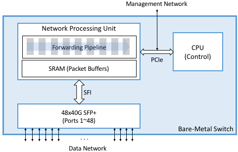
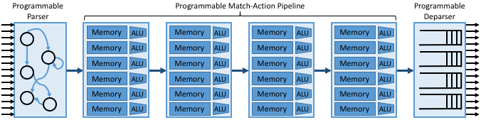
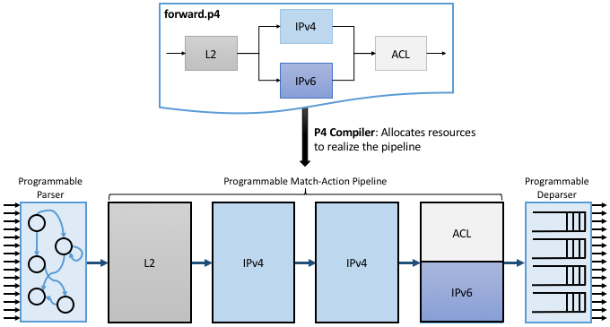
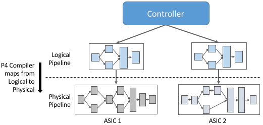
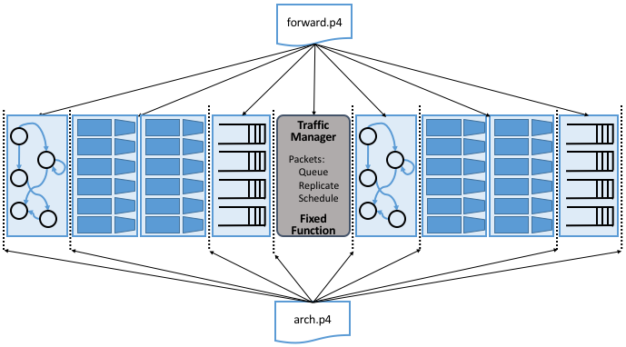

Chapter 4:  White-Box Switches 
===============================

This chapter describes the white-box switches that provide the
underlying hardware foundation for SDN. Our goal is not to give a
detailed hardware schematic, but rather, to sketch enough of the
design to appreciate the software stack that runs on top of it. Also,
because we ultimately want to be vendor agnostic, this chapter
discusses both P4 as a language-based approach to programming the
switch’s data plane, and OpenFlow as the first-generation alternative.

4.1 Switch-Level Schematic
----------------------------------

We start by considering a white-box switch as a whole, where the best
analogy is to imagine a PC built from a collection of commodity,
off-the-shelf components. In fact, a full architectural specification
for switches that take advantage of such components is available
on-line at the *Open Compute Project (OCP)*. This is the hardware
equivalent of open source software, and makes it possible for anyone
to build a high-performance switch, analogous to a home-built PC. But
just as the PC ecosystem includes commodity server vendors like Dell
and HP, you can buy a pre-built (OCP-compliant) switch from white-box
switch vendors such as EdgeCore, Delta and others.

:numref:`Figure %s <fig-switch>` gives a high-level schematic of a
white-box switch. The *Network Processing Unit (NPU)*\ —a merchant
silicon switching chip—is optimized to parse packet headers and make
forwarding decisions. NPUs are able to process and forward packets at
rates measured in Terabits-per-second (Tbps), easily fast enough to
keep up with 32x100-Gbps ports, or the 48x40-Gbps ports shown in the
figure. As of this writing, the state-of-the-art for these chips is
25.6 Tbps with 400-Gbps ports.

.. _fig-switch:

    High-Level schematic of a white-box switch. 

Note that our use of the term NPU is a bit non-standard. Historically,
NPU was the name given to more narrowly-defined network processing
chips used, for example, to implement intelligent firewalls or deep
packet inspection. They were not as general-purpose as the NPUs we are
discussing in this chapter, nor were they as high-performance. It
seems likely that the current merchant silicon switching chips will
make purpose-built network processors obsolete, but in any case, we
prefer the NPU nomenclature because it is consistent with the
industry-wide trend to build programmable domain-specific processors,
including GPUs (Graphic Processing Units) for graphics and TPUs
(Tensor Processing Units) for AI.

:numref:`Figure %s <fig-switch>` shows the NPU as a combination of
SRAM-based memory that buffers packets while they are being processed,
and an ASIC-based forwarding pipeline that implements a series of
(Match, Action) pairs. We describe the forwarding pipeline in more
detail in the next section. The switch also includes a general-purpose
processor, typically an x86 chip, that controls the NPU. This is where
BGP or OSPF would run if the switch is configured to support an
on-switch control plane, but for our purposes, it’s where the Switch
OS runs, exporting an API that allows an off-switch, Network OS to
control the data plane. This control processor communicates with the
NPU, and is connected to an external management network, over a
standard PCIe bus.

:numref:`Figure %s <fig-switch>` also shows other commodity
components that make this all practical. In particular, it is possible
to buy pluggable transceiver modules that take care of all the media
access details—be it 40-Gigabit Ethernet, 10-Gigabit PON, or SONET—as
well as the optics. These transceivers all conform to standardized
form factors, such as SFP+, that can in turn be connected to other
components over a standardized bus (e.g., SFI). Again, the key
takeaway is that the networking industry is now entering into the same
commoditized world that the computing industry has enjoyed for the
last two decades.

Finally, although not shown in :numref:`Figure %s <fig-switch>`, each
white-box switch includes a BIOS, which much like its microprocessor
counterpart, is firmware that provisions and boots a bare-metal
switch. A standard BIOS called the *Open Network Install Environment
(ONIE)* has emerged under the OCP’s stewardship, and so we assume ONIE
throughout the rest of chapter.

4.2 Forwarding Pipeline 
----------------------------------

High-speed switches use a multi-stage pipeline to process packets. The
relevance of using a multi-stage pipeline rather than a single-stage
processor is that forwarding a single packet likely involves looking
at multiple header fields. Each stage can be programmed to look at a
different combination of fields. A multi-stage pipeline adds a little
end-to-end latency to each packet (measured in nanoseconds), but means
that multiple packets can be processed at the same time. For example,
Stage 2 can be making a second lookup on packet A while Stage 1 is
doing an initial lookup on packet B, and so on. This means the
pipeline as a whole is able to keep up with the aggregate bandwidth of
all its input ports. Repeating the numbers from Chapter 3, the
state-of-the-art is currently 25.6 Tbps.

The main distinction in how a given NPU implements this pipeline is
whether the stages are fixed-function (i.e., each stage understands
how to process headers for some fixed protocol) or programmable (i.e.,
each stage is dynamically programmed to know what header fields to
process). In the following discussion we start with the more general
case—a programmable pipeline—and return to its fixed-function
counterpart at the end.

At an architectural level, the programmable pipeline is often referred
to as a *Protocol Independent Switching Architecture (PISA)*.
:numref:`Figure %s <fig-pisa1>` gives a high-level overview of PISA,
which includes three major components. The first is a *Parser*, which
is programmed to define what header fields (and their location in the
packet) are to be recognized and matched by later stages. The second
is a sequence of *Match-Action Units*, each of which is programmed to
match (and potentially act upon) one or more of the identified header
fields. The third is the *Deparser*, which re-serializes the packet
metadata into the packet before it is transmitted on the output
link. The deparser reconstructs the over-the-wire representation for
each packet from all the in-memory header fields processed by earlier
stages.

Not shown in the figure is a collection of metadata about the packets
traversing the pipeline. This includes both per-packet state, such as
the input port and arrival timestamp, and flow-level state computed
across successive packets, such as switch counters and queue
depth. This metadata, which has an ASIC counterpart (e.g., a register),
is available for individual stages to read and write. It can also be
used by the Match-Action Unit, for example matching on the input port.

.. _fig-pisa1:

    High-level overview of PISA’s multi-stage pipeline.

The individual Match-Action Units in :numref:`Figure %s <fig-pisa1>`
deserve a closer look. The memory shown in the figure is typically
built using a combination of SRAM and TCAM: it implements a table that
stores bit patterns to be matched in the packets being processed. The
relevance of the specific combination of memories is that TCAM is more
expensive and power-hungry than SRAM, but it is able to support
wildcard matches. Specifically, the “CAM” in TCAM stands for “Content
Addressable Memory,” which means that the key you want to look up in a
table can effectively be used as the address into the memory that
implements the table. The “T” stands for “Ternary” which is a
technical way to say the key you want to look up can have wildcards in
it (e.g., key 10*1 matches both 1001 and 1011). From the
software perspective, the main takeaway is that wildcard matches are
more expensive than exact matches, and should be avoided when
possible.

The ALU shown in the figure then implements the action paired with the
corresponding pattern. Possible actions include modifying specific
header fields (e.g., decrementing a TTL), pushing or popping tags
(e.g., VLAN, MPLS), incrementing or clearing various counters internal
to the switch (e.g., packets processed), and setting user/ internal
metadata (e.g. the VRF ID to be used in the routing table).

Directly programming the parser, match-action units, and deparser
would be tedious, akin to writing microprocessor assembly code, so
instead we express the desired behavior using a high-level language
like P4, and depend on a compiler to generate the equivalent low-level
program. We will get to the specifics of P4 in a later section, so for
now we substitute an even more abstract representation of the desired
forwarding pipeline: the graphical depiction included in
:numref:`Figure %s <fig-pisa2>`. (To be consistent with other
examples, we call this program ``forward.p4``.) This example program
first matches L2 header fields, then matches either IPv4 or IPv6
header fields, and finally applies some ACL rules to the packets
before allowing them through (e.g., think of the latter as firewall
filter rules). This is an example of the OpenFlow pipeline shown in
:numref:`Figure %s <fig-pipeline>` of Section 1.2.3.

In addition to translating the high-level representation of the
pipeline onto the underlying PISA stages, the P4 compiler is also
responsible for allocating the available PISA resources, in this case,
slots (rows) for the available Match-Action Units (of which
:numref:`Figure %s <fig-pisa2>` shows four, just as in :numref:`Figure
%s <fig-pisa1>`). Allocating slots in the available Match-Action units
is the P4/PISA counterpart of register allocation for a conventional
programming language running on a general-purpose microprocessor. In
our example, we assume there are many more IPv4 Match-Action rules
than IPv6 or ACL rules, so the compiler allocates entries in the
available Match-Action Units accordingly.

.. _fig-pisa2:

    Depiction of the desired forwarding behavior (as specified by a
    pictorial representation of a P4 program) mapped onto PISA.

4.3 Abstracting the Pipeline
----------------------------

The next piece of the puzzle is to account for different switching
chips implementing different physical pipelines. To do this we need an
abstract (canonical) pipeline that is general enough to fairly
represent the available hardware, plus a definition of how the
abstract pipeline maps onto the physical pipeline. With such a logical
model for the pipeline, we will be able to support pipeline-agnostic
controllers, as illustrated in :numref:`Figure %s <fig-logical>`.

Ideally, there will be just one logical pipeline, and the P4 compiler
will be responsible for mapping that logical pipeline into various
physical counterparts. Unfortunately, the marketplace has not yet
converged on a single logical pipeline, but let’s put that
complication aside for now. On the other side of the equation, there
are currently on the order of ten target ASICs that this approach
needs to account for. There are many more than ten switch vendors, but
in practice, it is only those built for the high-end of the market
that come into play.

.. _fig-logical:

    Defining a logical pipeline as a general approach to supporting a
    pipeline-agnostic control plane.

How do we specify the logical pipeline? This is also done with a P4
program, resulting in the situation shown in :numref:`Figure %s
<fig-psa>`. Notice that we are revisiting the two P4 programs
introduced in :numref:`Figure %s <fig-stack>`. The first program
(``forward.p4``) defines the functionality we want from the available
switching chip. This program is written by the developers that want to
establish the behavior of the data plane. The second program
(``arch.p4``) is essentially a header file: it represents a contract
between the P4 program and the P4 compiler. Specifically, ``arch.p4``
defines what P4-programmable blocks are available, the interface for
each stage, and the capability for each stage. Who is responsible for
writing such an architecture program? The P4 Consortium is one source
of such a definition, but different switch vendors have created their
own architectures to closely describe the capabilities of their
switching chips. This makes sense because there is a tension between
having a single common architecture that enables executing the same P4
program on different ASICs from different vendors, and having an
architecture that best represents the differentiating capabilities of
any given ASIC.

The example shown in :numref:`Figure %s <fig-psa>` is called the
*Portable Switch Architecture (PSA)*. It is intended to provide P4
developers implementing forwarding programs like ``forward.p4`` with
an abstract target machine, analogous to a Java Virtual Machine. The
goal is the same as for Java: to support a *write-once-run-anywhere*
programming paradigm. (Note that :numref:`Figure %s <fig-psa>`
includes the generic ``arch.p4`` as the the architecture model spec,
but in practice the architecture model would PSA specific, such as
``psa.p4``.)

.. _fig-psa:

    P4 architecture known as the Portable Switch Architecture
    (PSA). Includes the generic ``arch.p4`` as the the architecture
    model spec, but for PSA this would be a replaced by ``psa.p4``.

When compared to the simpler PISA model used in :numref:`Figure %s
<fig-pisa1>` and :numref:`%s <fig-pisa2>`, we see two major
differences. First, the pipeline includes a new fixed-function stage:
the *Traffic Manager*. This stage is responsible for queuing,
replicating, and scheduling packets. This stage can be configured in
well-defined ways (e.g., setting parameters such as queue size and
scheduling policy), but cannot be re-programmed in a general-purpose
way (e.g., to define a new scheduling algorithm). Second, the pipeline
is divided into two halves: *ingress processing* (to the left of the
Traffic Manager), and *egress processing* (to the right of the Traffic
Manager).

What exactly does ``arch.p4`` define? Essentially three things:

1. As implied by :numref:`Figure %s <fig-psa>`, it defines the
   inter-block interface signatures in terms of input and output
   signals (think “function parameters and return type”). The goal of
   a P4 programmer is that of providing an implementation for each
   P4-programmable block that takes the provided input signals, such
   as the input port where a packet was received from, and writes to
   the output signals to influence the behavior of the following
   blocks (e.g., the output queue/port where a packet has to be
   directed).
   
2. Type declarations for *externs*, which can be seen as additional
   fixed-function services that are exposed by the target and which
   can be invoked by a P4 programmer. Examples of such externs are
   checksum and hash computation units, packet or byte counters,
   ciphers to encrypt/decrypt the packet payload, and so on. The
   implementation of such externs is *not* specified in P4 by the
   architecture, but their interface is.
	
3. Extensions to core P4 language types, including alternative match
   types (e.g., ``range`` and ``lpm`` described in Section 4.4.3).

The P4 compiler (like all compilers) has a hardware-agnostic
*frontend* that generates an *Abstract Syntax Tree (AST)* for the
programs being compiled, and a hardware-specific *backend* that
outputs an ASIC-specific executable. ``arch.p4`` is simply a collection
of type and interface definitions.

4.3.1 V1Model
~~~~~~~~~~~~~~~~~~~~~~

The PSA shown in :numref:`Figure %s <fig-psa>` is still a
work-in-progress. It represents an idealized architecture that sits
between the P4 developer and the underlying hardware, but the
architectural model that developers are coding to today is somewhat
simpler. That model, called V1Model, is shown in :numref:`Figure %s
<fig-v1model>`. \ [#]_ It does not include a re-parsing step after the
Traffic Manager. Instead it implicitly bridges all metadata from
ingress to egress processing. Also, V1Model includes a checksum
verification/update block, whereas PSA treats checksums as an extern,
and supports incremental computations at any point during
ingress/egress processing.

.. [#] V1Model was originally introduced as the reference architecture
       for an earlier version of P4, known as P4_14, and was
       subsequently used to ease the porting of P4 programs from P4_14
       to P4_16.

We will be using this simpler model throughout the rest of the
book. As an aside, the most important factor in why V1Model is widely
used and that is not the case for PSA, is that the switch vendors do
not provide the compiler backend that maps from PSA onto their
respective ASICs. Until that happens, PSA will remain a mostly “on
paper” artifact.

.. _fig-v1model:

    V1Model used in practice to abstract away the details of different 
    physical forwarding pipelines. Developers write P4 to this 
    abstract architectural model. 

When we say P4 developers “write to this model” we are being more
descriptive than you might think. In practice, every P4 program starts
with the following template, which literally has a code block for
every programmable element in the abstract depiction shown in
:numref:`Figure %s <fig-v1model>`

.. code-block:: c
		
	#include <core.p4>
	#include <v1model.p4>

	/* Headers */
	struct metadata { ... }
	struct headers {
		ethernet_t	ethernet;
		ipv4_t		ipv4;
	}

	/* Parser */
	parser MyParser(
			packet_in packet,
			out headers hdr,
			inout metadata meta,
			inout standard_metadata_t smeta) {
		...
	}

	/* Checksum Verification */
	control MyVerifyChecksum(
			in headers, hdr,
			inout metadata meta) {
		...
	}

	/* Ingress Proceessing */
	control MyIngress(
			inout headers hdr,
			inout metadata meta,
			inout standard_metadata_t smeta) {
		...
	}

	/* Egress Proceessing */
	control MyEgress(
			inout headers hdr,
			inout metadata meta,
			inout standard_metadata_t smeta) {
		...
	}

	/* Checksum Update */
	control MyComputeChecksum(
			inout headers, hdr,
			inout metadata meta) {
		...
	}

	/* Deparser */
	parser MyDeparser(
			inout headers hdr,
			inout metadata meta) {
		...
	}

	/* Switch */
	V1Switch(
		MyParser(),
		MyVerifyChecksum(),
		MyIngress(),
		MyEgress(),
		MyComputeChecksum(),
		MyDeparser()
	) main;

That is, after including two definition files (``core.p4``,
``v1model.p4``) and defining the packet headers that the pipeline is
going to process, the programmer writes P4 code blocks for parsing,
checksum verification, ingress processing, and so on. The final block
(``V1Switch``) is the “main” function that specifies all the pieces
are to be pulled together into a complete switch pipeline. As to the
details corresponding to every “...” in the template, we will return
to those in a later section. For now, the important point is that
``forward.p4`` is a highly stylized program that gets its structure
from the abstract model defined in ``v1model.p4``.

4.3.2 TNA
~~~~~~~~~~~~~~~~~

As just noted, V1Model is one of many possible pipeline
architectures. PSA is another, but it is also the case that different
switch vendors have provided their own architecture definitions. There
are different incentives for doing this. One is that vendors have
their own version of the multi-ASIC problem as they continue to
release new chips over time. Another is that it enables vendors to
expose unique capabilities of their ASICs without being constrained by
a standardization process. The *Tofino Native Architecture (TNA)*,
which is an architecture model defined by Barefoot for their family of
programmable switching chips, is an example.

We do not give this example because we plan to define TNA, but rather,
because having a second tangible example helps to illustrate all the
degrees of freedom available in this space. In effect, the P4 language
defines a general framework for writing programs (we’ll see the syntax
in the next section), but it’s not until you supply a P4 architecture
definition (generically we refer to this as ``arch.p4``, but specific
examples are ``v1model.p4``, ``psa.p4``, and ``tna.p4``) that a
developer is able to actually write and compile a forwarding program.

In contrast to ``v1model.p4`` and ``psa.p4``, which aspire to
abstracting commonality across different switching chips,
architectures like ``tna.p4`` faithfully define the low-level
capabilities of a given chip. Often, such capabilities are those that
differentiate a chip like Tofino from the competition (For this
reason, the definition of such vendor/chip-specific architectures is
not public and often requires signing a non-disclosure agreement.)
When picking an architecture model for a new P4 program, it is
important to ask questions like: Which of the available architectures
are supported by the switches I intend to program? Does my program
need access to chip-specific capabilities (e.g., a P4 extern to
encrypt/decrypt packet payload) or can it rely solely on
common/non-differentiating features (e.g., simple match-action tables
or a P4 extern to count packets)? Do I want the P4 program I develop
to be public on GitHub?

As for that forwarding program (which we’ve been generically referring
to as ``forward.p4``), an interesting tangible example is a program
that faithfully implements all the features that a conventional L2/L3
switch supports. Let’s call that program ``switch.p4``.\ [#]_ Strangely
enough, that leaves us having re-created the legacy switch we could
have bought from dozens of vendors, but there are two notable
differences: (1) we can control that switch using an SDN controller
via P4Runtime, and (2) we can easily modify that program should we
discover we need a new feature.

.. [#] Such a program exists (it was written by Barefoot for their
       chipset and uses ``tna.p4`` as its architecture model), but it
       is not open source. A roughly equivalent open source variant,
       called ``fabric.p4``, uses ``v1model.p4``, but it is more
       narrowly written to support Trellis (see Chapter 7) than
       serving as a general-purpose L2/L3 data plane.

To summarize, the overarching goal is to enable the development of
control apps without regard to the specific details of the device
forwarding pipeline. Introducing the P4 architecture model helps meet
this goal, as it enables portability of the same forwarding pipeline
(P4 program) across multiple targets (switching chips) that support
the corresponding architecture model. However, it doesn’t totally
solve the problem because the industry is still free to define
multiple forwarding pipelines. But looking beyond the current
state-of-affairs, having one or more programmable switches opens the
door to programming the control app(s) and the forwarding pipeline in
tandem. When everything is programmable, all the way down to the chip
that forwards packets in the data plane, exposing that programmability
to developers is the ultimate goal. If you have an innovative new
function you want to inject into the network, you write both the
control plane and data plane halves of that function, and turn the
crank on the toolchain to load them into the SDN software stack!

.. sidebar:: Is the Complexity Worth It?

	At this point you may be wondering if all the complexity being
	introduced is worth it, and we haven't even gotten to the
	control plane yet! What we've covered so far is complex with
	or without SDN. That's because we're working at the SW/HW
	boundary, and the hardware is designed to forward packets at
	rates measured in Terabits-per-second. This complexity use to
	be hidden inside proprietary devices. All that SDN has done is
	put pressure on the marketplace to open up that space so
	others can innovate.

	But before anyone can innovate, the next step is to reproduce
	what we had running before, except now using open interfaces
	and programmable hardware. Even though this chapter uses
	``forward.p4`` as a hypothetical new data plane function
	someone might write, it's really programs like ``switch.p4``
	(plus the Switch OS described in the next chapter) that
	establish parity with legacy networking gear. Now we are ready
	to do something new. But what?

	It is not our goal to answer that question with any certainty.
	The VNF off-loading and INT examples introduced in Chapter 2
	are a start. Chapter 8 goes on to introduce closed-loop
	verification and software-defined 5G networks as potential
	killer-apps. But history teaches us that killer-apps are
	impossible to predict with any accuracy. On the other hand, it
	also includes *many* examples of how opening
	closed/fixed-function systems usually leads to qualitatively
	new capabilities.

4.4 P4 Programs
---------------------

Finally, we give a brief overview of the P4 language. The following is
not a comprehensive reference manual for P4. Our more modest goal is
to give a sense of what a P4 program looks like, thereby connecting
all the dots introduced up to this point. We do this by example, that
is, by walking through a P4 program that implements basic IP
forwarding. This example is taken from a P4 Tutorial that you can find
online and try for yourself:

.. _reading_p4:
.. admonition:: Further Reading

   `P4 Tutorials
   <https://github.com/p4lang/tutorials>`__. P4 Consortium, May 2019.

To help set some context, think of P4 as similar to the C programming
language. P4 and C share a similar syntax, which makes sense because
both are designed for low-level systems code. Unlike C, however, P4
does not include loops, pointers, or dynamic memory allocation. The
lack of loops makes sense when you remember that we are specifying
what happens in a single pipeline stage. In effect, P4 “unrolls” the
loops we might otherwise need, implementing each iteration in one of a
sequence of control blocks (i.e., stages). In the example program that
follows, you can imagine plugging each code block into the template
shown in the previous section.

4.4.1 Header Declarations and Metadata
~~~~~~~~~~~~~~~~~~~~~~~~~~~~~~~~~~~~~~~~~~~~~

First comes the protocol header declarations, which for our simple
example includes the Ethernet and IP headers. This is also a place to
define any program-specific metadata we want to associate with the
packet being processed. The example leaves this structure empty, but
``v1model.p4`` defines a standard metadata structure for the
architecture as a whole. Although not shown in the following code
block, this standard metadata structure includes such fields as
``ingress_port`` (port the packet arrived on), ``egress_port`` (port
selected to send the packet out on), and ``drop`` (bit set to indicate
the packet is to be dropped). These fields can be read or written by
the functional blocks that make up the rest of the program. \ [#]_ 

.. [#] A quirk of the V1Model is that there are two egress port fields
  in the metadata structure. One (``egress_port``) is read-only and
  valid only in the egress processing stage. A second
  (``egress_spec``), is the field that gets written from the ingress
  processing stage to pick the output port. PSA and other
  architectures solve this problem by defining different metadata for
  the ingress and egress pipelines.

.. code-block:: c

	/***** P4_16 *****/
	#include <core.p4>
	#include <v1model.p4>

	const bit<16> TYPE_IPV4 = 0x800;

	/************************************************************************
	*********************** H E A D E R S  **********************************
	************************************************************************/

	typedef bit<9>  egressSpec_t;
	typedef bit<48> macAddr_t;
	typedef bit<32> ip4Addr_t;

	header ethernet_t {
	    macAddr_t dstAddr;
	    macAddr_t srcAddr;
	    bit<16>   etherType;
	}

	header ipv4_t {
	    bit<4>    version;
	    bit<4>    ihl;
	    bit<8>    diffserv;
	    bit<16>   totalLen;
	    bit<16>   identification;
	    bit<3>    flags;
	    bit<13>   fragOffset;
	    bit<8>    ttl;
	    bit<8>    protocol;
	    bit<16>   hdrChecksum;
	    ip4Addr_t srcAddr;
	    ip4Addr_t dstAddr;
	}

	struct metadata {
	   /* empty */
	}

	struct headers {
	    ethernet_t   ethernet;
	    ipv4_t       ipv4;
	}

4.4.2 Parser
~~~~~~~~~~~~~~~~~

The next block implements the parser. The underlying programming model
for the parser is a state transition diagram, including the built-in
``start``, ``accept``, and ``reject`` states. The programmer adds
other states (``parse_ethernet`` and ``parse_ipv4`` in our example),
plus the state transition logic. For example, the following parser
always transitions from the ``start`` state to the ``parse_ethernet``
state, and if it finds the ``TYPE_IPV4`` (see the constant definition
in the previous code block) in the ``etherType`` field of the Ethernet
header, next transitions to the ``parse_ipv4`` state. As a side-effect
of traversing each state, the corresponding header is extracted from
the packet. The values in these in-memory structures are then
available to the other routines, as we will see below.

.. code-block:: c

	/************************************************************************
	*********************** P A R S E R  ************************************
	************************************************************************/

	parser MyParser(
			packet_in packet,
	                out headers hdr,
	                inout metadata meta,
	                inout standard_metadata_t standard_metadata) {

	    state start {
	        transition parse_ethernet;
	    }

	    state parse_ethernet {
	        packet.extract(hdr.ethernet);
	        transition select(hdr.ethernet.etherType) {
	            TYPE_IPV4: parse_ipv4;
	            default: accept;
	        }
	    }

	    state parse_ipv4 {
	        packet.extract(hdr.ipv4);
	        transition accept;
	    }
	}

As is the case with all the code blocks in this section, the function
signature for the parser is defined by the architecture model, in this
case, ``v1model.p4``. We do not comment further on the specific
parameters, except to make the general observation that P4 is
architecture-agnostic. The program you write depends heavily on the
architecture model you include.

4.4.3 Ingress Processing
~~~~~~~~~~~~~~~~~~~~~~~~~~~~~

Ingress processing has two parts. The first is checksum verification.\
[#]_ This is minimal in our example; it simply applies the
default. The interesting new feature this example introduces is the
``control`` construct, which is effectively P4’s version of a
procedure call. While it is possible for a programmer to also define
“subroutines” as their sense of modularity dictates, at the top level
these control blocks match up one-for-one with the pipeline stages
defined by the logical pipeline model.

.. [#] This is particular to V1Model. PSA doesn't have an explicit
       checksum verification or computation stage of ingress or egress
       respectively.

.. code-block:: c

	/************************************************************************
	************   C H E C K S U M    V E R I F I C A T I O N   *************
	************************************************************************/

	control MyVerifyChecksum(inout headers hdr, inout metadata meta) {   
	    apply {  }
	}

We now get to the heart of the forwarding algorithm, which is
implemented in the ingress segment of the Match-Action pipeline. What
we find are two ``actions`` being defined: ``drop()`` and
``ipv4_foward()``. The second of these two is the interesting one. It
takes a ``dstAddr`` and an egress port as arguments, assigns the port
to the corresponding field in the standard metadata structure, sets
the ``srcAddr/dstAddr`` fields in the packet’s ethernet header, and
decrements the ttl field of the IP header. After executing this
action, the headers and metadata associated with this packet contain
enough information to properly carry out the forwarding decision.

But how does that decision get made? This is the purpose of the
``table`` construct. The table definition includes a ``key`` to be
looked up, a possible set of ``actions`` (``ipv4_forward``, ``drop``,
``NoAction``), the size of the table (``1024`` entries), and the
default action to take whenever there is no match in the table
(``drop``). The key specification includes both the header field to be
looked up (the ``dstAddr`` field of the IPv4 header), and the type of
match we want (``lpm`` implies Longest Prefix Match). Other possible
match types include ``exact`` and ``ternary``, the latter of which
effectively applies a mask to select which bits in the key to include
in the comparison. ``lpm``, ``exact`` and ``ternary`` are part of the
core P4 language types, where their definitions can be found in
``core.p4``. P4 architectures can expose additional match types. For
example, PSA also defines ``range`` and ``selector`` matches.

The final step of the ingress routine is to “apply” the table we just
defined. This is done only if the parser (or previous pipeline strage)
marked the IP header as valid.
	
.. code-block:: c

	/************************************************************************
	**************  I N G R E S S   P R O C E S S I N G   *******************
	************************************************************************/

	control MyIngress(
		       	inout headers hdr,
			inout metadata meta,
			inout standard_metadata_t standard_metadata) {			

	    action drop() {
	        mark_to_drop(standard_metadata);
	    }
    
	    action ipv4_forward(macAddr_t dstAddr, egressSpec_t port) {
	        standard_metadata.egress_spec = port;
	        hdr.ethernet.srcAddr = hdr.ethernet.dstAddr;
	        hdr.ethernet.dstAddr = dstAddr;
	        hdr.ipv4.ttl = hdr.ipv4.ttl - 1;
	    }
    
	    table ipv4_lpm {
	        key = {
	            hdr.ipv4.dstAddr: lpm;
	        }
	        actions = {
	            ipv4_forward;
	            drop;
	            NoAction;
	        }
	        size = 1024;
	       default_action = drop();
	    }
    
	    apply {
	        if (hdr.ipv4.isValid()) {
	            ipv4_lpm.apply();
	        }
	   }
	}

4.4.4 Egress Processing
~~~~~~~~~~~~~~~~~~~~~~~~~~~~~~~~

Egress processing is a no-op in our simple example, but in general it
is an opportunity to perform actions based on the egress port, which
might not be known during ingress processing (e.g., it might depend on
the traffic manager). For example, replicating a packet to multiple
egress ports for multicast can be done by setting the corresponding
intrinsic metadata in the ingress processing, where the meaning of
such metadata is defined by the architecture. The egress processing
will see as many copies of the same packet as those generated by the
traffic manager. As a second example, if one switch port is expected
to send VLAN-tagged packets, the header must be extended with the
VLAN id. A simple way of dealing with such a scenario is by creating a
table that matches on the ``egress_port`` of the ingress
metadata. Other examples include doing ingress port pruning for
multicast/broadcast packets and adding a special “CPU header” for
intercepted packets passed up to the control plane.

.. code-block:: c

	/************************************************************************
	****************  E G R E S S   P R O C E S S I N G   *******************
	************************************************************************/

	control MyEgress(
			inout headers hdr,
	                inout metadata meta,
	                inout standard_metadata_t standard_metadata) {
   
	    apply {  }
	}

	/************************************************************************
	*************   C H E C K S U M    C O M P U T A T I O N   **************
	************************************************************************/

	control MyComputeChecksum(
			inout headers  hdr,
			inout metadata meta) {
   
	     apply {
		update_checksum(
		    hdr.ipv4.isValid(),
	              { hdr.ipv4.version,
		        hdr.ipv4.ihl,
	                hdr.ipv4.diffserv,
	                hdr.ipv4.totalLen,
	                hdr.ipv4.identification,
	                hdr.ipv4.flags,
	                hdr.ipv4.fragOffset,
	                hdr.ipv4.ttl,
	                hdr.ipv4.protocol,
	                hdr.ipv4.srcAddr,
	                hdr.ipv4.dstAddr },
	            hdr.ipv4.hdrChecksum,
	            HashAlgorithm.csum16);
	    }
	}

4.4.5 Deparser
~~~~~~~~~~~~~~~~~~~~~~~

The deparser is typically straightforward. Having potentially
changed various header fields during packet processing, we now have an
opportunity to ``emit`` the updated header fields. If you change a
header in one of your pipeline stages, you need to remember to emit
it. Only headers that are marketed as valid will be re-serialized into
that packet. There is no need to say anything about the rest of the
packet (i.e., the payload), since by default, all the bytes beyond
where we stopped parsing are included in the outgoing message. The
details of how packets are emitted are specified by the architecture.
For example, TNA supports truncating the payload based on the setting
of a special metadata value consumed by the deparser.

.. code-block:: c

	/************************************************************************
	***********************  D E P A R S E R  *******************************
	************************************************************************/

	control MyDeparser(
			packet_out packet,
			in headers hdr) {
			
	    apply {
	        packet.emit(hdr.ethernet);
	        packet.emit(hdr.ipv4);
	    }
	}

4.4.6 Switch Definition
~~~~~~~~~~~~~~~~~~~~~~~~~~~~~~~~

Finally, the P4 program must define the behavior of the switch as a
whole, which is given by the V1Switch package shown below. This set of
elements in this package is defined by ``v1model.p4``, and consists of
references to all the other routines defined above.

.. code-block:: c

	/************************************************************************
	***********************  S W I T C H  ***********************************
	************************************************************************/

	V1Switch(
	  MyParser(),
	  MyVerifyChecksum(),
	  MyIngress(),
	  MyEgress(),
	  MyComputeChecksum(),
	  MyDeparser()
	) main;

Keep in mind this example is minimal, but it does serve to illustrate
the essential ideas in a P4 program. What’s hidden by this example is
the interface used by the control plane to inject data into the
routing table; ``table ipv4_lpm`` defines the table, but does not
populate it with values. We resolve the mystery of how the control
plane puts values into the table when we discuss P4Runtime in
Chapter 5.

4.5  Fixed-Function Pipelines
---------------------------------

We now return to fixed-function forwarding pipelines, with the goal of
placing them in the larger ecosystem. Keeping in mind that
fixed-function switching chips still dominate the market, we do not
mean to understate their value or the role they will undoubtedly
continue to play. But they do remove one degree-of-freedom—the ability
to reprogram the data plane—which helps to highlight the the
relationship between all the moving parts introduced in this chapter.

4.5.1 OF-DPA

We start with a concrete example: The *OpenFlow—Data Plane Abstraction
(OF-DPA)* hardware abstraction layer that Broadcom provides for their
switching chips. OF-DPA defines an API that can be used to install
flow rules into the underlying Broadcom ASIC. Technically, an OpenFlow
agent sits on top of OF-DPA (it implements the over-the-wire aspects
of the OpenFlow protocol) and the Broadcom SDK sits below OF-DPA (it
implements the proprietary interface that knows about the low-level
chip details), but OF-DPA is the layer that provides an abstract
representation of the Tomahawk’s fixed forwarding
pipeline. :numref:`Figure %s <fig-ofdpa1>` shows the resulting
software stack, where OF-Agent and OF-DPA are open source (the
OF-Agent corresponds to a software module called Indigo, originally
written by BigSwitch), whereas the Broadcom SDK is
proprietary. :numref:`Figure %s <fig-ofdpa2>` then depicts what the
OF-DPA pipeline looks like.

.. _fig-ofdpa1:

    Software stack for Tomahawk fixed-function forwarding pipeline. 

.. _fig-ofdpa2:
.. figure:: figures/ofdpa.png 
    :width: 650px 
    :align: center

    Logical fixed-function pipeline defined by OF-DPA.

We do not delve into the details of :numref:`Figure %s <fig-ofdpa2>`,
but the reader will recognize tables for several well-known protocols.
For our purposes, what is instructive is to see how OF-DPA maps onto
its programmable pipeline counterparts. In the programmable case, it’s
not until you add a program like ``switch.p4`` that you get something
roughly equivalent OF-DPA. That is, ``v1model.p4`` defines the available
stages (control blocks). It’s not until you add ``switch.p4`` that you
have the functionality that runs in those stages.

With this relationship in mind, we might want to incorporate both
programmable and fixed-function switches in a single network and
running a common SDN software stack. This can be accomplished by
hiding both types of chips behind the ``v1model.p4`` (or similar)
architecture model, and letting the P4 compiler output the backend
code understood by their respective SDKs. Obviously this scenario
doesn’t work for an arbitrary P4 program that wants to do something
that the Tomahawk chip doesn’t support, but it will work for standard
L2/L3 switch behavior.

4.5.2 SAI
~~~~~~~~~~~~~~~~~~~

Just as we saw both vendor-defined and community-defined architecture
models (TNA and V1Model, respectively), there are also vendor-defined
and community-defined logical fixed-function pipelines. OF-DPA is the
former, and the *Switch Abstraction Interface (SAI)* is an example of
the latter. Because SAI has to work across a range of switches—and
forwarding pipelines—it necessarily focuses on the subset of
functionality all vendors can agree on, the least common denominator,
so to speak.

SAI includes both a configuration interface and a control interface,
where its the control interface that’s most relevant to this section
because it abstracts the forwarding pipeline. On the other hand, there
is little value in looking at yet another forwarding pipeline, so we
refer the interested reader to the SAI specification for more details:

.. _reading_sai:
.. admonition:: Further Reading

   `SAI Pipeline Behavioral Model.
   <https://github.com/opencomputeproject/SAI/blob/master/doc/behavioral%20model/pipeline_v6.pdf>`__
   Open Compute Project.

We revisit the configuration API in the next chapter.

4.6 Comparison
-----------------------

This discussion about logical pipelines and their relationship to P4
programs is subtle, and worth restating. On the one hand, there is
obvious value in having an abstract representation of a physical
pipeline, as introduced as a general concept in :numref:`Figure %s
<fig-logical>`. When used in this way, a logical pipeline is an
example of the tried-and-true idea of introducing a hardware
abstraction layer. In our case, it helps with control plane
portability.  OF-DPA is a specific example of a hardware abstraction
layer for Broadcom’s fixed-function switching chips.

On the other hand, P4 provides a programming model, with architectures
like ``v1model.p4`` and ``tna.p4`` adding detail to P4’s general
language constructs (e.g., ``control``, ``table``, ``parser``). These
architecture models are, in effect, a language-based abstraction of a
generic forwarding device, which can be fully-resolved into a logical
pipeline by adding a particular P4 program like ``switch.p4``. P4
architecture models don't define pipelines of match-action tables, but
they instead define the building blocks (including signatures) that
can be used by a P4 developer to define a pipeline, whether logical or
physical. In a sense, then, P4 architectures are equivalent to a
traditional switch SDK, as illustrated by the five side-by-side
examples in :numref:`Figure %s <fig-compare>`.

.. _fig-compare:

    Five example Pipeline/SDK/ASIC stacks. The two leftmost stacks,
    plus the fourth stack, exist today; the middle stack is
    hypothetical; and the rightmost stack is a work-in-progress.
    
Each example in :numref:`Figure %s <fig-compare>` consists of three
layers: a switching chip ASIC, a vendor-specific SDK for programming
the ASIC, and a definition of the forwarding pipeline. By providing a
programmatic interface, the SDKs in the middle layer effectively
abstract the underlying hardware. They are either conventional (e.g.,
the Broadcom SDK shown in the second and fourth examples) or as just
pointed out, logically corresponds to a P4 architecture model paired
with an ASIC-specific P4 compiler.  The topmost layer in all five
examples defines a logical pipeline that can subsequently be
controlled using a control interface like OpenFlow or P4Runtime (not
shown). The five examples differ based on whether the pipeline is
defined by a P4 program or through some other means (e.g., the OF-DPA
specification).

The two leftmost examples exist today, and represent the canonical
layers for programmable and fixed-function ASICs, respectively. The
middle example is purely hypothetical, but it illustrate that it is
possible to define a P4-based stack even for a fixed-function pipeline
(and by implication, control it using P4Runtime). The fourth example
also exists today, and is how Broadcom ASICs conform to the
SAI-defined logical pipeline. Finally, the rightmost example projects
into the future, when SAI is extended to support P4 programmability
and runs on multiple ASICs.

