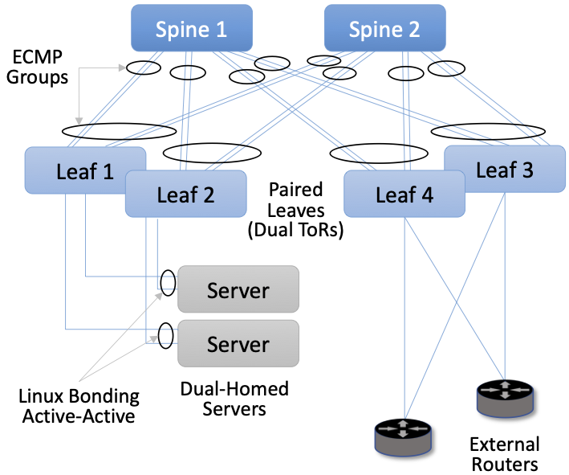

Chapter 7:  Leaf-Spine Fabric
=======================================

This chapter describes a leaf-spine switching fabric implemented by a
collection of control applications. We use SD-Fabric, running on ONOS,
as our exemplar implementation. Various aspects of SD-Fabric were
introduced in earlier chapters, so we summarize those highlights
before getting into the details.

* SD-Fabric supports the leaf-spine fabric topology that is commonly
  used to interconnect multiple racks of servers in a datacenter (see
  :numref:`Figure %s <fig-leaf-spine>`), but it also supports
  multi-site deployments (see :numref:`Figure %s <fig-trellis>`).
  SD-Fabric uses only bare-metal switches, equipped with the software
  described in the previous chapters, to build out the fabric. It can
  run on a mix of fixed-function and programmable pipelines but is
  running in production with the former.

* SD-Fabric supports a wide range of L2/L3 features, all re-implemented
  as SDN control apps (with the exception of a DHCP server used to
  relay DHCP requests and a Quagga BGP server used to exchange BGP
  routes with external peers). SD-Fabric implements L2 connectivity
  within each server rack and L3 connectivity between racks.

* SD-Fabric supports access/edge networking technologies, such as PON
  (see :numref:`Figure %s <fig-seba>`) and RAN (see :numref:`Figure %s
  <fig-trellis>`), including support for (a) routing IP traffic
  to/from devices connected to those access networks and (b)
  off-loading access network functionality into the fabric switches.

This chapter does not give a comprehensive description of all of these
features, but it does focus on the datacenter fabric use case, which
is sufficient to illustrate the approach to building a
production-grade network using SDN principles. More information about
the full range of SD-Fabric design decisions is available on the SD-Fabric
website.

.. _reading_trellis:
.. admonition:: Further Reading

   `SD-Fabric <https://opennetworking.org/sd-fabric/>`__. Open
   Networking Foundation, 2021.

7.1 Feature Set
---------------

SDN provides an opportunity to customize the network, but for
pragmatic reasons, the first requirement for adoption is to reproduce
functionality that already exists and do so in a way that reproduces
(or improves upon) the resilience and scalability of legacy
solutions. SD-Fabric has satisfied this requirement, which we
summarize here.

First, with respect to L2 connectivity, SD-Fabric supports VLANs,
including native support for forwarding traffic based on VLAN id,
along with Q-in-Q support based on an outer/inner VLAN id
pair. Support for Q-in-Q is particularly relevant to access networks,
where double-tagging is used to isolate traffic belonging to different
service classes. In addition, SD-Fabric supports L2 tunnels across the
L3 fabric (both single and double-tagged).

Second, with respect to L3 connectivity, SD-Fabric supports IPv4 and
IPv6 routing for both unicast and multicast addresses. For the latter,
SD-Fabric implements centralized multicast tree construction (as opposed
to running a protocol like PIM) but does include IGMP support for end
hosts wishing to join/leave multicast groups. SD-Fabric also supports
both ARP (for IPv4 address translation) and NDP (for IPv6 neighbor
discovery), along with support for both DHCPv4 and DHCPv6.

Third, SD-Fabric provides high availability in the face of link or
switch failures. It does this through a combination of well-known
techniques: dual-homing, link binding, and ECMP link groups. As
illustrated in :numref:`Figure %s <fig-netconfig>`, each server in an
SD-Fabric cluster is connected to a pair of Top-of-Rack (ToR, or leaf) switches, where
the OS running on each compute server implements active-active link
bonding. Each leaf switch is then connected by a pair of links to two
or more spine switches, with an ECMP group defined for the pair of
links connecting each leaf to a given spine and for the set of links
connecting each leaf to a set of spines. The cluster as a whole then
has multiple connections to external routes, shown via leaf switches 3
and 4 in the Figure. Not shown in :numref:`Figure %s <fig-netconfig>`
is the fact that SD-Fabric runs on top of ONOS, which is itself
replicated for the sake of availability. In a configuration like the
one shown here, ONOS (and hence the SD-Fabric control applications) are
replicated on three to five servers.

.. _fig-netconfig:

    High availability through a combination of dual-homing, link
    bonding, and ECMP groups.

The use of link aggregation and ECMP is straightforward: the packet
forwarding mechanism is augmented to load-balance outgoing packets
among a group (e.g., a pair) of links (egress ports) rather than
having just a single “best” output link (egress port). This both
improves bandwidth and results in an automatic recovery mechanism
should any single link fail. It is also the case that switch
forwarding pipelines have explicit support for port groups, so once
equivalences are established, they can be pushed all the way into the
data plane.

To be clear, ECMP is a forwarding strategy that SD-Fabric applies
uniformly across all the switches in the fabric. The SD-Fabric control
application knows the topology and pushes the port groups into each
of the fabric switches accordingly. Each switch then applies these
port groups to its forwarding pipeline, which then forwards packets
across the set of ports in each group without additional control plane
involvement.

Fourth, with respect to scalability, SD-Fabric has demonstrated the
ability to support up to 120k routes and 250k flows. This is in a
configuration that includes two spine switches and eight leaf
switches, the latter implying up to four racks of servers. As with
availability, SD-Fabric’s ability to scale performance is directly due
to ONOS’s ability to scale.

7.2 Segment Routing
-------------------

The previous section focused on *what* SD-Fabric does. This section
focuses on *how*.  The core strategy in SD-Fabric is based on *Segment
Routing (SR)*. The term “segment routing” comes from the idea that the
end-to-end path between any pair of hosts can be constructed from a
sequence of segments, where label-switching is used to traverse a
sequence of segments along an end-to-end path. Segment routing is a
general approach to source routing which can be implemented in a
number of ways. In the case of SD-Fabric, segment routing leverages the
forwarding plane of *Multi-Protocol Label Switching (MPLS)*, which you
can read more about online.

.. _reading_mpls:
.. admonition:: Further Reading

   `Multi-Protocol Label Switching
   <https://book.systemsapproach.org/scaling/mpls.html>`__. *Computer
   Networks: A Systems Approach*, 2020.

When applied to a leaf-spine fabric, there are always two segments
involved: leaf-to-spine and spine-to-leaf.  SD-Fabric programs the
switches to match labeled or unlabeled packets and push or pop
MPLS labels as needed.  :numref:`Figure %s
<fig-sr>` illustrates how SR works in SD-Fabric using a simple
configuration that forwards traffic between a pair of hosts: 10.0.1.1
and 10.0.2.1. In this example, the servers connected to Leaf 1 are on
subnet 10.0.1/24, the servers connected to Leaf 2 are on subnet
10.0.2/24, and each of the switches has an assigned MPLS id: 101,
103, 102, and 104.

.. _fig-sr:

    Example of Segment Routing being used to forward traffic between a
    pair of hosts.

When Host 1 sends a packet with destination address 10.0.2.1, it is by
default forwarded to the server’s ToR/leaf switch. Leaf 1 matches the
destination IP address, learns this packet needs to cross the fabric
and emerge at Leaf 2 to reach subnet 10.0.2/24, and so pushes the MPLS
label 102 onto the packet. Because of ECMP, Leaf 1 can forward the
resulting packet to either spine, at which point that switch matches
the MPLS label 102, pops the label off the header, and forwards it to
Leaf 2.  Finally, Leaf 2 matches the destination IP address and
forwards the packet along to Host 2.

What you should take away from this example is that SR is highly
stylized. For a given combination of leaf and spine switches, SD-Fabric
first assigns all identifiers, with each rack configured to share an
IP prefix and be on the same VLAN. SD-Fabric then pre-computes the
possible paths and installs the corresponding match/action rules in
the underlying switches. The complexity having to do with balancing
load across multiple paths is delegated to ECMP, which is similarly
unaware of any end-to-end paths. From an implementation perspective,
the SD-Fabric control application that implements SR passes these
match/action rules to ONOS, which in turn installs them on the
underlying switches. SD-Fabric also maintains its own Atomix map to
manage the set of ECMP groups connecting leaf and spine switches.

7.3 Routes and Multicast
------------------------

In addition to Segment Routing, which establishes data paths between
leaf switches, SD-Fabric also takes advantage of the Route and Mcast
services introduced in Chapter 6. They determine which of the
leaf-spine switches serve each IP prefix, and where to find all the
hosts connected to each multicast group, respectively.

SD-Fabric does not run distributed protocols like OSPF to learn about
routes or PIM to construct multicast trees.  Instead, it computes the
right answers based on global information, and then pushes these
mappings to the Route and Mcast services. This is straightforward to
do because SD-Fabric imposes the simplifying constraint that each rack
corresponds to exactly one IP subnet.

To make this discussion more concrete, consider that all the ONOS
Services described in Chapter 6 can be invoked via a RESTful API, or
alternatively, through a CLI that is a thin wrapper around REST's
``GET``, ``POST`` and ``DELETE`` calls.  Using the CLI to illustrate
(because it is easier to read), one can query the Route service to
learn the existing routes as follows:

.. literalinclude:: code/onos1.txt

Similarly, one can add a static route to the Route Service:

.. literalinclude:: code/onos2.txt

One thing to note about these examples is that there are two possible
sources for routes. One is that the route is ``STATIC``, which usually
means that SD-Fabric inserted it, with full knowledge of the what prefix
it has assigned to each rack in the cluster. (Human operators could
also add a ``STATIC`` route using the CLI, but this would be an
exception rather than the rule.)

The second possibility is that ``FPM`` was the source. FPM (Forwarding
Plane Manager) is yet
another ONOS Service–one of the SD-Fabric suite of services. Its
job is to learn routes from external sources, which it does by tapping
into a locally running Quagga process that is configured to peer with
BGP neighbors. Whenever FPM learns about an external route, it adds
the corresponding prefix-to-nexthop mapping to the Route service,
indicating that the destination prefix is reachable via the leaf
switches that connect the fabric to upstream networks (e.g., Switches 3
and 4 in :numref:`Figure %s <fig-netconfig>`).

The story with multicast is similar. Again using the ONOS CLI, it is
possible to create a new multicast route and add a sink to it. For example:

.. literalinclude:: code/onos3.txt

specifies *Any-Source Multicast (ASM)*  (``sAddr *``), a multicast group address
(``gAddr``), the group source addresses (``srcs``) and the group sink
addresses (``sinks``). A sink can then be removed as follows:

.. literalinclude:: code/onos4.txt

Again, there is no PIM running, but instead, SD-Fabric offers a
programmatic interface for network operators to define a multicast tree
through a sequence of such calls. For example, when SD-Fabric runs as
part of an access network that delivers IPTV to subscribers, one
option is for software running on the operator's set-top boxes to
issue calls similar to the ones shown above (except, of course, using
the RESTful API rather than the CLI). Another option is to have
set-top boxes send IGMP messages, which SD-Fabric intercepts using the
Packet Service (similar to how the Host service intercepts ARP and
DHCP packets). So the next time you use your TV remote to change
channels, it is possible you are triggering procedure invocations up
and down the SDN software stack described throughout this book!
    
7.4  Customized Forwarding
--------------------------

SD-Fabric is an example use case for SDN. It is a set of control
applications running top of a Network OS, which in turn runs on top of
a collection of programmable switches arranged in a leaf-spine topology,
where each switch runs a local Switch OS. In this way, SD-Fabric serves
as a capstone for our bottom-up tour of the SDN software stack.

But if we knew from the outset that a leaf-spine fabric supporting the
SD-Fabric feature-set was exactly what we wanted, we might go back to
lower layers and tailor them for that purpose. This is what has
happened over time with SD-Fabric, resulting in a customized forwarding
plane implemented by a P4 program called ``fabric.p4``. We conclude
this chapter by giving a high-level summary of ``fabric.p4``,
highlighting how its design meshes with the rest of the software
stack.

Before doing that, it is important to acknowledge that knowing exactly
what you want from a network at the outset is an impossibly high
bar. Networks evolve based on experience using and operating them. No
one knew how to write ``fabric.p4`` on day one, but after iterating
through a series of implementations of the other layers up-and-down
the stack (including the introduction of Tofino as a programmable
forwarding pipeline), ``fabric.p4`` emerged. *The point is that
treating the network as a programmable platform frees you to
continually and rapidly evolve it.*

Said another way, we introduced ``forward.p4`` as our canonical
example of "a forwarding plane customized to do exactly what we want"
in Chapter 4, but then spent the rest of the chapter describing all
the machinery that makes something like ``forward.p4`` possible,
without ever revisiting what network-specific functionality it might
actually implement.  In short, ``fabric.p4`` is a specific example of
``forward.p4``, which we are only now able to describe because of how
it relates to the control plane.

There are three things of note about ``fabric.p4``. First, it is
loosely based on the Broadcom OF-DPA pipeline, which makes sense
because SD-Fabric was originally implemented on top of a set of
Tomahawk-based switches. The ``fabric.p4`` pipeline is simpler than
OF-DPA, as it eliminates tables that SD-Fabric does not need. This makes
``fabric.p4`` easier to control.

Second, ``fabric.p4`` is designed to mimic ONOS's FlowObjective API,
thereby simplifying the process of mapping FlowObjectives onto
P4Runtime operations. This is best illustrated by :numref:`Figure %s
<fig-fabric>` which shows ``fabric.p4``\'s ingress pipeline. The
egress pipeline is not shown, but it is a straightforward rewriting of
the header fields in the common case.

.. _fig-fabric:

    Logical pipeline supported by ``fabric.p4``, designed to parallel
    the Filtering, Forwarding, and Next stages of the FlowObjective
    API.

Third, ``fabric.p4`` is designed to be configurable, making it
possible to selectively include additional functionality. This is not
easy when writing code that is optimized for an ASIC-based forwarding
pipeline, and in practice it makes heavy use of pre-processor
conditionals (i.e., ``#ifdefs``). The code fragment shown below is the
main control block of ``fabric.p4``\'s ingress function. Chapter 9
discusses these optional extensions in more depth, but at a high
level:

* **UPF (User Plane Function):** Augments IP functionality in
  support of 4G/5G Mobile Networks.

* **BNG (Broadband Network Gateway):** Augments IP functionality in
  support of Fiber-to-the-Home.

* **INT (Inband Network Telemetry):** Adds metric collection and
  telemetry output directives.

.. literalinclude:: code/fabric.p4

.. sidebar:: VNF Off-loading

    *The UPF and BNG extensions are examples of an optimization
    technique sometimes called VNF off-loading. VNF is an acronym
    for Virtual Network Function, which refers to functionality that
    sometimes runs as software in virtual machines. Off-loading refers
    to the idea of re-implementing this functionality to run in switch
    forwarding pipeline, rather than on a general-purpose server. This
    generally leads to better performance because packets can be
    forwarded from source to destination without having to be diverted
    to a server.*

    *Calling out functions like UPF and BNG as being an off-load
    "optimization" is arguably an example of selective memory. It's
    just as accurate to say that we've off-loaded IP to the switch
    since IP forwarding also sometimes runs in software on
    general-purpose processors. To a first approximation, UPF and BNG
    are just specialized IP routers, augmented with additional
    features unique to cellular and wireline access networks,
    respectively. In the grand scheme of things, networks are built
    from a combination of forwarding functions, and we now have more
    options as to what hardware chip is the most appropriate target
    for implementing each such function.*
    
For example, a companion file, ``upf.p4`` (not shown), implements the
forwarding plane for the UPF extension, which includes the GTP tunnel
encapsulation/decapsulation required by the 3GPP cellular standard to
connect the SD-Fabric fabric to the base stations of the Radio Access
Network.  Similarly, ``bng.p4`` (not shown) implements PPPoE
termination, which is used by some Passive Optical Networks
deployments to connect the SD-Fabric fabric to home routers. Finally,
it is worth nothing that the code fragment illustrates the basic
structure of ``fabric.p4``\'s core functionality, which first applies
the *filtering objective* (``filtering.apply``), then applies the
*forwarding objective* (``forwarding.apply`` and ``acl.apply``), and
finally applies the *next objective* (``next.apply``).

In addition to selecting which extensions to include, the pre-processor 
also defines several constants, including the size of each logical 
table.  Clearly, this implementation is a low-level approach to 
building configurable forwarding pipelines. Designing higher level 
language constructs for composition, including the ability to 
dynamically add functions to the pipeline at runtime, is a subject of 
on-going research. 
