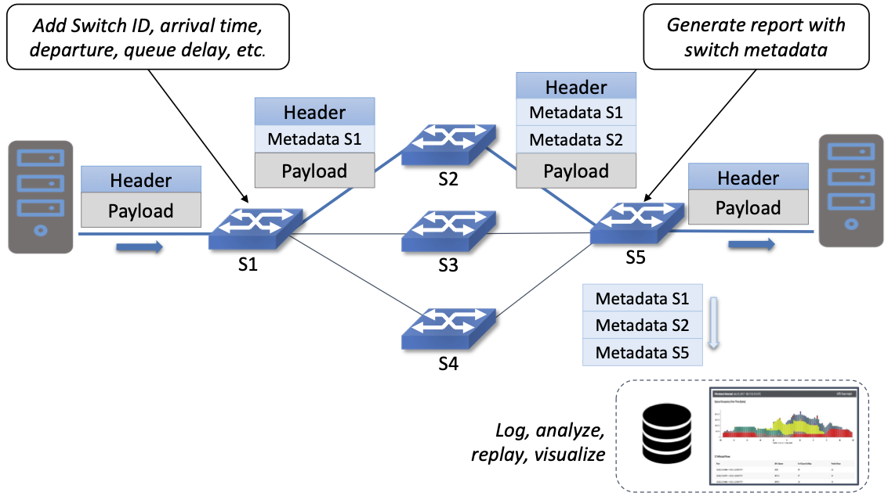

Chapter 2:  Use Cases
======================

A good way to understand the value of SDN is to look at how it is used
in practice.  Doing so also helps explain the different perspectives
on what SDN means, corresponding to what we refer to as “pure play”
versus “hybrid/lite” Software-Defined Networking in the previous
chapter. But before getting into *how* SDN is used, we start by first
summarizing *who* is using it.

First, SDN has been embraced and widely deployed by cloud providers,
with Google, Facebook, and Microsoft being the most public about
adoption. While their platforms and solutions are still mostly
proprietary, they have open sourced individual components in an effort
to catalyze wider adoption. We discuss these individual components in
later chapters.

Second, large network operators like AT&T, DT, NTT, and Comcast
publicly talk about their plans to deploy SDN-based
solutions—especially in their access networks—but they are proceeding
cautiously, with most of their initiatives either using hybrid
approaches, or in the case of pure play SDN, still in the trial
phase. The most notable exception is Comcast, which has deployed the
open source components described in this book throughout their
production network.

Finally, enterprises are the slowest to adopt SDN, but there are three
things to note about this situation. One is that pure play SDN is
deployed in some Universities, with the goal of supporting research
and innovation. The second is that the most likely path-to-adoption
for pure play SDN in enterprises is via managed edge services offered
by cloud providers. The idea is to connect on-premise clusters running
edge workloads with public clouds running scalable datacenter
workloads. The third is that many enterprise vendors offer SDN-lite
products, primarily focused on helping enterprises manage virtual
networks. This last example is the first use case we discuss.

2.1 Virtual Networks
-------------------------

The first widely-adopted use case for SDN was to virtualize the
network. Virtual networks, including both *Virtual Private Networks
(VPNs)* and *Virtual Local Area Networks (VLANs)*, have been a part of
the Internet for years. VLANs have historically proven useful within
enterprises, where they are used to isolate different organizational
groups, such as departments or labs, giving each of them the
appearance of having their own private LAN.

In the SDN context, the idea is to make VLAN-like virtual networks
easy-to-use, so they can be set up, managed, and torn down
programmatically (i.e., without a sysadmin having to manually
configure VLAN tags into network switches). In doing so, virtual
networks become commonplace, providing a way to securely isolate all
sorts applications and computational activities, not just to separate
organizational groups. Moreover, since today’s computing environments
are primarily built around Virtual Machines (VM), these virtual
networks connect VMs and not just physical servers. It makes sense
then, that the most widely used virtual network management systems are
tightly coupled with VM management systems. VMWare’s vSphere is the
predominant commercial example, where NSX is the virtual network
management subsystem of vSphere. In the open source arena, OpenStack
includes a virtual network subsystem called Neutron.

This use of virtual networks is quite similar to what happens in a
cloud datacenters, where it is important to isolate the network
traffic of different cloud tenants. But as briefly discussed in
Chapter 1, the 4096 possible VLANs are not sufficient to account for
all the tenants that a cloud might host, or all the virtual networks
an enterprise might want to create. The VXLAN standard was introduced
to address this challenge; the important point is that today virtual
networks are primarily implemented as overlay networks (encapsulated
in UDP), rather than implemented by VLAN tags embedded in L2 Ethernet
frames.

What does this have to do with SDN? On the one hand, managing all
these virtual networks, and in particular, automatically adding any
new VM that gets created to the right set of virtual networks, is a
tedious and error-prone task, but well-defined enough to implement in
software. That’s what a system like NSX or Neutron does. On the other
hand, creating and managing virtual networks makes only limited use of
SDN: (1) it is limited to configuring rather than controlling the
network, and (2) when running as an overlay, it can be implemented
entirely on the servers connected to a traditional network built using
legacy switches.\ [#]_ Supporting network virtualization is a critically
important use case, but not one that demonstrates the full
capabilities of SDN.

.. [#] This observation about different aspects of SDN being
       implemented in switches versus end hosts is an important one
       that we return to in Section 3.1.

2.2 Switching Fabrics
----------------------------

The predominant use case for pure play SDN is within cloud
datacenters, where for reasons of both lowering costs and improving
feature velocity, cloud providers have moved away from black-box
switches (i.e., those traditionally sold by network vendors), in favor
of white-box switches built using merchant silicon switching
chips. These cloud providers then control the *switching fabric* that
interconnects their servers entirely in software. This is the use case
we explore in-depth throughout this book, so for now we give only a
brief introduction.

A datacenter switching fabric is a network often designed according to
a *leaf-spine* topology. The basic idea is illustrated by the small
4-rack/3-tier example shown in Figure 8. Each rack has a *Top-of-Rack
(ToR)* switch that interconnects the servers in that rack; these are
referred to as the *leaf* switches of the fabric. (There are typically
two such ToR switches per rack for resilience, but the figure shows
only one for simplicity.) Each leaf switch then connects to a subset
of available *spine* switches, with two requirements: (1) that there
be multiple paths between any pair of racks, and (2) that each
rack-to-rack path is two-hops (i.e., via a single intermediate spine
switch). Note that this means in 3-tier design like the one shown in
:numref:`Figure %s <fig-leaf-spine>`, every server-to-server path is
either two hops (server-leaf-server in the intra-rack case) or four
hops (server-leaf-spine-leaf-server in the inter-rack case).

.. _fig-leaf-spine:
.. figure:: figures/Slide20.png
    :width: 400px
    :align: center

    Example of a leaf-spine switching fabric common to cloud
    datacenters and other compute clusters.

The main fabric-control software sets up L2 forwarding (bridging)
within a server-rack, and L3 forwarding (routing) across racks. The
use of L3 down-to-the ToR switches is a well-known concept in
leaf-spine fabrics, mainly due to L3 scaling better than L2. In
such cases, the ToRs (leaves) route traffic by hashing IP flows to
different spines using *Equal-Cost Multipath (ECMP)* forwarding.
Because every ToR is 2-hops away from every other ToR, there are
multiple such equal-cost paths. (Internally, the control software
takes advantage of label switching concepts similar to that used by
MPLS.) Having the fabric control software also provide L2-bridging
comes from the need to support legacy workloads that often expect to
communicate over an L2 network. There is much more to implementing a
leaf-spine fabric, but we postpone a more complete description until
Chapter 7, where we describe the specifics of the Trellis
implementation.

2.3 Wide-Area Networks
----------------------

Another cloud-inspired use case is traffic engineering applied to the
wide-area links between datacenters. For example, Google has publicly
described their private backbone, called B4, which is built entirely
using white-box switches and SDN. A central component of B4 is a
*Traffic Engineering (TE)* control program that provisions the network
according to the needs of various classes of applications. In the case
of B4, “provisioning the network” means dynamically building
end-to-end paths using the same Equal-Cost Multipath (ECMP) technique
mentioned in the previous subsection, but the same idea could be
applied to provisioning MPLS circuits or DWDM wavelengths between
sites in a wide-area network.

B4 identifies three classes of applications: (1) copying user data
(e.g., email, documents, audio/video) to remote datacenters for
availability; (2) accessing remote storage by computations that run
over distributed data sources; and (3) pushing large-scale data to
synchronize state across multiple datacenters. These classes are
ordered in increasing volume, decreasing latency sensitivity, and
decreasing overall priority. For example, user-data represents the
lowest volume on B4, is the most latency sensitive, and is of the
highest priority.

Through a combination of centralizing the decision-making process,
programatically rate-limiting traffic at the senders, and
differentiating three classes of traffic, Google has been able to
drive their link utilizations to nearly 100%. This is two to three
times better than the 30-40% average utilization that WAN links are
typically provisioned for, which is necessary to allow those networks
to deal with both traffic bursts and link/switch failures. The Google
experience with SDN is an interesting one, and shows the value of
being able to customize the network. A convesation with
Amin Vahdat, Jennifer Rexford, and David Clark is especially
insightful about the thought process in adopting SDN.

.. _reading_b4:
.. admonition:: Further Reading

   A. Vahdat, D. Clark, and J. Rexford. `A Purpose-built Global Network: 
   Google's Move to SDN
   <https://queue.acm.org/detail.cfm?id=2856460>`__.
   ACM Queue, December 2015.

2.4 Access Networks
-------------------------

Access networks that implement the *last mile* connecting homes,
businesses, and mobile devices to the Internet are another opportunity
to apply SDN principles. Example access network technologies include
*Passive Optical Networks (PON)*, colloquially known as
fiber-to-the-home, and the *Radio Access Network (RAN)* at the heart
of the 4G/5G cellular network.

What’s interesting about these use cases is that unlike all the
others—which effectively open Ethernet switches to programmable
control—access networks are typically built from special-purpose
hardware devices. The challenge is to transform these purpose-built
devices into their merchant silicon/white-box counterparts, so they
can be controlled by software. In the case of wired networks like PON,
there are two such devices: *Optical Line Terminals (OLT)* and
*Broadband Network Gateways (BNG)*. In the case of the cellular
network, there are also two relevant legacy components: *eNodeB* (the
RAN base station) and the *Enhanced Packet Core (EPC)*. A brief
introduction is available online if you are not familiar with these
acronyms.

.. _reading_access:
.. admonition:: Further Reading

   `Access Networks
   <https://book.systemsapproach.org/direct/access.html>`__.
   *Computer Networks: A Systems Approach*, 2020.

Because these devices are purpose-built, not to mention closed and
proprietary, they would seem to be worst-case examples for applying
SDN principles. But that also means they represent an opportunity for
the biggest payoff, and it is for precisely this reason that large
network operators are actively pursuing software-defined PON and RAN
networks. This initiative is often referred to as *CORD (Central
Office Re-architected as a Datacenter)* and has been the subject of
much business analysis, including a comprehensive report by A.D. Little.

.. _reading_cord:
.. admonition:: Further Reading

   `Who Dares Wins! How Access Transformation Can Fast-Track Evolution
   of Operator Prodution Platforms
   <https://www.adlittle.com/en/who-dares-wins>`__. *A.D. Little
   Report*, September 2019.

The central challenge of initiatives like CORD is to disaggregate the
existing legacy devices, so as to isolate the underlying packet
forwarding engine (the central element of the data plane) from the
control plane. Doing so makes it possible to package the former as
commodity hardware and to implement the latter in software.

Progress disaggregating PON-based access networks is quite far along,
with a solution known as *SEBA (SDN-Enabled Broadband Access)*
currently being deployed in operator field trials; production
deployments are expected by 2021. Full details are beyond the scope of
this book, but the general idea is to add white-box OLT devices to a
cluster similar to the one presented in :numref:`Figure %s
<fig-leaf-spine>`, resulting in configuration like the one depicted in
:numref:`Figure %s <fig-seba>`. In other words, the cluster includes a
mix of compute servers and access white-boxes, interconnected by a
switching fabric. And just as the *Open Compute Project (OCP)* has
certified white-box ethernet switches, they now also certify white-box
OLT devices. Both the fabric switches and access devices are
controlled by a software-defined control plane, with the code that
implements that control plane running on servers in the cluster.

Moreover, when the fabric is constructed using switches with
programmable pipelines, certain functionality originally provided by
the legacy hardware can be programmed into the switches that comprise
the fabric. For example, BNG-equivalent functionality, which could be
packaged as a *Virtual Network Function (VNF)* running on a
general-purpose processor, is instead programmed directly into a
white-box switches. This practice is sometimes called *VNF
off-loading* because the packet processing is moved from the compute
servers into the switches. This is a great example of what happens
when switch data planes become programmable: developers write software
that is able to take advantage of the hardware in new and unanticipated
ways.

.. _fig-seba:
.. figure:: figures/Slide21.png
    :width: 500px
    :align: center

    General hardware architecture of SEBA: SDN-Enabled Broadband
    Access.

Progress on *Software-Defined Radio Access Networks (SD-RAN)* lags
software-defined broadband, with development still in the
proof-of-concept stage. Disaggregating the RAN is a bigger challenge,
but the payoff will likely be even larger, as it leads to a
5G-empowered edge cloud. We revisit SD-RAN in Chapter 8, but for a
broad introduction to how 5G is being implemented according to SDN
principles, we recommend a companion book.

.. _reading_5g:
.. admonition:: Further Reading

   L. Peterson and O. Sunay. `5G Mobile Networks: A Systems Approach
   <https://5g.systemsapproach.org/>`__. June 2020.

The bottom line is that the effort to apply SDN principles to both
fiber and mobile access networks starts with the same building block
components described throughout this book. We will highlight where
such software-defined access networks “plug into” the SDN software
stack as we work our way through the details.

2.5 Network Telemetry
---------------------

We conclude this overview of SDN use cases by looking at a recent
example made possible by the introduction of programmable forwarding
pipelines: *In-Band Network Telemetry (INT)*. The idea of INT is to
program the forwarding pipeline to collect network state as packets
are being processed (i.e., “in-band”). This is in contrast to the
conventional monitoring done by the control plane by reading various
fixed counters (e.g., packets received/transmitted) or sampling
subsets of packets (e.g., sFlow).

In the INT approach, telemetry “instructions” are encoded into packet
header fields, and then processed by network switches as they flow
through the forwarding pipeline. These instructions tell an
INT-capable device what state to collect, and then how to also write
that state into the packet as it transits the network. INT traffic
sources (e.g., applications, end-host networking stacks, VM
hypervisors) can embed the instructions either in normal data packets
or in special probe packets. Similarly, INT traffic sinks retrieve and
report the collected results of these instructions, allowing the
traffic sinks to monitor the exact data plane state that the packets
observed (experienced) while being forwarded.

The idea is illustrated in :numref:`Figure %s <fig-int>`, which shows
an example packet travsering a path from source switch *S1* to sink
switch *S5* via transit switch *S2*. The INT metadata added by each
swith along the path both indicates what data is to be collect for the
packet, and records the corresponding data for each switch.

.. _fig-int:

    Illustration of Inband Network Telemetry (INT), with each packet
    collecting measurement data as it traverses the network.

INT is still early-stage, but it has the potential to provide
qualitatively deeper insights into traffic patterns and the root
causes of network failures. For example, INT can be used to measure
and record queuing delay individual packets experience while
traversing a sequence of switches along an end-to-end path, with a
packet like the one shown in the figure reporting: *"I visited Switch
1 @780ns, Switch 2 @1.3µs, Switch 5 @2.4µs."* By correlating this
information across packet flows that may have followed different
routes, it is even possible to determine which flows shared buffer
capacity at each switch.

Similarly, packets can report the decision making process that
directed their delivery, for example, with something like: *"In Switch
1, I followed rules 75 and 250; in Switch 2, I followed rules 3 and
80."* This opens the door to using INT to verify that the data plane
is faithfully executing the forwarding behavior the network operator
intended. We return to the potential of INT to impact how we build and
operate networks in the concluding chapter of this book.
    
