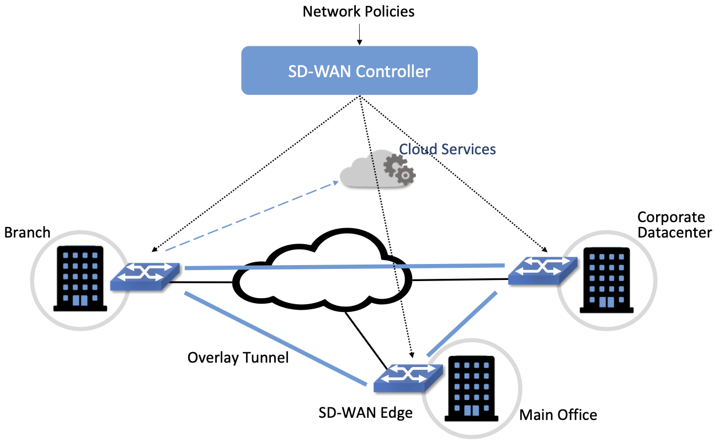
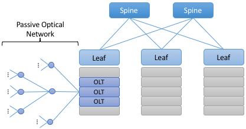

Chapter 2:  Use Cases
======================

A good way to understand the value of SDN is to look at how it is used
in practice.  Doing so also helps explain the different perspectives
on what SDN means, corresponding to what we refer to as “pure play”
versus “hybrid/lite” Software-Defined Networking in the previous
chapter. But before getting into *how* SDN is used, we start by first
summarizing *who* is using it.

First, SDN has been embraced and widely deployed by cloud providers,
with Google, Facebook, and Microsoft being the most public about
adoption. While their platforms and solutions are still mostly
proprietary, they have open sourced individual components in an effort
to catalyze wider adoption. We discuss these individual components in
later chapters.

Second, large network operators like AT&T, DT, NTT, and Comcast
publicly talk about their plans to deploy SDN-based
solutions—especially in their access networks—but they are proceeding
cautiously, with most of their initiatives either using hybrid
approaches, or in the case of pure play SDN, still in the trial
phase. The most notable exception is Comcast, which has deployed the
open source components described in this book throughout their
production network.

Finally, enterprises have begun to adopt SDN, but there are two things
to note about this situation. One is that while pure play SDN is
deployed in some Universities, with the goal of supporting research
and innovation, adoption is slower for enterprises in general. The
most likely path-to-adoption for pure play SDN by enterprises is via
managed edge services offered by cloud providers.  The idea is to
connect on-premise clusters running edge workloads with public clouds
running scalable datacenter workloads. The second is that many
enterprise vendors offer SDN products, where the focus has been more
on the benefits of logical control plane centralization rather than
open interfaces to the data plane. Network virtualization and SD-WAN
(software-defined wide area networks) have both had considerable
success in the enterprise, as discussed below.

2.1 Network Virtualization
---------------------------

The first widely-adopted use case for SDN was to virtualize the
network. Virtual networks, including both *Virtual Private Networks
(VPNs)* and *Virtual Local Area Networks (VLANs)*, have been a part of
the Internet for years. VLANs have historically proven useful within
enterprises, where they are used to isolate different organizational
groups, such as departments or labs, giving each of them the
appearance of having their own private LAN. However, these early forms
of virtualization were quite limited in scope and lacked many of the
advantages of SDN. You could think of them as virtualizing the address
space of a network but not all its other properties, such as firewall
policies or higher-level network services like load balancing. 

The original idea behind using SDN to create virtual networks is
widely credited to the team at Nicira, whose approach is described in
in an NSDI paper by Teemu Koponen and colleagues. The key insight was
that modern clouds required networks that could be programmatically
created, managed, and torn down, without a sysadmin having to manually
configure, say, VLAN tags on some number of network switches. By
separating the control plane from the data plane, and logically
centralizing the control plane, it became possible to expose a single
API entry point for the creation, modification, and deletion of
virtual networks. This meant that the same automation systems that
were being used to provision compute and storage capacity in a cloud
(such as OpenStack at the time) could now programmatically provision a
virtual network with appropriate policies to interconnect those other
resources.

.. admonition:: Further Reading

   T. Koponen et al. `Network Virtualization in Multi-tenant
   Datacenters
   <https://www.usenix.org/conference/nsdi14/technical-sessions/presentation/koponen>`__.
   NSDI, April, 2014.

The rise of network virtualization followed by several years the rise
of compute virtualization, and was very much enabled by it. Compute
virtualization made manual server provisioning a thing of the past,
and exposed the manual and time-consuming processes of network
configuration as the "long pole" in delivering a cloud
service. Virtual machine migration, which enabled running VMs to move from one
network location to another (taking their IP addresses with them),
further exposed the limitations of manual network configuration. This
need to automate network provisioning was first recognized by large
cloud providers but eventually became mainstream in enterprises.

As microservices and container-based systems such as Kubernetes have
gained in popularity, network virtualization has continued to evolve
to meet the needs of these environments. There are a range of open
source network "plugins"  (Calico, Flannel, Antrea,
etc.) that provide network virtualization services for Kubernetes. 

Because network virtualization set out to deliver a full set of
network services in a programmatic way, its impact went beyond the
simplification and automation of network provisioning. As virtual
networks became lightweight objects, created and destroyed as needed,
with a full set of services (such as stateful firewalling, deep-packet
inspection, and so on), a new approach to network security was
enabled. Rather than adding security features after the network was
created, security features could be created as an inherent part of the
network itself. Furthermore, with no limit on how many virtual
networks could be created, as approach known as *microsegmentation*
took hold. This entails the creation of fine-grained, isolated
networks (microsegments) specific to the needs of, say, a group of
processes implementing a single distributed application.
Microsegmentation offers clear benefits over prior approaches to
network security, dramatically reducing the attack surface and the
impact of attacks spreading throughout an enterprise or data center.

.. sidebar:: Bringing SDN to Life

	As we saw in Chapter 1, the ideas behind SDN had been in the
	works for years, but there were two related events
	that, looking back, had a significant impact in bringing the
	concept of programmable networks from theory to practice. First
	was the 2007 founding of the commercial startup Nicira
	Networks. Nicira was founded by three of the acknowledged
	pioneers of SDN: Martin Casado, Scott Shenker, and Nick
	McKeown. While Nicira was founded to make commercial use of
	SDN, as with many startups, it took a while to find the ideal
	product for the marketplace. In the end, it was Network
	Virtualization that became the industry's first successful
	application of SDN. Nicira's network virtualization platform
	first shipped in 2011, establishing the category and
	ultimately paving the way for VMware's acquisition of the
	company and subsequent development of VMware NSX.

	At around the same time, McKeown and Shenker also created
	three non-profit organizations to catalyze the SDN
	transformation across the networking industry: the Open
	Networking Foundation (ONF) took on responsibility for
	advancing the cause of network disaggregation, including
	development of the OpenFlow standard; the Open Networking
	Laboratory (ON.Lab) was created to produce open source
	SDN-based solutions and platforms; and the Open Networking
	Summit (ONS) was created as a conference platform to bring
	together academics and practitioners interested in SDN. In
	2018, ONF and ON.Lab merged, and the combined organization has
	focused on building the open source software that is
	highlighted throughout this book.

        Of course there have been many other startups, conferences,
        and consortia that have driven the development of SDN to where
        it is today, and the effects of their work can be seen
        throughout this chapter.

It's worth noting that to create virtual networks as we have
described, it is necessary to encapsulate packets from the virtual
networks in a way that lets them traverse the underlying physical
network. As a simple example, a virtual network can have its own
private address space which is decoupled from the underlying physical
address space. For this reason, virtual networks have used a range of
encapsulation techniques, of which VXLAN (briefly discussed in
Chapter 1) is probably the most well
known. In recent years, a more flexible encapsulation called GENEVE
(Generic Network Virtualization Encapsulation) has emerged. 

There have been reasonable debates about whether network
virtualization is really SDN. Certainly it displays many of the
properties we discussed in the previous chapter—the original Nicira
network virtualization platform even used OpenFlow to communicate
between its central controller and the data plane elements. And the
centralization benefits of SDN are at the core of what made network
virtualization possible, particularly as an enabler of network
automation. On the other hand, network virtualization has not really
enabled the disaggregation of networks envisioned by SDN: the
controllers and the switches in a network virtualization system are
typically quite tightly integrated using proprietary signalling methods
rather than an open interface. And because the focus of network
virtualization has been on connecting virtual machines and containers,
it is usually implemented as an overlay among the servers on which
those computing abstractions are implemented. Sitting underneath that
overlay is a physical network, which network virtualization just takes
as given (and that physical network need not implement SDN at
all).\ [#]_ In this book we take a broad view of what SDN is, but at the
same time we can see that not all the potential benefits of SDN are
delivered by network virtualization. 

.. [#] This observation about different aspects of SDN being
       implemented in switches versus end hosts is an important one
       that we return to in Section 3.1.
       

2.2 Switching Fabrics
----------------------------

The predominant use case for pure play SDN is within cloud
datacenters, where for reasons of both lowering costs and improving
feature velocity, cloud providers have moved away from proprietary
switches (i.e., those traditionally sold by network vendors), in favor
of bare-metal switches built using merchant silicon switching
chips. These cloud providers then control the *switching fabric* that
interconnects their servers entirely in software. This is the use case
we explore in-depth throughout this book, so for now we give only a
brief introduction.

A datacenter switching fabric is a network often designed according to
a *leaf-spine* topology. The basic idea is illustrated by the small
4-rack/3-tier example shown in Figure 8. Each rack has a *Top-of-Rack
(ToR)* switch that interconnects the servers in that rack; these are
referred to as the *leaf* switches of the fabric. (There are typically
two such ToR switches per rack for resilience, but the figure shows
only one for simplicity.) Each leaf switch then connects to a subset
of available *spine* switches, with two requirements: (1) that there
be multiple paths between any pair of racks, and (2) that each
rack-to-rack path is two-hops (i.e., via a single intermediate spine
switch). Note that this means in 3-tier design like the one shown in
:numref:`Figure %s <fig-leaf-spine>`, every server-to-server path is
either two hops (server-leaf-server in the intra-rack case) or four
hops (server-leaf-spine-leaf-server in the inter-rack case).

.. _fig-leaf-spine:

    Example of a leaf-spine switching fabric common to cloud
    datacenters and other compute clusters.

The main fabric-control software sets up L2 forwarding (bridging)
within a server-rack, and L3 forwarding (routing) across racks. The
use of L3 down-to-the ToR switches is a well-known concept in
leaf-spine fabrics, mainly due to L3 scaling better than L2. In
such cases, the ToRs (leaves) route traffic by hashing IP flows to
different spines using *Equal-Cost Multipath (ECMP)* forwarding.
Because every ToR is 2-hops away from every other ToR, there are
multiple such equal-cost paths. (Internally, the control software
takes advantage of label switching concepts similar to that used by
MPLS.) Having the fabric control software also provide L2-bridging
comes from the need to support legacy workloads that often expect to
communicate over an L2 network. There is much more to implementing a
leaf-spine fabric, but we postpone a more complete description until
Chapter 7, where we describe the specifics of the Trellis
implementation.

2.3 Traffic Engineering for WANs
--------------------------------

Another cloud-inspired use case is traffic engineering applied to the
wide-area links between datacenters. For example, Google has publicly
described their private backbone, called B4, which is built entirely
using bare-metal switches and SDN. A central component of B4 is a
*Traffic Engineering (TE)* control program that provisions the network
according to the needs of various classes of applications.

The idea of traffic engineering for packet-switched networks is almost
as old as packet switching itself, with some ideas of traffic-aware
routing having been tried in the Arpanet. However, traffic engineering
only really became mainstream for the Internet backbone with the
advent of MPLS, which provides a set of tools to steer traffic to
balance load across different paths. However, a notable shortcoming of
MPLS-based TE is that path calculation, like traditional routing, is a
fully distributed process. Central planning tools are common but the
real-time management of MPLS paths remains fully distributed. This
means that it is near impossible to achieve any sort of global
optimization, as the path calculation algorithms–which kick in any
time a link changes status, or as traffic loads change–are making
local choices about what seems best.

B4 recognizes this shortcoming and moves the path calculation to a
logically centralized SDN controller. When a link fails, for example,
the controller calculates a new mapping of traffic demands onto
available links, and programs the switches to forward traffic flows in
such a way that no link is overloaded.

Over many years of operation, B4 has become more sophisticated. For
example, it evolved from treating all traffic equally to supporting a
range of traffic classes with different levels of tolerance to delay
and availability requirements. Examples of traffic classes
included: (1) copying user data (e.g., email, documents, audio/video)
to remote datacenters for availability; (2) accessing remote storage
by computations that run over distributed data sources; and (3)
pushing large-scale data to synchronize state across multiple
datacenters. In this example, user-data represents the lowest volume
on B4, is the most latency sensitive, and is of the highest
priority. By breaking traffic up into these classes with different
properties, and running a path calculation algorithm for each one, the
team was able to considerably improve the efficiency of the network,
while still meeting the requirements of the most demanding
applications.

Through a combination of centralizing the decision-making process,
programmatically rate-limiting traffic at the senders, and
differentiating classes of traffic, Google has been able to
drive their link utilizations to nearly 100%. This is two to three
times better than the 30-40% average utilization that WAN links are
typically provisioned for, which is necessary to allow those networks
to deal with both traffic bursts and link/switch failures. The Google
experience with SDN is an interesting one, and shows both the value of
being able to customize the network and the power of centralized
control to change networking abstractions. A conversation with
Amin Vahdat, Jennifer Rexford, and David Clark is especially
insightful about the thought process in adopting SDN.

.. _reading_b4:
.. admonition:: Further Reading

   A. Vahdat, D. Clark, and J. Rexford. `A Purpose-built Global Network: 
   Google's Move to SDN
   <https://queue.acm.org/detail.cfm?id=2856460>`__.
   ACM Queue, December 2015.

2.4 Software-Defined WANs
-------------------------

Another use-case for SDN that has taken off for enterprise users is
*Software-Defined Wide-Area Networks (SD-WAN)*. Enterprises have for
many years been buying WAN services from telecommunications companies,
mostly to obtain reliable and private network services to interconnect
their many locations–main offices, branch offices, and corporate data
centers. For most of the 21st century the most common technical
approach to building these networks has been MPLS, using a technique
known as MPLS-BGP VPNs (virtual private networks). The rapid rise of
SD-WAN as an alternative to MPLS is another example of the power of
centralized control.

Provisioning a VPN using MPLS, while less complex than most earlier
options, still requires some significant local configuration of both
the Customer Edge (CE) router located at each customer site, and the
Provider Edge (PE) router to which that site would be connected. In
addition, it would typically require the provisioning of a circuit
from the customer site to the nearest point of presence for the
appropriate Telco.

With SD-WAN, there was a realization that VPNs lend themselves to
centralized configuration. An enterprise wants its sites—and only its
authorized sites—to be interconnected, and it typically wants to apply
a set of policies regarding security, traffic prioritization, access
to shared services and so on. These can be input to a central
controller, which can then push out all the necessary configuration to
a switch located at the appropriate office. Rather than manually
configuring a CE and a PE every time a new site is added, it is
possible to achieve "zero-touch" provisioning: an appliance is shipped
to the new site with nothing more than a certificate and an address to
contact, which it then uses to contact the central controller and
obtain all the configuration it needs. Changes to policy, which might
affect many sites, can be input centrally and pushed out to all
affected sites. An example policy would be *"put YouTube traffic into
the lowest priority traffic class"* or *"allow direct access to a given
cloud service from all branch offices"*. The idea is illustrated in
:numref:`Figure %s <fig-sd-wan>`.

.. _fig-sd-wan:

    An SD-WAN controller receives policies centrally and pushes them
    out to edge switches at various sites. The switches build an
    overlay of tunnels over the Internet or other physical networks,
    and implement policies including allowing direct access to cloud
    services.  

Note that the "private" part of the VPN is generally achieved by the
creation of encrypted tunnels between locations. This is another
example of a task that is painful to set up using traditional
box-by-box configuration but easy to achieve when all switches are
receiving their configuration from a central controller.

Many factors that are external to SDN came into play to make SD-WAN a
compelling option. One of these was the ubiquity of broadband Internet
access, meaning that there is no longer a reason to provision a
dedicated circuit to connect a remote site, with the corresponding
time and cost to install. But the privacy issue had to be solved
before that could happen–as it was, using centrally managed, encrypted tunnels. Another was the increasing
reliance on cloud services such as Office365 or Salesforce.com, which
have tended to replace on-premises applications in corporate data centers. It
seems natural that you would choose to access those services directly
from an Internet-connected branch, but traditional VPNs would
*backhaul* traffic to a central site before sending it out to the
Internet, precisely so that security could be controlled
centrally. With SD-WAN, the central control over security policy is achieved, while the data
plane remains fully distributed–meaning that remote sites can directly
connect to the cloud services without backhaul. This is yet another
example of how separating the control and data planes leads to a new
network architecture.

As with some of the other use cases, SD-WAN is not necessarily doing
everything that SDN promised. The control plane to data plane
communication channel tends to be proprietary, and, like network
virtualization, the SD-WAN solutions are overlay networks running on
top of traditional networks. Nevertheless, SD-WAN has opened up a path
for innovation because both the edge devices and the control planes
are implemented in software, and centralization has offered new ways
of tackling an old problem. Furthermore, there is plenty of competition among
the players in the SD-WAN marketplace.
      
2.5 Access Networks
-------------------------

Access networks that implement the *last mile* connecting homes,
businesses, and mobile devices to the Internet are another opportunity
to apply SDN principles. Example access network technologies include
*Passive Optical Networks (PON)*, colloquially known as
fiber-to-the-home, and the *Radio Access Network (RAN)* at the heart
of the 4G/5G cellular network.

What’s interesting about these use cases is that unlike all the
others—which effectively open general-purpose switches to programmable
control—access networks are typically built from special-purpose
hardware devices. The challenge is to transform these purpose-built
devices into their merchant silicon/bare-metal counterparts, so they
can be controlled by software. In the case of wired networks like PON,
there are two such devices: *Optical Line Terminals (OLT)* and
*Broadband Network Gateways (BNG)*. In the case of the cellular
network, there are also two relevant legacy components: *eNodeB* (the
RAN base station) and the *Enhanced Packet Core (EPC)*. A brief
introduction is available online if you are not familiar with these
acronyms.

.. _reading_access:
.. admonition:: Further Reading

   `Access Networks
   <https://book.systemsapproach.org/direct/access.html>`__.
   *Computer Networks: A Systems Approach*, 2020.

Because these devices are purpose-built, not to mention closed and
proprietary, they would seem to be worst-case examples for applying
SDN principles. But that also means they represent an opportunity for
the biggest payoff, and it is for precisely this reason that large
network operators are actively pursuing software-defined PON and RAN
networks. This initiative is often referred to as *CORD (Central
Office Re-architected as a Datacenter)* and has been the subject of
much business analysis, including a comprehensive report by A.D. Little.

.. _reading_cord:
.. admonition:: Further Reading

   `Who Dares Wins! How Access Transformation Can Fast-Track Evolution
   of Operator Production Platforms
   <https://www.adlittle.com/en/who-dares-wins>`__. *A.D. Little
   Report*, September 2019.

The central challenge of initiatives like CORD is to disaggregate the
existing legacy devices, so as to isolate the underlying packet
forwarding engine (the central element of the data plane) from the
control plane. Doing so makes it possible to package the former as
commodity hardware and to implement the latter in software.

Progress disaggregating PON-based access networks is quite far along,
with a solution known as *SEBA (SDN-Enabled Broadband Access)*
currently being deployed in operator field trials; production
deployments are expected by 2021. Full details are beyond the scope of
this book, but the general idea is to add bare-metal OLT devices to a
cluster similar to the one presented in :numref:`Figure %s
<fig-leaf-spine>`, resulting in configuration like the one depicted in
:numref:`Figure %s <fig-seba>`. In other words, the cluster includes a
mix of compute servers and access devices, interconnected by a
switching fabric. And just as the *Open Compute Project (OCP)* has
certified bare-metal ethernet switches, they now also certify bare-metal
OLT devices. Both the fabric switches and access devices are
controlled by a software-defined control plane, with the code that
implements that control plane running on servers in the cluster.

Moreover, when the fabric is constructed using switches with
programmable pipelines, certain functionality originally provided by
the legacy hardware can be programmed into the switches that comprise
the fabric. For example, BNG-equivalent functionality, which could be
packaged as a *Virtual Network Function (VNF)* running on a
general-purpose processor, is instead programmed directly into a
programmable switch. This practice is sometimes called *VNF
off-loading* because the packet processing is moved from the compute
servers into the switches. This is a great example of what happens
when switch data planes become programmable: developers write software
that is able to take advantage of the hardware in new and unanticipated
ways.

.. _fig-seba:

    General hardware architecture of SEBA: SDN-Enabled Broadband
    Access.

Progress on *Software-Defined Radio Access Networks (SD-RAN)* lags
software-defined broadband, with development still in the
proof-of-concept stage. Disaggregating the RAN is a bigger challenge,
but the payoff will likely be even larger, as it leads to a
5G-empowered edge cloud. We revisit SD-RAN in Chapter 8, but for a
broad introduction to how 5G is being implemented according to SDN
principles, we recommend a companion book.

.. _reading_5g:
.. admonition:: Further Reading

   L. Peterson and O. Sunay. `5G Mobile Networks: A Systems Approach
   <https://5g.systemsapproach.org/>`__. June 2020.

The bottom line is that the effort to apply SDN principles to both
fiber and mobile access networks starts with the same building block
components described throughout this book. We will highlight where
such software-defined access networks “plug into” the SDN software
stack as we work our way through the details.

2.6 Network Telemetry
---------------------

We conclude this overview of SDN use cases by looking at a recent
example made possible by the introduction of programmable forwarding
pipelines: *In-Band Network Telemetry (INT)*. The idea of INT is to
program the forwarding pipeline to collect network state as packets
are being processed (i.e., “in-band”). This is in contrast to the
conventional monitoring done by the control plane by reading various
fixed counters (e.g., packets received/transmitted) or sampling
subsets of packets (e.g., sFlow).

In the INT approach, telemetry “instructions” are encoded into packet
header fields, and then processed by network switches as they flow
through the forwarding pipeline. These instructions tell an
INT-capable device what state to collect, and then how to write
that state into the packet as it transits the network. INT traffic
sources (e.g., applications, end-host networking stacks,
hypervisors) can embed the instructions either in normal data packets
or in special probe packets. Similarly, INT traffic sinks retrieve and
report the collected results of these instructions, allowing the
traffic sinks to monitor the exact data plane state that the packets
observed (experienced) while being forwarded.

The idea is illustrated in :numref:`Figure %s <fig-int>`, which shows
an example packet traversing a path from source switch *S1* to sink
switch *S5* via transit switch *S2*. The INT metadata added by each
switch along the path both indicates what data is to be collected for the
packet, and records the corresponding data for each switch.

.. _fig-int:
.. figure:: figures/Slide38.png
    :width: 700px
    :align: center

    Illustration of Inband Network Telemetry (INT), with each packet
    collecting measurement data as it traverses the network.

INT is still early-stage, but it has the potential to provide
qualitatively deeper insights into traffic patterns and the root
causes of network failures. For example, INT can be used to measure
and record queuing delay individual packets experience while
traversing a sequence of switches along an end-to-end path, with a
packet like the one shown in the figure reporting: *"I visited Switch
1 @780ns, Switch 2 @1.3µs, Switch 5 @2.4µs."* This information can be
used, for example, to detect *microbursts*—queuing delays measured
over millisecond or even sub-millisecond time scales—as reported by
Xiaoqi Chen and colleagues.  It is even possible to correlate this
information across packet flows that followed different routes, so as
to to determine which flows shared buffer capacity at each switch.

.. _reading_int:
.. admonition:: Further Reading

   X. Chen, et. al. `Fine-grained queue measurement in the data plane
   <https://p4.org/p4/conquest>`__. ACM CoNEXT'19, December 2019.

Similarly, packets can report the decision making process that
directed their delivery, for example, with something like: *"In Switch
1, I followed rules 75 and 250; in Switch 2, I followed rules 3 and
80."* This opens the door to using INT to verify that the data plane
is faithfully executing the forwarding behavior the network operator
intended. We return to the potential of INT to impact how we build and
operate networks in the concluding chapter of this book.

This use case illustrates once again a potential benefit of SDN: the
ability to try out new ideas that would have in the past been
infeasible. With traditional fixed-function ASICs doing the packet
forwarding, you could never get the chance to try an idea like INT to
see if the benefits justify the cost. It is this freedom to experiment
and innovate that will lead to lasting benefits from SDN in the long
run.
